- [1 QAOA算法](#1-QAOA)
  - [1.1 QAOA算法介绍](#1.1-QAOA)
  - [1.2 QAOA算法的实现](#1.2-QAOA)
  - [1.3 QAOA算法小结](#1.3-QAOA)
- [2 Deutsch–Jozsa算法](#2-DJ)
  - [2.1 Deutsch–Jozsa算法介绍](#2.1-DJ)
  - [2.2 Deutsch–Jozsa算法的实现](#2.2-DJ)
  - [2.3 Deutsch–Jozsa算法小结](#2.3-DJ)
- [3 Grover算法](#3-Grover)
  - [3.1 Grover算法介绍](#3.1-Grover)
  - [3.2 Grover算法的实现](#3.2-Grover)
  - [3.3 Grover算法小结](#3.3-Grover)
- [4 HHL算法](#4-HHL)
  - [4.1 HHL算法介绍](#4.1-HHL)
  - [4.2 HHL算法的实现](#4.2-HHL)
  - [4.3 HHL算法小结](#4.3-HHL)
- [5 QuantumWalk算法](#5-QuantumWalk)
  - [5.1 QuantumWalk算法介绍](#5.1-QuantumWalk)
  - [5.2 QuantumWalk算法的实现](#5.2-QuantumWalk)
  - [5.3 QuantumWalk算法小结](#5.3-QuantumWalk)
- [6 Simon算法](#6-Simon)
  - [6.1 Simon算法介绍](#6.1-Simon)
  - [6.2 Simon算法的实现](#6.2-Simon)
  - [6.3 Simon算法小结](#6.3-Simon)
- [7 CoinFlip算法](#7-CoinFlip)
  - [7.1 CoinFlip算法介绍](#7.1-CoinFlip)
  - [7.2 CoinFlip算法的实现](#7.2-CoinFlip)
  - [7.3 CoinFlip算法小结](#7.3-CoinFlip)
- [8 Bernstein-Vazirani算法](#8-BV)
  - [8.1 Bernstein-Vazirani算法介绍](#8.1-BV)
  - [8.2 Bernstein-Vazirani算法的实现](#8.2-BV)
  - [8.3 Bernstein-Vazirani算法小结](#8.3-BV)
- [9 QPE算法](#9-QPE)
  - [9.1 QPE算法介绍](#9.1-QPE)
  - [9.2 QPE算法的实现](#9.2-QPE)
  - [9.3 QPE算法小结](#9.3-QPE)
- [10 Shor算法](#10-Shor)
  - [10.1 Shor算法介绍](#10.1-Shor)
  - [10.2 Shor算法的实现](#10.2-Shor)
  - [10.3 Shor算法小结](#10.3-Shor)


# <a name="1-QAOA"></a>QAOA算法


## <a name="1.1-QAOA"></a>QAOA算法介绍


量子近似优化算法(QAOA)，是由Farhi, Goldstone和Gutmann开发的一个多项式时间算法，用于寻找“最优化问题的一种‘好’的解决方案”。对于给定的NP-Hard问题，近似算法是一种多项式时间算法，QAOA算法以期望的一些质量保证来解决每个问题实例。品质因数是多项式时间解的质量与真实解的质量之间的比率。

**NP-Hard Problem**

最大切割问题（MAX-CUT）是原始量子近似优化算法论文中描述的第一个应用。此问题类似于图形着色。给定节点和边的图形，将每个节点着色为黑色或白色，然后对有不同颜色节点的边给定一个分值。目的是找到得分最高的着色点。
更正式地说，问题是将图的节点划分为两组，使得连接相对组中的节点的边的数量最大化。例如，杠铃图


有4种方法将节点分为两组：

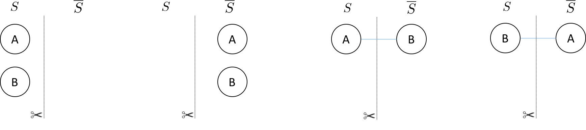

我们仅对连接不同集合中的节点时才会绘制边。带有剪刀符号的线条表示我们要计算的切割边。对于杠铃图，有两个相等的权重分区对应于最大切割（如上图，右侧两个分区），将杠铃切成两半。我们可以将集合S或¯S中的节点表示为0或1，组成一个长度为N的比特串 。上图的四个分区可以表示为 {00, 11, 01, 10} 其中最左边的比特对应节点 A，最右边的比特对应节点B。用比特串来表示使得表示图的特定分区变得很容易。每个比特串具有相关联的切割权重。
对任意一个图中，节点分割所使用的比特串长度总是N。可分割的情况总数是  。例如，方形环见下图：

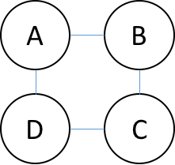

有16个可能的分区（$2^4$）。以下是两种可能的节点分区方式：

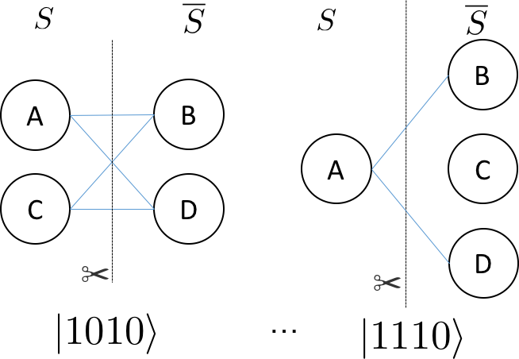


与每个分区相关联的比特串如上图所示，其中最右边的比特对应节点A，最左边的比特对应节点D。

**解决方案**

**经典解决算法**

为了在经典计算机上找到最佳剪切，最直接的方法是枚举图的所有分区并检查与分区关联的切割的权重。

面对寻找最佳切割（或一组最佳切割）的指数成本，我们可以设计出具有特定质量的多项式算法。例如，著名的多项式时间算法是随机分区方法，通过遍历图表的节点并抛掷硬币，如果硬币是正面，则节点在集合S中，否则节点在集合S中。随机分配算法的质量至少是最大切割的50％。对于硬币抛掷过程来说，边被切割中的概率是50％。因此，随机分配产生的切割的期望值可以写成如下：

 

由于所有边的总和必然是最大切割的上限，因此随机化方法产生的切割预期值至少是中最佳切割的 0.5 倍。其它多项式方法包括半定规划可以使期望的切割值至少为最大切割的 0.87856 倍。

**量子近似优化算法（QAOA）**

我们可以将对应于图上的最大切割的比特串（或比特串组），视为是使用哈密顿量编码的代价函数的基态。这个哈密顿量的形式，可以通过构造经典函数返回值来决定，如果被切割边所对应的两个节点跨越不同集合，则返回1（或边的权重），否则返回0。

$$ C_{ij} = 1/2(1-z_i z_j)​$$

如果节点i和节点j属于S，则 $z_i$ 或 $z_j$ 的值为 +1，否则为 -1。总代价是图中所有 (i, j) 节点对形成的边集权重的总和。这表明对于 MAX-CUT，哈密顿量编码的问题是

$$\sum_{ij}\frac{1}{2}(I-σ_i^z σ_j^z)$$

其中和是对图中（i，j）节点对组成的边集权重的遍历。量子近似优化算法（QAOA）基于这样的事实：我们可以准备一些近似于该哈密顿量的基态的东西并对该状态进行测量，对 N 位量子状态执行测量，并以高概率返回对应于最大切割的比特串。
为了使描述更具体，让我们回到杠铃图。该图需要两个量子位以表示节点。就会有如下的哈密顿量的形式

$$\widehat{H} = \frac{1}{2} (I-σ_z^1 ⊗σ_z^0 )= \begin{bmatrix}0& 0 &  0& 0\\ 0 &  1& 0 & 0\\ 0&  0&  1& 0\\ 0 & 0 & 0 & 0\end{bmatrix}$$

基序对应于以二进制格式增加整数值（最左边的位是最重要的）。这对应于上面的H ̂操作符的基底是：

$$ (|00⟩, |01⟩, |10⟩, |11⟩)$$

这里哈密顿量是带有整数特征值的对角线，显然这里每个比特串都是哈密顿量的特征态因为 $\widehat{H}$ 是对角线的。

QAOA 通过从参考状态演变来识别 MAXCUT 哈密顿量的基态，该参考状态是哈密顿量的基态，它耦合总共 $2^N$ 个状态来构成成本哈密顿量的基底——成本函数的对角基底。对于 MAX-CUT，这是以 Z 为计算基底。

参考哈密顿量的基态与 MAXCUT 哈密顿量的基态之间的演化可以通过两个算子之间的插值产生

$$ \widehat{H}_τ= τ\widehat{H}_{ref}+ (1-τ)\widehat{H}_{MAXCUT}$$

其中 τ 在 1 和 0 之间变化，如果参考的哈密顿量基态已经准备好并且 τ=1 ，这个状态是 $\widehat{H}_τ$ 的静止状态。当 $\widehat{H}_τ$ 变换到 MAXCUT 哈密顿量，基态相对于 $\widehat{H}_(τ≠1)$ 将演变成为不再静止。这可以被认为是 QAOA 演变的连续版本。

算法的近似部分来自于使用多少个T值来逼近连续演化。我们将这个切片数称作 α。原始论文证明，对于 α = 1 时，最优线路产生的状态分布，具有哈密顿期望值为3-正则图的真实最大切割值 0.6924。此外，通过增加近似演化的切片数量，可以改善真实最大切割与来自 QAOA 的期望值之间的比值。

**实现细节**

对于MAXCUT，参考哈密顿量是 $σ_x$ 运算符在每个量子位上的和。

$$\widehat{H}_{ref}= \sum_{i=0}^{N-1}\sigma ^{X}_{i}$$

该哈密顿量具有基态，该基态是 $σ_x$ 算子 (\|+⟩) 的最低特征向量的张量积。

$$ |ψ_{ref}⟩=|+⟩_{N-1}⊗|+⟩_{N-2}⊗…⊗|+|+⟩_0$$

通过在每个量子位上执行 Hadamard 门很容易生成参考状态。假设系统的初始状态全为零。生成此状态的 QRunes 代码是

```
    H 0
    H 1
    ...
    H N-1
```

QPanda::QAOA要求用户输入参考哈密顿量和 MAXCUT 哈密顿量之间演化的近似步长。然后，该算法使用最大化成本函数的 quantum-variational-eigensolver 方法来变分地确定旋转的参数（表示为 β 和 γ ）。

例如，如果选择（α = 2），则生成近似连续演化的两个单一算子。

$$U = U(\widehat{H}_{\alpha1})U(\widehat{H }_{\alpha0})$$

每个 $U (\widehat{H}_{\alpha i})$ 由一阶 Trotter-Suzuki 分解近似，Trotter 步数等于1

$$ U (\widehat{H}_{si})= U(\widehat{H}_{ref},β_i)U(\widehat{H}_{MAXCUT},γ_i )$$

其中

$$U(\widehat{H}_{ref},β_i ) = e^{-iβ_{i}\widehat{H}_{ref}}$$

并且

$$U(\widehat{H}_{MAXCUT},γ_i ) = e^{-iγ_{i}\widehat{H}_{MAXCUT}}$$

$U(\widehat{H}_{ref},β_i )$ 和 $U(\widehat{H}_{MAXCUT},γ_i )$ 可以表示为一个短的量子线路。

对于$U(\widehat{H}_{ref},β_i )$ 项（或混合项），总和中的所有运算符都可以通信，因此可以分成指数 $σ_x$ 运算符的乘积。

$$ e^{−iβ_{i}\widehat{H}ref} = \prod_{n=0}^{1}e^{−iβ_{i}\sigma^{x}_{n}}$$

```
    H 0
    RZ(beta_i) 0
    H 0
    H 1
    RZ(beta_i) 1
    H 1
```

当然，如果RZ在量子处理器的自然门集中，则该 QRunes 被编译成一组RZ旋转。QRunes代码风格的成本函数。

$$e^{-i\frac{γi}{2}(I-σ_1^Z⊕σ_0^Z)}$$

看起来像这样：

```
    X 0
    U1(gamma{i}/2) 0
    X 0
    U1(gamma{i}/2) 0
    CNOT 0 1
    RZ(gamma{i}) 1
    CNOT 0 1
```

执行QRuns代码将会产生 $|+⟩_1⊗|+⟩_0$ 状态，并用选定的β 和 γ 角度进行演化

$$|β,γ⟩= e^{-iβ_1\widehat{H}_{ref}}\quad e^{-iγ_1\widehat{H}_{MAXCUT}}\quad  e^{-iβ_0\widehat{H}_{ref}}\quad e^{-iγ_0\widehat{H}_{MAXCUT}}\quad |+⟩_{N-1,… ,0}$$

为了识别最大化目标函数的β和γ角的集合

$$⟨β,γ|\widehat{H}_{MAXCUT} |β,γ⟩$$

QPanda::QAOA利用经典量子混合方法，称为quantum-variational-eigensolver。量子处理器通常通过多项式操作来准备状态，然后使用该操作来评估成本。评估成本（ $⟨β,γ|\widehat{H}_{MAXCUT}|β,γ⟩​$ ）需要进行许多准备和测量以生成足够的样本来准确地构建分布。然后，经典计算机再生成一组新的参数(β,γ)，以最大化成本函数。

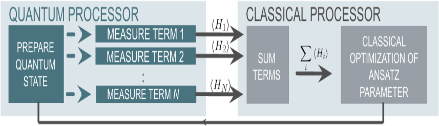

通过允许β和γ角度的自由变化，QAOA找到固定步数的最佳路径。一旦通过经典优化循环确定了最佳角度，就可以通过β，γ和采样的状态的许多准备来读出分布。

## <a name="1.2-QAOA"></a> QAOA算法的实现

下面给出 QRunes 实现 QAOA 算法的代码示例：

```
    @settings:
        language = Python;
        autoimport = True;
        compile_only = False;
        
    @qcodes:
    //Solving the problem of Maximum Cutting
    variationalCircuit oneCircuit(vector<qubit> qlist, hamiltonian hp, avar beta, avar gamma){
        for(let i = 0 : 1: hp.length()){
            vector<qubit> tmp_vec;
            let hamiltonItem = hp[i];
            let dict_p = hamiltonItem.getFirst();
            for(map m in dict_p) {
                tmp_vec.add(qlist[m.first()]);
            }
    
            let coef = hamiltonItem.getSecond();
            VQG_CNOT(tmp_vec[0], tmp_vec[1]);
            VQG_RZ(tmp_vec[1], 2*gamma*coef);
            VQG_CNOT(tmp_vec[0], tmp_vec[1]);
        }
    
        for(let i=0: 1: qlist.length()){
            VQG_RX(qlist[i],2.0*beta);
        }
    }
    
    @script:
    import numpy as np
    
    #Convert the data format to be processed
    def trans(friendShip):
        pro = {}
        for i in range(len(friendShip)):
            for j in range (len(friendShip[i])):
                if i != j:
                    s = "Z" + str(i) + " " + "Z" + str(j)
                    pro[s] = friendShip[i][j]
        return pro
    
    if __name__=="__main__":
        firendShip =[[0, 0.8, 0.2, -0.2],[0.8, 0, 0, 0.7],[0.2, 0, 0, -0.3],[-0.2, 0.7, -0.3, 0]]
        print("what we r need to handle:")
        print(firendShip)
        problem = trans(firendShip)
    
        #Bulid pauli operator base on the data of problem
        Hp = PauliOperator(problem)
        qubit_num = Hp.getMaxIndex()
    
        machine = init_quantum_machine(QMachineType.CPU_SINGLE_THREAD)
        qlist = machine.qAlloc_many(qubit_num)
        step = 4
        beta = var(np.ones((step,1), dtype = 'float64'), True)
        gamma = var(np.ones((step,1), dtype = 'float64'), True)
       
        #Create a variable quantum circuit
        vqc = VariationalQuantumCircuit()
    
        #Insert Hadamard gates to each qubit as initial condition
        for i in qlist:
            vqc.insert(VariationalQuantumGate_H(i))
    
        #Insert quantum circuits corresponding to each step according to the step size
        for i in range(step):    
            vqc.insert(oneCircuit(qlist, Hp.toHamiltonian(1), beta[i], gamma[i]))
    
        #Calculate loss variables
        loss = qop(vqc, Hp, machine, qlist)  
        #Use momentum-based optimizer and get result variables
        optimizer = MomentumOptimizer.minimize(loss, 0.02, 0.9)
        leaves = optimizer.get_variables()
    
        for i in range(100):
            loss_value = optimizer.get_loss()
            print("i: ", i, " loss:", loss_value )
            optimizer.run(leaves, 0)
    
        prog = QProg()
        qcir = vqc.feed()
        prog.insert(qcir)
        #Run quantum programs
        directly_run(prog)
    
        result = quick_measure(qlist, 100)
        print(result)
```

## <a name="1.3-QAOA"></a>QAOA算法小结

我们用于求解这些问题的经典方法已经历了数十年的打磨发展，效果已经相当好了。即使早期 NISQ 时代的量子设备还无法与最好的经典计算机媲美，实验结果也可能会激励我们期待看到 QAOA 或 VQE 在未来超越经典方法，从而近一步推动技术发展。QAOA很有意思的一个原因是它具有展示量子霸权潜力。


# <a name="2-DJ"></a>Deutsch–Jozsa算法 

##  <a name="2.1-DJ"></a>Deutsch–Jozsa算法介绍  

Deutsch–Jozsa算法是一种经过设计的情况，它证明了量子算法相对于经典算法有指数级别的加速能力。D-J算法的问题描述是这样的：

**问题描述：**

考虑函数：

$$f:\{0,1\}^n→\{0,1\}$$

我们保证有如下两种可能性:

(1) f是常数的(Constant)， 即是对 $x∈\{0,1\}^n$， 都有 f(x) = 0 或 f(x) = 1。
(2) f是平衡的(Balanced)， 对于输入的 $x∈\{0,1\}^n$， f(x)出输出0和1的个数相同。

算法的目标：判断函数f是什么类型。

**经典算法情况：** 

在最简单的情况下，最少也需要2次才能判断函数属于什么类型。因为需要第二个输出才能判断最终函数的类型。对于n位输入时，最坏的情况下需要 $2^{n-1}$ 次才能确认。

**量子算法：**
通过构造Oracle的方式，仅需运行一次就能确定函数属于哪一类。

**植入步骤：**

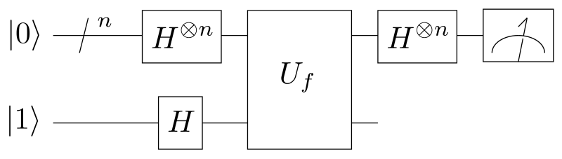

第一步，制备n个工作 (Working) 比特到 \|0\⟩ 态，与一个辅助 (Ancillary) 比特到 \|1\⟩。

第二步，所有比特都经过 Hadamard 变换，使系统处于叠加态上。

$$ |0⟩^{⨂n}  |1⟩^{H^{⨂n+1}}\rightarrow \frac{1}{\sqrt{2^n}}\sum_{x=0}^{2^n-1}|x⟩\left (\frac{(|0⟩-|1⟩)}{\sqrt2} \right)$$

第三步，系统通过Oracle ，一种酉变换，满足：

$$U_f：|x⟩|y⟩→|x⟩|y⊕f(x)⟩$$

这时候，系统状态为：

$$\frac{1}{\sqrt{2^n }}\sum_{x=0}^{2^n-1}|x⟩\left(\frac{(|0⟩ -|1⟩)}{\sqrt{2}}\right)\overset{oracle}{\rightarrow}\frac{1}{\sqrt{2^n }} \sum_{x=0}^{2^n-1}(-1)^{f(x)} |x⟩\left(\frac{(|0⟩ -|1⟩)}{\sqrt{2}}\right)$$

当f(x)=1时，会使得$\frac{(|0⟩-|1⟩)}{\sqrt{2}} →\frac{(|1⟩-|0⟩)}{\sqrt{2}}$，发生相位的翻转。

第四步：去除辅助比特，执行 Bell 测量。如果输出全部为0，则是f是常数的，反之，这是平衡的。


## <a name="2.2-DJ"></a>Deutsch–Jozsa算法的实现 

下面给出 QRunes 实现 Deutsch–Jozsa 算法的代码示例：

```
    @settings:
    language = Python;
    autoimport = True;
    compile_only = False;
    
    @qcodes:
    circuit<vector<qubit>,qubit> generate_two_qubit_oracle(vector<bool> oracle_function){
        return lambda (vector<qubit> qlist,qubit qubit2):{
            if (oracle_function[0] == false &&
                oracle_function[1] == true)
            {
                // f(x) = x;
                CNOT(qlist[0], qubit2);
            }
            else if (oracle_function[0] == true &&
                oracle_function[1] == false)
            {
                // f(x) = x + 1;
                CNOT(qlist[0], qubit2);
                X(qubit2);
            }
            else if (oracle_function[0] == true &&
                oracle_function[1] == true)
            {
                // f(x) = 1
                X(qubit2);
            }
            else
            {
                // f(x) = 0, do nothing  
            }
        };
    }
    
    Deutsch_Jozsa_algorithm(vector<qubit> qlist,qubit qubit2,vector<cbit> clist,circuit<vector<qubit>,qubit> oracle){
        X(qubit);
        apply_QGate(qlist, H);
        H(qubit2);
        oracle(qlist,qubit2);
        apply_QGate(qlist, H);
        measure_all(qlist,clist);
    }
    
    @script:
    def two_qubit_deutsch_jozsa_algorithm(boolean_function):
        init(QMachineType.CPU_SINGLE_THREAD)
        qubit_num = 2
        cbit_num = 1
        qvec = qAlloc_many(qubit_num)
        cvec = cAlloc_many(cbit_num)
        oracle = generate_two_qubit_oracle(boolean_function)
        prog = Deutsch_Jozsa_algorithm([qvec[0]],qvec[1],[cvec[0]],oracle)
        result = directly_run(prog)
        if cvec[0].eval() == False:
            print("Constant function!")
        elif cvec[0].eval() == True:
            print("Balanced function!")
        finalize()


    if __name__ == '__main__':
        fx0 = 0
        fx1 = 1
        print("input the input function")
        print("The function has a boolean input")
        print("and has a boolean output")
        print("f(0)= (0/1)?")
        fx0 = int(input())
        print("f(1)=(0/1)?")
        fx1 = int(input())
        oracle_function = [fx0,fx1]
        print("Programming the circuit...")
        two_qubit_deutsch_jozsa_algorithm(oracle_function)

```

##  <a name="2.3-DJ"></a>Deutsch–Jozsa算法小结


经典算法的验证次数是 O(2^n) 的，量子算法算上叠加态的准备和测量的时间，需要的操作步骤为 O(n)。所以我们说明量子算法相对于经典算法具有指数级别加速的特性。
D-J算法的问题在于它解决的问题既不实用，又具有很大的限制（要求平衡函数中必须恰好为一半0一半1）。另外，我们还对黑盒子本身的形态有要求。所以说D-J算法的理论意义是远大于其实用意义的。


# <a name="3-Grover"></a>Grover算法

## <a name="3.1-Grover"></a> Grover算法介绍

什么是搜索算法呢？举一个简单的例子，在下班的高峰期，我们要从公司回到家里。开车走怎样的路线才能够耗时最短呢？我们最简单的想法，当然是把所有可能的路线一次一次的计算，根据路况计算每条路线所消耗的时间，最终可以得到用时最短的路线，即为我们要找的最快路线。这样依次的将每一种路线计算出来，最终对比得到最短路线。搜索的速度与总路线数N相关，记为 O(N) 。而采用量子搜索算法，则可以以 O(sqrt(N)) 的速度进行搜索，要远快于传统的搜索算法。

那么我们怎么实现Grover搜索算法呢？ 

首先，我们先化简一下搜索模型。我们将所有数据存在数据库中，假设我们有n个量子比特，用来记录数据库中的每一个数据的索引，一共可以表示 $2^n$ 个数据，记为N个。我们希望搜索得到的数据有M个。为了表示一个数据是否我我们搜索的结果。我们建立一个函数：

$$f(x) = \left\{\begin{matrix}0 & (x \neq x_0)\\ 1 & (x = x_0) \end{matrix}\right.$$

其中 $x_0$ 为我们的搜索目标的索引值。也就是说，当我们搜索到我们的目标时，我们的函数值f(x)置为1，如果搜索的结果不是我们的目标时，f(x)置为0。

接下来，我们假设有一个量子Oracle可以识别搜索问题的解，是别的结果通过Oracle的一个量子比特给出。我们可以将Oracle定义为:

$$ |x⟩|q⟩\overset{Oracle}{\rightarrow} |x⟩|q⟩⨁f(x)⟩$$

其中 \|q⟩ 是一个结果寄存器, ⨁ 是二进制加法，通过Oracle，我们可以实现，当搜索的索引为我们的目标结果时，结果寄存器翻转；反之，结果寄存器值不变。从而我们可以通过判断结果寄存器的值，来确定搜索的对象是否为我们要的目标值。
如此描述Oracle有些抽象，Oracle对量子态的具体操作是什么样的呢？同D-J算法相似，我们先将初态制备在 $|0⟩ ⨁^{n}|1⟩$ 态上，$0⟩⨁^{n}$ 为查询寄存器，$1⟩$ 为结果寄存器。 经过 Hardmard 门操作后，可以将查询寄存器的量子态，变为所有结果的叠加态。换句话说，经过了 Hardmard 门，
我们就可以得到所有结果的索引。而结果寄存器则变为 $\frac{1}{\sqrt{2}}(|0⟩ - |1⟩)$ 接下来，使其通过Oracle，可以对每一个索引都进行一次检验，如果是我们的目标结果，则将答案寄存器的量子态进行0、1翻转，即答案寄存器变为 

$$ \frac{1}{\sqrt{2}}(|1⟩ - |0⟩) = -\frac{1}{\sqrt{2}}(|1⟩ - |0⟩)$$

，而查询寄存器不变。而当检验的索引不是我们要求的结果时，寄存器均不发生改变。因此，Oracle可以换一种表示方式

$$|x⟩\left ( \frac{|0⟩-|1⟩}{\sqrt{2}} \right )\overset{Oracle}{\rightarrow}(-1)^{f(x)}|x⟩\left ( \frac{|0⟩-|1⟩}{\sqrt{2}} \right )$$

其中，\|x⟩ 是查询寄存器的等额叠加态中的一种情况。 

也就是说，Oracle的作用，是通过改变了解的相位，标记了搜索问题的解。

现在，我们已经将搜索问题的解通过相位标记区分出来了。那么如何能够将量子态的末态变为已标记出的态呢？

我们将问题换一种思路进行考虑。我们知道，当查询寄存器由初态经过 Hardmard 门后，会变为所有可能情况的等额叠加态。也就是说，它包含着所有搜索问题的解与非搜索问题的解。我们将这个态记为

$$|\psi⟩ = \frac{1}{\sqrt{N}}\sum_{x}|x⟩$$

我们将所有非搜索问题的解定义为一个量子态 \|α⟩ ,其中 $sum_{x_{1}}$  代表着 x 上所有非搜索问题的解的和。

$$ |\alpha⟩  = \frac{1}{\sqrt{N - M}}\sum_{x_1}|x⟩$$

显然，\|β⟩ 为我们期望的最终的量子态，而且 \|α⟩ 和 \|β⟩ 相互正交。利用简单的代数运算，我们就可以将初态 \|ψ⟩ 重新表示为

$$|\psi⟩ = \sqrt{\frac{N -M}{N}}|\alpha⟩+\sqrt{\frac{M}{N}}|\beta⟩$$

也就是说，我们用搜索问题的解的集合和非搜索问题的解的集合，重新定义了初始态换句话说，我们的初态属于 \|α⟩ 与 \|β⟩ 张成的空间。因此，我们可以用平面向量来表示这三个量子态，如图。

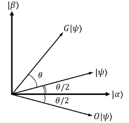

那么，Oracle作用在新的表示方法下的初态会产生怎样的影响呢？
我们知道，Oracle的作用是用负号标记搜索问题的解，因此相当于将 \|β⟩ 内每一个态前均增加一个负号，将所有的负号提取出来，可以得到：

$$|\psi⟩ \overset{Oracle}{\rightarrow} \sqrt{\frac{N -M}{N}}|\alpha⟩ - \sqrt{\frac{M}{N}}|\beta⟩$$

对应在平面向量中，相当于将 \|ψ⟩ 做关于 \|α⟩ 轴的对称。
但是，仅仅有这一种操作，是无法将量子态从 \|ψ⟩ 变为 \|β⟩ 。我们还需要另一种对称操作。

第二种对称操作，是将量子态关于|ψ⟩ 对称的操作。这个操作由三个部分构成。 

1. 将量子态经过一个 Hardmard 门。 
2. 对量子态进行一个相位变换，将$|0⟩ ⨁^n$ 态的系数保持不变，将其他的量子态的系数增加一个负号。相当于$2|0⟩⟨0|-I$ 酉变换算子。 
3. 再经过一个 Hardmard 门。 

这三步操作的数学表述为:

$$H^{\bigotimes n}(2|0⟩⟨0|-I)H^{\bigotimes n}= 2|\psi ⟩⟨\psi|-I$$

上述过程涉及到复杂的量子力学知识，如果你不理解，没关系。你只需要知道，这三部分的操作，只是为了实现将量子态关于|ψ⟩ 对称即可。如果你想了解为什么这三步操作可以实现，可以阅读关于量子计算相关书籍进一步理解。

前面介绍的两种对称操作，合在一起称为一次Grover迭代。假设初态 \|ψ⟩与 \|α⟩ 可以表示为

$$|\psi⟩ = cos\frac{\theta}{2}|\alpha⟩ + sin\frac{\theta}{2}|\beta⟩$$

很容易得到

$$cos\frac{\theta}{2} = \sqrt{\frac{N-M}{N}}$$

可以从几何图像上看到，每一次Grover迭代，可以使量子态逆时针旋转 θ。经历了k次Grover迭代，末态的量子态为：

$$ G^{k}|\psi⟩ = cos\left (\frac{2k+1}{2}\theta\right )|\alpha⟩  + sin\left (\frac{2k+1}{2}\theta\right )|\beta⟩ $$

因此，经过多次迭代操作，总可以使末态在|β⟩ 态上概率很大，满足精确度的要求。经过严格的数学推导，可证明，迭代的次数R满足:

$$R\leq \frac{\pi }{4}\sqrt{\frac{N}{M}}$$

**参考线路图：**

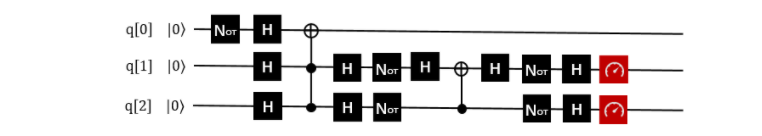


## <a name="3.2-Grover"></a>Grover算法的实现

下面给出 QRunes 实现 Grover 算法的代码示例：

```
    @settings:
    language = Python;
    autoimport = True;
    compile_only = False;
    
    @qcodes:
    circuit<vector<qubit>,qubit> generate_3_qubit_oracle(int target){
        return lambda (vector<qubit> qvec, qubit qu):{
            if(target == 0){
                X(qvec[0]);
                X(qvec[1]);
                Toffoli(qvec[0], qvec[1], qu);
                X(qvec[0]);
                X(qvec[1]);
            }
            if(target == 1){
                X(qvec[0]);
                Toffoli(qvec[0], qvec[1], qu);
                X(qvec[0]);
            }
            if(target == 2){
                X(qvec[1]);
                Toffoli(qvec[0], qvec[1], qu);
                X(qvec[1]);
            }
            if(target == 3){
                Toffoli(qvec[0], qvec[1], qu);
            }
        };
    }
    
    circuit diffusion_operator(vector<qubit> qvec){
        vector<qubit> controller;
        controller = qvec[0: qvec.length()-1];
        for (qubit q in qvec)
            H(q);
        for (qubit q in qvec)
            X(q);
        Z(qvec[qvec.length()-1]).control(controller);
        for (qubit q in qvec)
            X(q);
        for (qubit q in qvec)
            H(q);
    }
    
    Grover_algorithm(vector<qubit> working_qubit, qubit ancilla, vector<cbit> cvec, 
                        circuit<vector<qubit>,qubit> oracle, int repeate){
                    
                    X(ancilla);
                    for(qubit q in working_qubit)
                        H(q);
                    H(ancilla);
    
                    if(repeate == 0){
                        let sqrtN = 1 << (working_qubit / 2);
                        repeate = 100 * sqrtN;
                    }
    
                    for(let i = 0 : 1 : repeate){
                        oracle(working_qubit, ancilla);
                        diffusion_operator(working_qubit);
                    }
    
                    Measure_all(working_qubit, cvec);
    }
    
    @script:
    if __name__ == '__main__':
        condition = 1
        while condition == 1:
            print("input the input function")
            print("The function has a boolean input")
            print("and has a boolean output")
            print("target=(0/1/2/3)?")
            target = int(input())
            print("Programming the circuit...")
            oracle = generate_3_qubit_oracle(target)
    
            qvm = init_quantum_machine(QMachineType.CPU_SINGLE_THREAD)
    
            qubit_number = 3
    
            working_qubit = qvm.qAlloc_many(qubit_number-1)
            
            ancilla = qvm.qAlloc()
    
            cbitnum = 2
            cvec = qvm.cAlloc_many(cbitnum);
            
            repeate = 1
            
            prog = Grover_algorithm(working_qubit, ancilla, cvec, oracle, repeate)
    
            # To Print The Circuit
            print(to_QRunes(prog, qvm))
    
            resultMap = directly_run(prog)
            
            if resultMap["c0"]:
                if resultMap["c1"]:
                    print("target number is 3 !")
                else:
                    print("target number is 2 !")
            else:
                if resultMap["c1"]:
                    print("target number is 1 !")
                else:
                    print("target number is 0 !")
            destroy_quantum_machine(qvm)
```

## <a name="3.3-Grover"></a>Grover算法小结

1996年，Lov Grover提出了量子搜索算法，对于N个无序列数据里寻求1个有效数据，经典算法给出的有效时间复杂度为O(N)，而Grover证明了处理同样的问题，量子算法可以做到时间复杂度为O(√N)。也就说Grover的搜索算法可以以指数级的加速改善搜索复杂度。
如何更直观理解：假设给定相同的问题，量子计算用10000次就解决，但是经典计算机则需要10000^2=100000000，这是一万和一亿的差距。由此可见，对于大数据的搜索，Grover算法印证了量子计算能大显身手，可有效解决搜索问题。


# <a name="4-HHL"></a>HHL算法 

## <a name="4.1-HHL"></a>HHL算法介绍

HHL算法是一个用量子计算机解决线性问题Ax=b最优解的算法，广泛的被应用于许多量子机器学习算法中（如支持向量机SVM，主成分分析PCA等等）。量子算法在其经典计算对比下，呈指数级加速。Harrow, Hassidim 和 Lloyd（HHL）提出了一种求解线性系统 Ax=b (其中A是算子，x，b是向量)中x信息的量子线性系统分析。HHL算法解决了什么样的问题？那就是求解线性方程的问题。

HHL算法的输入和输出:

- 输入：一个n*n的矩阵A和一个n维向量b， 

- 输出：n维向量x，满足Ax=b。

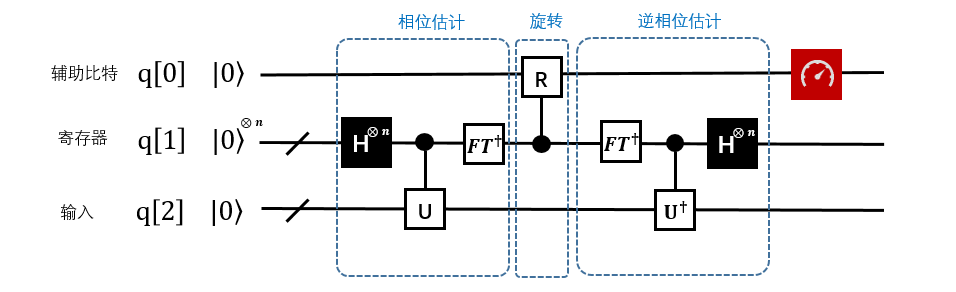
    
HHL的限制条件：

1. 输入的矩阵，必须是adjoint矩阵，当A不是Hermitian时，需要构造成adjoint矩阵。算法的输入部分如图1中红色方框所标出。输入q[2]存放在底部寄存器中，输入A作为相位估计中酉算子的一个组成部分。
2. 输出x的形式：算法的输出如红色部分标出（同一个寄存器）。底部寄存器存放的是一个蕴含了向量x的量子态。 此处不需要知道这个状态具体情况。

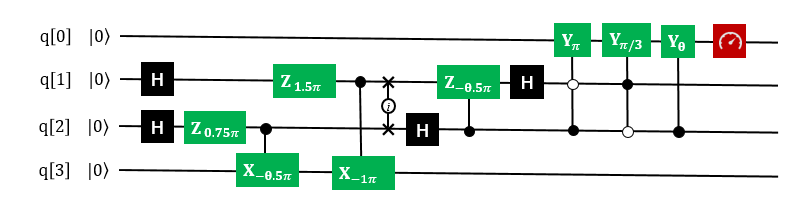

## <a name="4.2-HHL"></a>HHL算法的实现 

下面给出 QRunes 实现 HHL 算法的代码示例：

```
    @settings:
        language = Python;
        autoimport = True;
        compile_only = False;
    
    @qcodes:
    circuit CRotate(vector<qubit> q) {
        vector<qubit> controlVector;
        controlVector.add(q[1]);
        controlVector.add(q[2]);
        X(q[1]);
        RY(q[0], Pi).control(controlVector);
        X(q[1]);
        X(q[2]);
        RY(q[0], Pi/3).control(controlVector);
        X(q[2]);
        RY(q[0], 0.679673818908).control(controlVector);  //arcsin(1/3)
    }
    
    //Phase estimation algorithms
    circuit hhlPse(vector<qubit> q) {
     
        H(q[1]);
        H(q[2]);
        RZ(q[2], 0.75*Pi);
        CU(Pi, 1.5*Pi, -0.5*Pi, Pi/2, q[2], q[3]);
        RZ(q[1], 1.5*Pi);
        CU(Pi, 1.5*Pi, -Pi, Pi/2, q[1], q[3]);
        
        CNOT(q[1], q[2]);
        CNOT(q[2], q[1]);
        CNOT(q[1], q[2]);
    
        H(q[2]);
        CU(-0.25*Pi, -0.5*Pi, 0, 0, q[2], q[1]);
        H(q[1]);
    }
    
    hhl_no_measure(vector<qubit> qlist, vector<cbit> clist) {
        //phase estimation
        hhlPse(qlist);
        //rotate
        CRotate(qlist);
        Measure(qlist[0], clist[0]);
        qif (clist[0]) {
            hhlPse(qlist).dagger();
        }
    }
    
    @script:
    if __name__ == '__main__':
        init(QMachineType.CPU_SINGLE_THREAD)
    
        qubit_num = 4
        cbit_num = 2
        qv = qAlloc_many(qubit_num)
        cv = cAlloc_many(cbit_num)
        hhlprog = QProg()
        hhlprog.insert(RY(qv[3], 3.14159265358979/2))   #change vecotr b in equation Ax=b
        hhlprog.insert(hhl_no_measure(qv, cv))
        directly_run(hhlprog)
        pmeas_q = []
        pmeas_q.append(qv[3])
        res = PMeasure_no_index(pmeas_q)
        print('prob0: %s' %(res[0]))
        print('prob1: %s' %(res[1]))
    
        finalize()
```

## <a name="4.3-HHL"></a> HHL算法小结

线性系统是很多科学和工程领域的核心，由于HHL算法在特定条件下实现了相较于经典算法有指数加速效果，从而未来能够在机器学习、数值计算等场景有优势体现。配合Grover算法在数据方面的加速，将是未来量子机器学习，人工智等科技得以突破的关键性技术。


# <a name="5-QuantumWalk"></a> QuantumWalk算法

## <a name="5.1-QuantumWalk"></a> QuantumWalk算法介绍

QuantumWalk作为一种新的量子计算模型具有巨大的前景，为经典算法寻求量子版本的解决方案提供了新思路。将量子漫步理论与聚类算法相结合，在分析图上离散量子漫步特点及其在解决聚类问题时存在不足的前提下，采取将漫步空间网格化的方式将模型简化，提出一种网格化量子漫步聚类模型，使之能够很好的完成聚类任务，该模型将数据点考虑为在量子网格世界中的根据特定规则执行漫步过程的量子，由于量子叠加等特性的存在，量子漫步聚类居右更好的时间效率和侦探能力，仿真实验也表明算法在聚类正确性上具有不错的表现。

近十年来，量子漫步作为一种新的量子计算模型崭露头角，并由于量子漫步构造的量子算法在许多问题的求解上相比于经典算法具有明显的优势，因此其在搜索、组合优化、元素区分等领域均取得了重大的进展。另外，Childs和Lovett等分别提出了离散和连续两种具有通用意义上的量子漫步架构，阐述了一切量子算法均可在建立于量子漫步模型的一般算法框架，这促成了量子漫步模型成为构建通用算法的新思路。

## <a name="5.2-QuantumWalk"></a> quantumWalk算法的实现


下面给出 QRunes 实现 QuantumWalk 算法的代码示例：

```
    @settings:
        language = Python;
        autoimport = True;
        compile_only = False;
        
    @qcodes:
    circuit addOne(vector<qubit> q) {
        vector<qubit> vControlQubit;
        vControlQubit.insert(q, 1, q.length()-1);
        for (let i=0: 1: q.length()) {
            X(q[i]).control(vControlQubit);
            if (vControlQubit.length() >= 1) {
                vControlQubit.remove(0);
            }
        }
    }
    
    circuit walkOneStep(vector<qubit> q) {
        let iLength = q.length();
        X(q[iLength-1]);
        vector<qubit> vCQubit;
        vCQubit.insert(q, 1, q.length());
        addOne(q);
        X(q[iLength-1]);
        addOne(q).dagger();
    }
    
    //continuous quantum walks,consists of a walker and an evolution operator.
    quantumWalk(vector<qubit> q, vector<cbit> c) {  
        let length = q.length();
        X(q[length-2]);
        X(q[length-2]);
        for (let i=0: ((1 << length)-1): 1) {
            H(q[length - 1]);
            walkOneStep(q);
        }
    }
    
    @script:
    import sys
    if __name__ == '__main__':
        print('welcome to Quantum walk')
        qubit_num = int(input('please input qubit num\n'))
        if qubit_num < 0 or qubit_num > 24:
            print('error: qubitnum need > 0 and < 24')
            sys.exit(1)
        init(QMachineType.CPU_SINGLE_THREAD)
    
        cbit_num = qubit_num
        qv = qAlloc_many(qubit_num)
        cv = cAlloc_many(cbit_num)
        qv.append(qAlloc())
        qwAlgorithm = quantumWalk(qv, cv)
        result = prob_run_dict(qwAlgorithm, qv)
        for key,value in result.items():
            print(str(key) + " : " + str(value))
    
        finalize()
```

## <a name="5.3-QuantumWalk"></a> QuantumWalk算法小结

量子漫步是一种典型的量子计算模型, 近年来开始受到量子计算理论研究者们的广泛关注。该算法的时间复杂度与Grover算法相同, 但是当搜索的目标数目多于总数的1/3时搜索成功概率大于Grover算法。
量子漫步的实现对研发量子计算机具有开创性的重大意思，通过它新的算法就可以得到应用。比如，在现在技术中，要从一串0中找到某一个0，人们必须检查每个数位，所需的时间随0的总体数量的增加而线性增加。如果使用量子漫步算法，漫步者可以同时在多处搜索，“大海捞针”的速度就被极大的提高了。


# <a name="6-Simon"></a> Simon算法

## <a name="6.1-Simon"></a>Simon算法介绍

Simon问题是Daniel Simon在1994年提出。它是一个计算问题, 可以在量子计算机上以指数速度相较经典计算机更快地解决。虽然这个问题本身目前没有在实际应用中产生实际价值, 但它的趣味内涵在于它证明了量子算法可以比任何经典算法更快地解决这个问题。

Simon的算法也启发了Shor算法（详细请查阅Shor量子算法）。这两个问题都是阿贝尔隐子群（Abelian hidden subgroup problem）问题的特例, 而且是现今已知有效的量子算法。

**问题描述：**

- 给定一个方程： 

$$ f:\{0,1\}^n→\{0,1\}^n ​$$

- 存在 $s∈\{0,1\}^n​$，对所有的 $x,y∈\{0,1\}^n​$，满足下面的性质：
    $f(x)=f(y)​$ 当且仅当  $x=y​$ 或 $x⊕y=s​$

（这里⊕表示模2加。)

**算法目标：**

寻找s.
例：n=2的Simon问题,考虑2量子比特。注意，如果目标 $s=0^n$，那这个函数是1对1（one-to-one）的，此处不考虑。反之，则是一个二对一(two-to-one)的函数，几种情况如下图（函数值任意给定）：

|   (1)s=01|   |   (2)s=10|   | 	(3)s=11 |  |
| ---- | ---- | ---- | ---- | ---- | ---- |
| x    | f(x) | x    | f(x) | x    | f(x) |
| 00   | 1    | 00   | 1    | 00   | 1    |
| 01   | 1    | 01   | 2    | 01   | 3    |
| 10   | 0    | 10   | 1    | 10   | 3    |
| 11   | 0    | 11   | 2    | 11   | 1    |


在（1）很容易看出 $f(00)=f(01)=1$，$f(10)=f(11)=0$，因此 $00⊕01=01$， $10⊕11=01$，推出 $s=01$。经典算法最低需要2次的才能确定，一般情况下，对于n比特的问题估计找到目标s最糟糕的情况下要消耗多达 $2^{n-1}+1$ 次。但是在量子算法里，1次就解决了这个问题。

**量子Oracle**

Simon问题的量子Oracle(考虑s=11)

考虑n=2的Simon问题，此时需要2量子比特的变量和2量子比特的函数，合计需要4量子比特。

- 下面考虑Simon问题的Oracle:

$$ | x_0 x_1 ⟩ |00⟩\overset{U_f}{\rightarrow} |x_0 x_1 ⟩ |00⊕f(x_0 x_1 ) ⟩=|x_0 x_1 ⟩ |f(x_0 x_1 ) ⟩ $$

- 线路图如下:

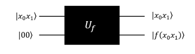

上面的这个量子Oracle可以加入Hadamard门，对前两个量子比特做H操作，等价于：

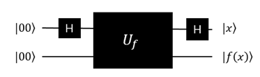

**过程：**

$$|0000⟩\xrightarrow[]{H⨂H⨂I⨂I}|++⟩|00⟩\xrightarrow[]{U_f}\frac{1}{2}[(|00⟩+|11⟩ )|1⟩+(|01⟩+|10⟩ ) |3⟩ ]\xrightarrow[]{H⨂H⨂I⨂I}\frac{1}{2} [(|00⟩+|11⟩ )|1⟩+(|00⟩-|11⟩ )|3⟩ ]$$

 (注意：$|3⟩$ 是我定义的函数值)

因此，最下面的两个位分别对应了 $|1⟩$ 和 $3⟩$，测量上面的两量子位，$|00⟩$ 和 $|11⟩$ 则会被以50%的概率被观察到。

**下面是QRunes的实施过程：**

```
    1.	初始化4个量子比特。
    2.	创建线路图: q[0], q[1]分别做Hadamard操作。
    3.	对q[0]，q[2]和q[1], q[2]分别执行CNOT操作。
    4.	对q[3]执行NOT操作。
    5.	再对q[0]，q[1]分别做Hadamard操作
    6.	最后测量全部量子逻辑位，输出结果。
```

**Simon问题(s=11）的线路图设计参考图：**

 这里，测定结果得|00⟩的时候，表示没有得到任何的信息，当测量得到|11⟩的时候，就得到了s=11，也就是说Simon量子算法里面，0以外的获取s的概率为50%。

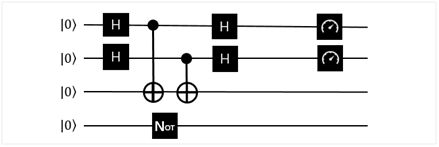

s=10的线路图参考，流程和思路和上面完全一致，测试用。
s= 10:

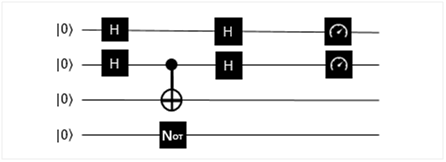

## <a name="6.2-Simon"> Simon算法的实现

**下面给出 QRunes 实现 Simon 算法的代码示例：**

```
    @settings:
        language = Python;
        autoimport = True;
        compile_only = False;
        
    @qcodes:
    //CNOT operations are performed on q[0]、q[2] and q[1]、 q[2], respectively
    //Perform NOT operations on q[3]
    circuit controlfunc(vector<qubit> q, int index, int value) {
        let length = q.length() / 2;
        vector<qubit> qvtemp;
        qvtemp.insert(q, 0, length);
        if (index == 1) {
            X(q[0]);
        } else if (index == 2) {
            X(q[1]);
        } else if (index == 0) {
            X(q[0]);
            X(q[1]);
        }

        if (value == 1) {
            X(q[3]).control(qvtemp);
        } else if (value == 2) {
            X(q[2]).control(qvtemp);
        } else if (value == 3) {
            X(q[2]).control(qvtemp);
            X(q[3]).control(qvtemp);
        }

        if (index == 1) {
            X(q[0]);
        } else if (index == 2) {
            X(q[1]);
        } else if (index == 0) {
            X(q[0]);
            X(q[1]);
        }
    }

    //f(x),x is 2bits variable
    circuit oraclefunc(vector<qubit> q, vector<int> funvalue) {
        let length = q.length()/2;
        for (let i=0: 1: 4) {
            controlfunc(q, i, funvalue[i]);
        }
    }

    Simon_QProg(vector<qubit> q, vector<cbit> c, vector<int> funvalue) {
        let length = c.length();
        // q[0]、q[1] Do the Hadamard operation separately
        for (let i=0: 1: length) 
            H(q[i]);
        oraclefunc(q, funvalue);
        //Then Hadamard operations are performed on q[0]、q[1], respectively.
        for (let i=0: 1: length) 
            H(q[i]);
        //Finally, all quantum logic bits are measured and the output results are obtained.
        for (let i=0: 1: length) 
            Measure(q[i], c[i]);
    }
    
    @script:
    if __name__ == '__main__':
        print('4-qubit Simon Algorithm')
        print('f(x)=f(y)\t x+y=s')
        print('input f(x),f(x):[0,3]')
        func_value = []
        func_value.append(int(input('input f(0):\n')))
        func_value.append(int(input('input f(1):\n')))
        func_value.append(int(input('input f(2):\n')))
        func_value.append(int(input('input f(3):\n')))
        print('f(0)=%d' %(func_value[0]))
        print('f(1)=%d' %(func_value[1]))
        print('f(2)=%d' %(func_value[2]))
        print('f(3)=%d' %(func_value[3]))
        print('Programming the circuit...')
    
        init(QMachineType.CPU_SINGLE_THREAD)
        qubit_num = 4
        cbit_num = 2
        # Initialization of 4 quantum bits
        qv = qAlloc_many(qubit_num)
        cv = cAlloc_many(cbit_num)
        simonAlgorithm = Simon_QProg(qv, cv, func_value)
    
        result = []
        for i in range(0, 20, 1):
            re = directly_run(simonAlgorithm)
            result.append(cv[0].eval()*2 + cv[1].eval())
        if 3 in result:
            if 2 in result:
                print('s=00')
            else:
                print('s=11')
        elif 2 in result:
            print('s=01')
        elif 1 in result:
            print('s=10')
        
        finalize()
```

## <a name="6.3-Simon">Simon算法小结
在一台量子计算机上运行了该算法的最简单版本,仅仅用了六个量子比特,量子计算机完成 这一任务仅用了两次迭代,而普通计算机得用三次。这种区别似乎不算什么,但人们相信,如果增加更多量子比特,量子计算机和普通计算机运算能力的差别就会拉 大,这也意味着,量子计算机能更快、更高效地解决此类算法问题。不过,还是要泼一盆冷水,到目前为止,能够运行西蒙算法并没有什么实际价值,该实验的唯一 目的是证明量子计算机在一种算法上能够做得更好。


# <a name="7-CoinFlip">CoinFlip算法

## <a name="7.1-CoinFlip">CoinFlip算法介绍

**问题描述：**

E.D.Schell在1945年1月版的美国数学月刊上提出了假币问题，初始问题是给定一定数量的硬币，其中一枚假币的质量和其他真币的质量不一样（外形一样，但质量轻），给定一个天平，可用来确定哪一枚是假币（通过天平的倾斜与否来判断重量差异）。

**理解问题：（以下是帮助理解规则）**

假设给定10枚硬币，其中一枚硬币是假的，质量比真硬币轻。

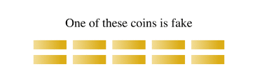

第一步，将10枚硬币均分为两组，每一组包含5个硬币：

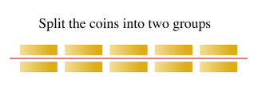


第二步，使用天平来判断：

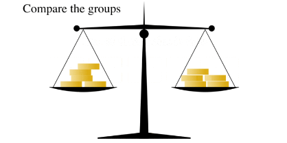

第三步：根据倾斜程度，可以判断假币在哪一个分组里，如下图，假硬币在左侧。

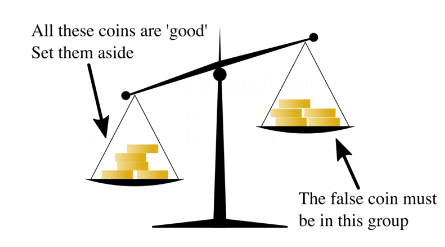

第四步，将包含假币的5枚硬币拿出来。

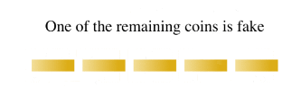

第五步，将5枚硬币划分为2组2枚的，外加单独1枚。

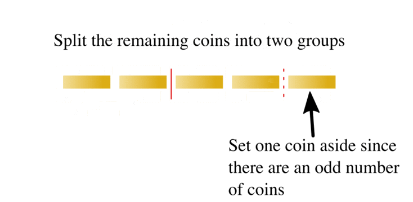

第六步，把2组硬币放入天平，查看天平倾斜情况。如果天平，持平，则额外的哪一枚是假币。

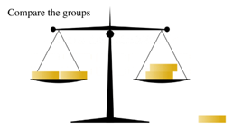

第七步，判断天平倾斜情况，如果是下面的情况，表明左侧包含了假币。

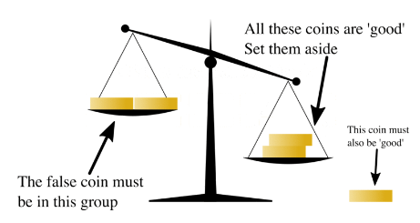

第八步，判断可能包含假币的两枚，分别放入天平两侧，一次性就可以判断出真假。

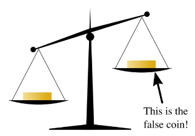

如上问题是对十个硬币的判断。（如上参考维基百科）

当然，该问题在不同的参考文献里有不同的版本，本实验算法里假设：

真币的重量均等，假币的质量也均等，假币的质量比真币轻。
天平只给我们提供两个信息，平衡（两组币的重量相同）或倾斜。

算法简述：给定N个外形一样的硬币，其中有k个假币，真币的质量均相等，假币质量轻。
算法目标：找出这k个假币。

**策略：**

本实验算法主要是Berstein 和 Vazirani 奇偶校验问题的一个应用，在经典策略里面，每次测量只能有一次，左右两边相同数的硬币数判断。而量子算法是通过构建叠加态从而对经典策略基础上的改进，我们可以同时查询叠加的左右两边状态。


**量子策略模型简述：**

在该问题里，平衡的天平模型可以用一个Oracle来刻画。简称B-Oracle(Balance Oracle)，它是一个N位的寄存器 $x_1 x_2…x_N∈\{0,1\}^N$，为了检索这些值，我们需要做一个查询（Query）,查询字符 $q_1 q_2…q_n∈\{0,1,-1\}^N$, 其中包括相同数量的1和-1（数量定义为L）。该Oracle返回1位的答案X，定义如下：

$$ f(x)=\left\{\begin{aligned}& 0 &  \sum_{i=1}^{n}{x_iq_i=0} \\&1& Otherwise \\\end{aligned}\right.​$$

考虑 $x_1 x_2…x_N$ 表示N个硬币，而且0表示硬币质量均等，1表示有一个假币。因此， $q_i=1$ 意味着我们把硬币 $x_i$ 放在天平右侧，$q_i=-1$ 则表示将x_i放在左侧盘里。这个时候我们必须保证，有相同数量的1和-1（天平里左右两侧放入相同数量的硬币），答案X正确的模拟了天平秤。如: $X=0$
则表示天平两边相等，反之  $X=1$ 表示倾斜。

有效的构造转化W(这里的思想可以参考Gervor算法). 从上面我们也可看出，如果N个硬币里包含了k（k大于1）个假币，那么Find(k)的复杂度是多项式时间复杂，我们已经在Bernstein-Vazirani算法接触了k=2的情况（请参考我们算法库里的Bernstein-Vazirani Algorithm ）。本算法主要目的是展示量子算法的优越性，因此只考虑包含一个假币的情况（即k=1）。

查找所有 k 假硬币的量子查询复杂度是入下表, 给定输入如上描述。

| Results   | k=1  | k=2         | k=3         | general       |
| --------- | ---- | ----------- | ----------- | ------------- |
| Quantum   | 1    | 1           | 2<=k<=3     | O(k^(1/4))    |
| Classical | logN | >=2log(N/2) | >=3log(N/3) | Ω(k log(N/k)) |


通过上表，比较清晰的展示了量子策略的优越性，尤其在多假币的情况下，当然，我们一个假币的情况，但是在硬币为N的时候，量子测量一次就可以完成。
一个假币的情况，详情请看Counterfeit Coin Game的参考线路图：

**参考线路图：**

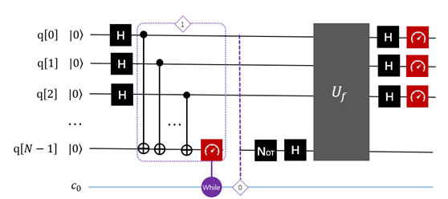

线路说明：紫色的if表示的是测量判断，根据输出的经典信息来判断是否需要执行下一步的操作。上面线路图里判定条件，如果输出为0的时候，则需要执行0 对应的操作，实际上就是从新执行一遍量子线路，反之，执行U_f操作，U_f指代了错误币所在位置的控制非门，目标位最后一位。

## <a name="7.2-CoinFlip"> CoinFlip算法的实现

下面给出 QRunes 实现 CoinFlip 算法的代码示例：

```
    @settings:
        language = Python;
        autoimport = True;
        compile_only = False;
        
    @qcodes:
    // Determine whether the next step needs to be performed based on the classical output information
    CoinFlip_Algorithm(vector<qubit> qlist, vector<cbit> clist, bool fx) {
        X(qlist[0]);
        H(qlist[0]);
        X(qlist[1]);
        CNOT(qlist[0], qlist[1]);
        H(qlist[1]);
        // If the output is 0, then the corresponding operation is needed later.
        if (fx) {
            X(qlist[0]);
        }
        H(qlist[0]);
        CNOT(qlist[0], qlist[1]);
        H(qlist[0]);
        Measure(qlist[0], clist[0]);
        Measure(qlist[1], clist[1]);
    }
        
    @script:
    import sys
    def CoinFlip_Prog(prog, q, c, fx):
        temp = CoinFlip_Algorithm(q, c, fx)
        prog.insert(temp)
        res = directly_run(prog)
        return ( c[1].eval() << 1) + int(c[0].eval())
    
    if __name__ == '__main__':
        print('Entanglement Flip Game')
        fx = int(input('Input choice of Q:(0/1)\n'))
        print('Programming the circuit...')
    
        init(QMachineType.CPU_SINGLE_THREAD)
    
        qubit_num = 2
        cbit_num = 2
        # Initialization of 2 quantum bits
        qv = qAlloc_many(qubit_num)
        cv = cAlloc_many(cbit_num)
        out_come = 0
        prog = QProg()
        temp = CoinFlip_Prog(prog, qv, cv, fx)
        for i in range(0, 10, 1):
            out_come = CoinFlip_Prog(prog, qv, cv, fx)
            if out_come != temp:
                print('Q wins!')
                sys.exit(0)
        print('max entanglement!')
        print('P wins!')
    
        finalize()
```

## <a name="7.3-CoinFlip">CoinFlip算法小结
我们传统的电脑构建模块，只能存储两个状态中的其中一个，就如硬币，50个同时抛掷你只能记录一种正反面的状态，50个硬币同时记录的话，就需要量子计算机就数千兆字节的数据存储才能达到。量子计算机就是这样的，它们是基于量子位的，它可以同时处于两个状态。这可以使每个硬币的单个量子位一次存储所有配置的概率分布


# <a name="8-BV">Bernstein-Vazirani算法

## <a name="8.1-BV">Bernstein-Vazirani算法介绍

量子计算机是相对经典计算机而言的，量子计算机并不是在通常的计算问题上取代传统的电子计算机，而是针对特定问题完成经典计算机难以胜任的高难度计算工作。它是以量子力学为基础，实现量子计算的机器。比如：若运Deutsch-Jozsa 问题的量子算法（DJ算法），只需运行一次，就可以分辨函数是常数函数还是对称函数，而运用相应的经典算法则需要运行O(N)次才能达到该目的。 后来，Bernstein和Vazirani运用DJ算法有效地解决了询问量子数据库的
问题（即BV算法）。

**问题描述：**

Input:
考虑一个经典的布尔函数：

$$ f:\{0,1\}^n→\{0,1\}$$

存在 $s∈\{0,1\}^n$ ，再定义一个函数：

$$f_s (x)=〈s,x〉  ,x∈\{0,1\}^n$$

s是一个未知的向量，通常称s为隐藏字符串（Hidden string），其中 $〈s,x〉$表示内积（inner product），定义为：

$$〈s,x〉=s_0 x_0⊕s_1 x_1⊕…⊕s_n x_n$$

符号 $⊕$  在所出现的量子算法文中都表示布尔加或模2加。）
Output：
算法目标：找到s.

**经典算法情况：**

由于对该函数的每个经典查询只能生成1位的信息, 而任意隐藏字符串 s 具有n位的信息, 所以经典查询复杂性是  $O(n)$ 。

**量子算法情况：**

Bernstein-Vazirani的工作建立在Deutsch和Jozsa早期工作理论上来探索量子查询复杂度。他们对该领域的贡献是一个用于隐藏字符串问题的量子算法, 该算法的非递归量子查询复杂度仅为1，同比经典情况 $O(n)$ 。这一量子算法的真正突破在于加快查询复杂度, 而不是执行时间本身。

案例：考虑n=3时的Bernstein-Vazirani问题。变量是3比特时，二进制表示为  $x_0 x_1 x_2$ ，常数s则表示为 $s_0 s_1 s_2$ ，因此所求的常数s总共有8个。此时，问题函数描述如下：

$$f_s (x_0 x_1 x_2 )=s_0 x_0⊕s_1 x_1⊕s_2 x_2 $$

不难看出，对于经典算法而言，如果是 $f_s (100)=s_0$ ,  $f_s (010)=s_1$ , $f_s (001)=s_2$ ，那么最少也需要3次调用函数才可以确定常量 $s=s_0 s_1 s_2$ 。但是对于量子算法而言，使用下面的量子Oracle计算，1次就可以决定 $s=s_0 s_1 s_2$，其计算复杂度为 $O(1)$ 。

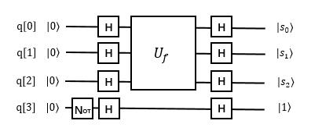

分析上图:

$$ |000⟩|1⟩\xrightarrow[]{H⨂H⨂H⨂H}\frac{2}{2\sqrt{2}}\sum_{x=0}^{7}{|x⟩⨂\left ( \frac{|0⟩-|1⟩}{\sqrt{2}}\right )}\\ \xrightarrow[]{U_f }\frac{1}{2\sqrt{2}}\sum_{x=0}^{7}{\left ( -1 \right )^\left \langle s,x\right \rangle\:   |x⟩⨂\left ( \frac{|0⟩-|1⟩}{\sqrt{2}} \right )}\\ \xrightarrow[]{H⨂H⨂H⨂H}\frac{2}{2\sqrt{2}}\sum_{x=0,y=0}^{7}{\left ( -1 \right )^{\left \langle s,x\right \rangle ⨂\left \langle x,y\right \rangle}\; \;    |y⟩⨂\left ( \frac{|0⟩-|1⟩}{\sqrt{2}} \right )\equiv|s⟩⨂\left ( \frac{|0⟩-|1⟩}{\sqrt{2}} \right ) }$$
    
不失一般性：

$$|0⟩^n|1⟩\xrightarrow[]{H^{⨂(n+1)}}\frac{1}{\sqrt{2^n}}\sum_{x=0}^{2^n-1}{|x⟩⨂\left ( \frac{|0⟩-|1⟩}{\sqrt{2}}\right )}\\ \xrightarrow[]{U_f }\frac{1}{\sqrt{2^n}}\sum_{x=0}^{2^n-1}{\left ( -1 \right )^\left \langle s,x\right \rangle\:   |x⟩⨂\left ( \frac{|0⟩-|1⟩}{\sqrt{2}} \right )}\\ \xrightarrow[]{H^{⨂(n+1)}}\frac{1}{\sqrt{2^n}}\sum_{x=0}^{2^n-1}{\left ( -1 \right )^{\left \langle s,x\right \rangle ⨂\left \langle x,y\right \rangle}\; \;    |y⟩⨂\left ( \frac{|0⟩-|1⟩}{\sqrt{2}} \right )\equiv|s⟩⨂\left ( \frac{|0⟩-|1⟩}{\sqrt{2}} \right ) } $$


**参考线路图：**

下面给出两组案例,分别是s=101和s=111
s=101

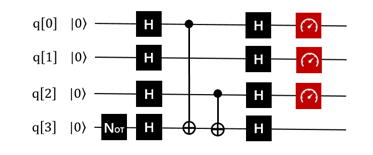

QRunes :

```
    RX 3,"pi"
    H 0
    H 1
    H 2
    H 3
    CNOT 0,3
    CNOT 2,3
    H 0
    H 1
    H 2
    MEASURE 0,$0
    MEASURE 1,$1
    MEASURE 2,$2
```

这时，输出的结果，指代了s。通过验证,输出结果为：


s=111时：
线路图设计为：

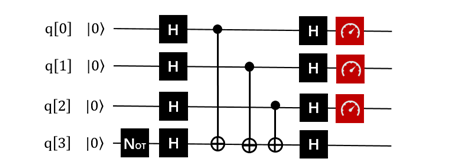

测量结果：


QRunes :

```
    RX 3,"pi"
    H 0
    H 1
    H 2
    H 3
    CNOT 0,3
    CNOT 1,3
    CNOT 2,3
    H 0
    H 1
    H 2
    MEASURE 0,$0
    MEASURE 1,$1
    MEASURE 2,$2
```

## <a name="8.2-BV">Bernstein-Vazirani算法的实现

下面给出 QRunes 实现 Bernstein-Vazirani 算法的代码示例：

```
    @settings:
        language = Python;
        autoimport = True;
        compile_only = False;
        
    @qcodes:
    // Hadamard gate operation and CNOT gate operation for a+1 qubit
    BV_QProg(vector<qubit> q, vector<cbit> c, vector<bool> a, bool b) {
        let length = q.length();
        X(q[length - 1]);
        for (let i=0: 1: length) {
            H(q[i]);
        }
        for (let i=0: 1: length-1) {
            if (a[i]) {
                CNOT(q[i], q[length - 1]);
            }
        }
        for (let i=0: 1: length-1) {
            H(q[i]);
        }
        for (let i=0: 1: length-1) {
            Measure(q[i], c[i]);
        }  
    }
        
    @script:
    import sys
    if __name__ == '__main__':
        print('Bernstein Vazirani Algorithm')
        print('f(x)=a*x+b')
        input_a = input('input a\n')
        a = []
        for i in input_a:
            if i == '0':
                a.append(0)
            else:
                a.append(1)
        b = int(input('input b\n'))
        print('a=\t%s' %(int(input_a)))
        print('b=\t%s' %(int(bool(b))))
        print('Programming the circuit...')
    
        init(QMachineType.CPU_SINGLE_THREAD)
        qubit_num = len(a)
        cbit_num = qubit_num
        # Initialization quantum bits
        qv = qAlloc_many(qubit_num+1)
        cv = cAlloc_many(cbit_num)
        
        if len(qv) != (len(a)+1):
            print("error: param error")
            sys.exit(1)
        bvAlgorithm = BV_QProg(qv, cv, a, b)
        directly_run(bvAlgorithm)
    
        print('a=\t', end='')
        for c in cv:
            print(c.eval())
        print('b=\t%s' %(int(bool(b))))
    
        finalize()
```

## <a name="8.3-BV">Bernstein-Vazirani算法小结

Bernstein-Vazirani的工作建立在Deutsch和Jozsa早期工作理论上来探索量子查询复杂度。他们对该领域的 贡献是一个用于隐藏字符串问题的量子算法, 该算法的非递归量子查询复杂度仅为1，同比经典情况O(n)。这一量子算法的真正突破在于加快查询复杂度, 而不是执行时间本身。


# <a name="9-QPE">QPE算法

## <a name="9.1-QPE">QPE算法介绍

QPE算法（Quantum Phase Estimation），量子相位估计算法。该算法在很早就已经被提出了，然而真正带来很大影响的，就是基于它实现的HHL算法，以及各种基于HHL算法实现的量子机器学习算法。
相位估计最神奇的效果是达到了相比传统计算机上运行的算法的一个指数加速。这个效果怎么理解，举个简单的例子，就是传统计算机上要运行2的30次方（约等于10亿）次运算，量子计算机上只要运行30次左右就OK了。当然这个指数加速效果是有前提条件的，就是输入和输出都需要是量子比特，而量子比特怎么和经典比特对应起来呢，这又是另外一个问题了。我们只要知道，在算法的运算过程中，是有一个指数加速的效果就可以了。而这个算法凭借它的优势，可以用在很多应用上，比如求阶问题，因子分解问题以及量子机器学习HHL算法等等。

**问题描述：**

相位估计 (Phase estimation)，也简称QPE,是量子计算中极为重要的一个子算法，它作为很多算法的主要构成部分，包括Shor算法，HHL求解线性系统算法等。尤其HHL算法，因为求解线性系统对量子机器学习算法的的价值潜力极大。目前，可用的真实量子比特可用数还比较少，如果我们想要测量更复杂的可观测量，例如哈密顿量H描述的能量，我们就会采用量子相位估计。
在相位估计里会用到量子傅里叶变换（QFT）, 它的重要性体现在它是很多量子算法的基础,因此了解本算法，对于了解其他量子算法有很好的帮助，甚至是理解很多典型算法必不可少的路径。

**问题定义：**

给定可作用于量子线路的幺正矩阵U以及其本征向量之一|ψ⟩，求其对应的本征值。

$$ U|ψ⟩=e^{2πiϕ}|ψ⟩\\0≤ϕ≤1 $$

由于U是幺正矩阵，所以其该本征值可以被表示为 $λ=e^{2πiϕ}$ 。求本征值在这里等价于求相位 $ϕ$ ，相位估计，顾名思义，就是求解相位$ϕ$ 。该算法使用受控U操作 $O(1/ε)$ 在加性误差 $ε$， 可以高概率估计 $ϕ$ 的值。 

需要准备实现的线路模型图如下：

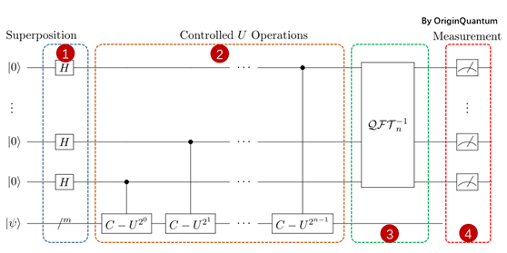

**植入步骤：**

- 初始化：

输入包括两部分寄存器集：上面的n个量子位包含第一个寄存器，下面的m个量子位是第二个寄存器。

- 创建叠加态：

统一给n个量子比特添加H门操作，将n个初始状态置于叠加态，上图中淡蓝色框步骤1里。

- 应用受控的单一操作：

C-U是一个受控U门，只有当相应的控制位（来自第一个寄存器）为 $|1⟩$ 时，它才在第二个寄存器上应用单一运算符U。注意位置位的位置，与目标位的对应。

- 应用逆傅里叶变换：

执行傅里叶变换，详情参考傅里叶变换算法。

- 测量：

|  测量前位量子比特。
|  如上就是相位估计算法的步骤。需要需要注意的是受控单元那里的处理。

**参考线路图：**

这里给出了一个最简单的测试案例，分别是“-”的相位估计和“+”的相位估计（）。以下示例演示了作用于量子比特q[2]的单量子比特哈密顿量 $σ_x$  的量子相位估计。去q[3]作为指针系统（测量操作在上面）。在这个例子中，指针系统上的量子傅立叶变换等效于q[3]上的Hadamard门。CNOT门描述了系统+指针系统的离散化演变。指针量子位q[3]的最终测量结果是0或1，这取决于q[2]是在 $σ_x$ 的+ 1还是-1对应的本征态中准备。在该示例中，量子位q[2]初始化为ZH|0⟩，它是 $σ_x$-1所对应的特征向量。因此，测量结果为1。（注意，测量结果等于0，表示的就是-1）

**相位估计 – 的情况：**

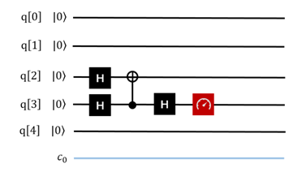

**相位估计 + 情况：**

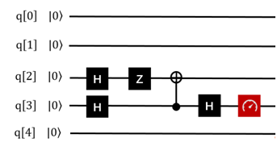

## <a name="9.2-QPE">QPE算法的实现

下面给出 QRunes 实现 QPE 算法的代码示例：

```
    @settings:
        language = Python;
        autoimport = True;
        compile_only = False;
        
    @qcodes:
    // Perform Fourier Transform
    circuit QFT(vector<qubit> q) {
        for(let i=0: 1: q.length()) {
            H(q[q.length()-1-i]);
            for (let j=i+1: 1: q.length()) {
                CR(q[q.length()-1-j], q[q.length()-1-i], 2*Pi/(1<<(j-i+1)));
            }
        }
    }
    
    circuit QFTdagger(vector<qubit> q) {
        QFT(q).dagger();
    }
    
    circuit unitary(vector<qubit> q) {
        RX(q[0], -Pi);
    }
    
    circuit Hadamard(vector<qubit> q) {
        for (let i=0: 1: q.length()) {
            H(q[i]);
        }
    }
    
    // U is generated by qc,
    // output U^(2^min)
    circuit unitarypower(vector<qubit> q, int min, circuit<vector<qubit> > qc) {
        for (let i=0: 1: (1 << min)) {
            qc(q);
        }
    }
    
    // Applying a controlled single operation
    circuit controlUnitaryPower(vector<qubit> q, qubit controlQubit, int min, circuit<vector<qubit> > qc) {
        vector<qubit> cControlQubit;
        cControlQubit.add(controlQubit);
        unitarypower(q, min, qc).control(cControlQubit);
    }
    
    circuit QPE(vector<qubit> controlqvec, vector<qubit> targetqvec, circuit<vector<qubit> > qc) {
        // A unified H-gate operation is added to controlqvec qubits, and N initial states are placed in superposition states.
        for(let i=0: 1: controlqvec.length()) {
            H(controlqvec[i]);
        }
        for (let i=0: 1: controlqvec.length()) {
            let q = controlqvec[controlqvec.length()-1-i];
            controlUnitaryPower(targetqvec, q, i, qc);
        }
        QFTdagger(controlqvec);
    }
    
    @script:
    if __name__ == '__main__':
        init(QMachineType.CPU_SINGLE_THREAD)
    
        qubit_num = 2
        cbit_num = 2
        # Initialization 2 quantum bits
        cqv = qAlloc_many(qubit_num) 
        # Initialization 1 quantum bits    
        tqv = qAlloc_many(1)
        cv = cAlloc_many(cbit_num)
        qpeProg = QProg()
        qpeProg.insert(H(tqv[0]))
        qpeProg.insert(QPE(cqv, tqv, unitary))
        qpeProg.insert(Measure(cqv[0], cv[0]))
        qpeProg.insert(Measure(cqv[1], cv[1]))
        directly_run(qpeProg)
        print("c0: %s" %(cv[0].eval()))
        print("c1: %s" %(cv[1].eval()))
    
        finalize()
```

## <a name="9.3-QPE">QPE算法小结

QPE算法应用了量子傅里叶逆变换，同时作为一个实用的基础量子算法，又被应用在Shor Algorithm（质因式分解算法），和HHL Algorithm（经常用于各种量子机器学习的最优化算法）等等算法中。


# <a name="10-Shor">Shor算法

## <a name="10.1-Shor">Shor算法介绍

舒尔算法，即秀尔算法（Shor算法），以数学家彼得·秀尔命名，是一个在1994年发现的，针对整数分解这题目的的量子算法（在量子计算机上面运作的算法）。它解决如下题目：给定一个整数N，找出他的质因数。

在一个量子计算机上面，要分解整数N，秀尔算法的运作需要多项式时间（时间是logN的某个多项式这么长，logN在这里的意义是输入的档案长度）。更精确的说，这个算法花费O((logN))的时间，展示出质因数分解问题可以使用量子计算机以多项式时间解出，因此在复杂度类BQP里面。这比起传统已知最快的因数分解算法，普通数域筛选法还要快了一个指数的差异。

秀尔算法非常重要，因为它代表使用量子计算机的话，我们可以用来破解已被广泛使用的公开密钥加密方法，也就是RSA加密算法。RSA算法的基础在于假设了我们不能很有效率的分解一个已知的整数。就目前所知，这假设对传统的（也就是非量子）电脑为真；没有已知传统的算法可以在多项式时间内解决这个问题。然而，秀尔算法展示了因数分解这问题在量子计算机上可以很有效率的解决，所以一个足够大的量子计算机可以破解RSA。这对于建立量子计算机和研究新的量子计算机算法，是一个非常大的动力。

| 将两个质数乘起来，例如907*641=581387，是一件小学生都能做到的事情，用计算机去处理，看起来也没有什么难度。但是如果我给你581387，让你去找它的质因数，问题就变得很复杂了。也许你可以用计算机一个一个的去尝试，但是当数字变得更大，达到成百上千位的时候，就连计算机也无能为力。世界上面有很多问题都是这样，难以找到答案，但是一旦找到答案就很容易去验证。类似的问题我们称之为NP问题。NP问题之所以难于处理，是因为它的时间复杂度往往具有指数级别。这意味着随着问题规模的线性扩大，需要的时间却是指数增长的。利用这个原理，人们创造了RSA算法，它利用大数难以分解，但是易于验证的原理，对数据进行有效的加密。
| 量子计算机有将问题指数加速的能力，那是否意味着能攻克所有的NP问题呢？很遗憾，不能。但是幸运的是，我们有能力把“质因数分解”的时间复杂度降低到多项式级别，使大数分解问题的解决变为可能。这就是Shor算法。Shor算法的提出意味着RSA密钥的安全性受到了挑战。下面我们就来介绍Shor算法的内容。

**问题的转化**

Shor算法首先将质因数分解问题转换成了一个子问题，下面我们来看问题的转换过程。假设我们待分解的数为 N；

STEP 1：随机取一个正整数 $1<a<N$，定义一个函数 $f(x)= 2^{x}  mod N$；

STEP 2：这个函数一定是一个周期函数，寻找到它的周期为  $r$ 。（这一步将使用量子计算机完成）；

STEP 3：如果  $r$ 为奇数，那么回到STEP 1。如果  $r$ 为偶数，那么计算  $f(r/2)$；

STEP 4：如果  $f(r/2)=−1$，那么回到STEP 1。否则，计算 $f(r/2)+1$ 和  $f(r/2)−1$ 分别对于N的最大公约数；

STEP 5：这两个最大公约数就是  $N$ 的两个质因数；

举个例子，对于21而言，假设我们选择  $a=2$ ，那么

STEP 1：定义函数  $f(x)=2^{x} mod N$

STEP 2：发现它的周期为6。

STEP 3：计算出 $f(3)=8$

STEP 4：计算7和9分别对于21的最大公因数 $gcd(7,21)=7， gcd(9,21)=3$

检验知7和3都是21的质因数，于是我们得到了问题的答案。

**函数的引入**

我们要为STEP 1中描述的函数找到它引入量子计算机的方式。这种函数被称为模指数（Modular Exponential）函数，在经典逻辑电路中，它已经被以各种形式设计了出来。所以现在，我们要为它准备一个量子线路的版本。
根据在“Oracle是什么”这一节里面提到的量子函数概念，我们需要构建出一个酉变换U使得：

$$ U|x⟩|y⟩=|x⟩|y⋅a^{x}(modN)⟩$$

| 这种情况是一种比较普适的情况，我们令 $y=1$，那么后面的这一组量子比特就作为辅助比特存储了 $f(x)$ 的计算结果。我们先来找一种比较简单的情况来分析具体问题，可以便于对其中的变量分解转换的理解。选取要分解的质因数15，和一个比15小的任意正整数7，所以我们要构建这样的酉变换：

$$ U|x⟩|1⟩=|x⟩|7^{x}(mod15)⟩$$

首先要提到的一点是要表示  $7^{x}(mod15)⟩$，就意味着我们的辅助比特的取值是从0~14的，为了表示这个数，需要用到4个比特，即从0000~1110。对于前面的工作比特来说，它的位数选择比较自由，而且选取的位数越多，我们得到正确结果的概率越大，这一点在后面会解释。
乍一看这个函数让我们有些无从下手，所以我们要对它进行一定的转换，比如先把x转化为二进制：

$$7^x=7^{x_0+2x_1+2^2x_2+...}=7^{x_0}\cdot(7^2)^{x_1}\cdot(7^4)^{x_2}...\cdot(7^{2^n})^{x_n}$$

$x_i$ 是x转换为二进制后每一位上对应的数码，所以它的取值无非是0或者1。这样我们就可以简单的用一个控制酉操作得到每一项，即

$$ \begin{align*}|x_i\rangle&=|1\rangle \ :\ U_a|y\rangle\rightarrow|y\cdot 7^{2^i} (mod15)\rangle\\|x_i\rangle&=|0\rangle \ :\ U_a=I\end{align*}$$

其中 $I$ 是单位操作。所以问题就转化为了构建“控制模乘”操作 $Ua$。
顺带一提，因为我们关注的点不是如何纯粹的用量子线路来描述里面的每一步操作，某些操作也不引入额外的计算时间复杂度，那么这些操作是可以用经典计算机代为完成的。就比如说这里的 $7^{2^i$。注意到

$$y\cdot 7^{2^i}(mod15)=(y\cdot (7^{2^i}mod15))mod15$$

我们只需要事先用经典计算机将 $7^{2^i}mod15(i=0\sim N-1)$ （N是选取的工作位数）全部计算出来，就可以在接下来的设计时只考虑对应的几种情况。
我们可以看出，$a^{2^i}=a^{2^{i-1}+2^{i-1}}=(a^{2^{i-1}})^2$ ，根据这个公式，可以列举出来对于不同的 i 的取值情况，上述表达式的取值（这个过程用经典计算机就可以完成）。在例子中的这种情况中，有

$$ \begin{align*}i&=0 \quad 7^{2^i}mod15=7\\i&=1 \quad 7^{2^i}mod15=4\\i&=2 \quad 7^{2^i}mod15=1\\i&\geq3 \quad 7^{2^i}mod15=1\end{align*}$$

也就是说我们只需要对应设计  $U_a|y\rangle\rightarrow|7y\ mod15\rangle$， $U_a|y\rangle\rightarrow|4y\ mod15\rangle$ 两种就可以达到设计目的了。
最后我们来看一下引入了函数，量子态变成了什么。
首先是一组Hadamard变换，它们只作用在一组N个工作比特上，所以这个总状态就会变成

$$ |\text{Working}\rangle|\text{Ancilla}\rangle=\left(\sum_{x=0}^{2^{N}-1} |x\rangle\right) |00...001\rangle$$

在量子函数作用在这一组量子态时，相当于这个函数的自变量从0到 $2^{N}-1$ 的所有取值都被保存到了辅助比特上。也就是说，工作比特的每个状态分量都和辅助比特的一个状态分量纠缠在了一起。

$$ \sum |x\rangle|f(x)\rangle$$

在之前的计算中，我们知道了 $f(x)=a^x (mod N)$ 是一个周期函数，假设它的周期是T。明显地，

$$f(x)=f(x+T)=f(x+2T)....$$

那么

$$|x\rangle|f(x)\rangle+|x+T\rangle|f(x+T)\rangle+|x+2T\rangle|f(x+2T)\rangle+...=\left(|x\rangle+|x+T\rangle+|x+2T\rangle+...\right)|f(x)\rangle$$

回到 $a=7$，$N=15$ 的例子中，我们有

$$\begin{align*}|\text{Working}\rangle|\text{Ancilla}\rangle&=(|0\rangle+|4\rangle+|8\rangle+...)|1\rangle\\&+(|1\rangle+|5\rangle+|9\rangle+...)|7\rangle\\&+(|2\rangle+|6\rangle+|10\rangle+...)|4\rangle\\&+(|3\rangle+|7\rangle+|11\rangle+...)|13\rangle\end{align*}$$

因为这个态是一个纠缠态，所以当我们测量辅助比特时，工作比特就会坍缩成对应的那种情况。但是不论你得到辅助比特的测量值是什么，工作比特总是会只保留为每个分量都恰好为一组周期数的叠加态。那么这一组叠加态表示的数的周期将会通过量子傅里叶变换来快速完成。

量子傅里叶变换

寻找态的周期可以通过量子傅里叶变换来快速完成。我们先以 $|0\rangle+|4\rangle+|8\rangle+...$ 为例子来看看量子傅里叶变换是怎么做的，之后你就会发现它对于1,5,9,13...或是2,6,10,14...都能得到类似的结果。

如图所示，量子傅里叶变换有两个重要的部分，第一是递归的依次控制旋转（CROT）操作，第二部分是改变比特的顺序。

数学表达上，每一项都是用离散傅里叶变换的形式去处理的。

$$y_k = \frac{1}{\sqrt{N}} \sum_{j=0}^{N-1} x_j \omega^{jk}$$

其中 $x_j$ 表示输入量子态的第 $j$ 个分量，而 $k$表示输出量子态的分量，如果用 $n$ 个量子比特表示，则 $\omega=e^{\frac{2\pi i}{2^n}}=e^{\frac{2\pi i}{N}}$。而从矩阵上来看，则为

$$F_N = \frac{1}{\sqrt{N}} \begin{bmatrix}1&1&1&1&\cdots &1 \\1&\omega&\omega^2&\omega^3&\cdots&\omega^{N-1} \\
1&\omega^2&\omega^4&\omega^6&\cdots&\omega^{2(N-1)}\\ 1&\omega^3&\omega^6&\omega^9&\cdots&\omega^{3(N-1)}\\
\vdots&\vdots&\vdots&\vdots&&\vdots\\
1&\omega^{N-1}&\omega^{2(N-1)}&\omega^{3(N-1)}&\cdots&\omega^{(N-1)(N-1)}
\end{bmatrix}$$

不妨假设工作比特只有4个。那么输入的量子态则为

$$|\text{Input}\rangle=|0\rangle+|4\rangle+|8\rangle+|12\rangle$$

这样就代表 $x_0=x_4=x_8=x_{12}=1$，并且 $\omega=e^{2\pi i/16}$，其它分量上都为0。根据傅里叶变换的公式我们可以计算出

$$ \begin{align*}
y_k &= \frac{1}{\sqrt{4}} (\omega^{0k}+\omega^{4k}+\omega^{8k}+\omega^{12k})\\
&=\frac{1}{2}(1+i^k+(-1)^k+(-i)^k)
\end{align*}$$

这里就是工作比特执行完量子傅里叶变换之后的输出态上的每个分量（第k个分量）的值。从而我们可以得到 $y_0=y_4=y_8=y_{12}=\frac{1}{2}$，其它情况下 $y_k=0\ (k\neq 0,4,8,12)$， 那么最后输出的量子态则为

$$|\text{Output}\rangle=|0\rangle+|4\rangle+|8\rangle+|12\rangle$$

利用连分数分解得到周期
在最后的测量时，我们会随机得到0，4，8，12四个结果中的一个，但是这个结果并不是周期。但是量子傅里叶变换的结果揭示了一点：

$$ \omega^{irx}=e^{2\pi i rx/2^N}\sim 1$$

其中我们假设测量结果是 $x$，总工作比特数为 $N$，函数的周期为 $r$。那么我们有

$$\frac{x}{2^N}=\frac{c}{r}$$

其中 $c$ 为一个未知的整数。所以我们可以通过这个式子近似地找出函数周期。例如 $x=4$，$N=4$，我们有

$$\frac{c}{r}=\frac{1}{4}$$

这样我们就找到了周期r=4。Shor算法的量子计算机部分至此解出。你可以检验一下 $f(x)=7^x (mod15)$ 这个函数的周期是否确实为4。你也可以检验一下 $f(r/2)+1$ 和 $f(r/2)−1$ 和15的最大公因数是否就是15的质因数。
有时候 $x/2^N$ 并不一定能顺利约出合理的 $r$，这样我们就可以通过连分数分解法，得到一个逼近的分数，从而获得 $r$。这里就不再细讲了。

## <a name="10.2-Shor">Shor算法的实现

下面给出 QRunes 实现 Shor 算法的代码示例：

```
    @settings:
    language = Python;
    autoimport = True;
    compile_only = False;
    
    @qcodes:
    //Quantum adder MAJ module
    circuit MAJ(qubit a, qubit b, qubit c) {
        CNOT(c, b);
        CNOT(c, a);
        Toffoli(a, b, c);
    }
    
    //Quantum adder UMA module
    circuit UMA(qubit a, qubit b, qubit c) {
        Toffoli(a, b, c);
        CNOT(c, a);
        CNOT(a, b);
    }
    
    //Quantum adder MAJ2 module
    circuit MAJ2(vector<qubit> a, vector<qubit> b, qubit c) {
        let nbit = a.length();
        MAJ(c, a[0], b[0]);
        for(let i=1: 1: nbit) 
            MAJ(b[i-1], a[i], b[i]);   
    }
    
    //Quantum adder, consists of MAJ and UMA modules, regardless of the carry term
    circuit Adder(vector<qubit> a, vector<qubit> b, qubit c) {
        let nbit = a.length();
        MAJ(c, a[0], b[0]);
        for(let i=1: 1: nbit) 
            MAJ(b[i-1], a[i], b[i]);
    
        for(let i=nbit-1: -1: 0) 
            MAJ(b[i-1], a[i], b[i]);
        
        UMA(c, a[0], b[0]);
    }
    
    //Determine if there is a carry
    circuit isCarry(vector<qubit> a, vector<qubit> b, qubit c, qubit carry) {
        MAJ2(a, b, c);
        CNOT(b[-1], carry);
        MAJ2(a, b, c).dagger();
    }
    
    //Binding classic data with qubits
    circuit bindData(vector<qubit> qlist, int data) {
        let checkValue = 1 << qlist.length();
    
        let i = 0;
        let tmp = data >> 1;
        for(data: -tmp: 1) {
            if ((data % 2) == 1) {
                X(qlist[i]);
            }
            tmp = tmp >> 1;
            data = data >> 1;
            i = i + 1;
        }
    }
    
    //Constant modular addition
    circuit constModAdd(vector<qubit> qa, int C, int M, vector<qubit> qb, vector<qubit> qs1) {
        let qNum = qa.length();
        let tmpValue = (1 << qNum) - M + C;
    
        bindData(qb, tmpValue);
        isCarry(qa, qb, qs1[1], qs1[0]);
        bindData(qb, tmpValue);
    
        circuit qCircuitTmp1;
        qCircuitTmp1.insert(bindData(qb, tmpValue));
        qCircuitTmp1.insert(Adder(qa, qb, qs1[1]));
        qCircuitTmp1.insert(bindData(qb, tmpValue));
        qCircuitTmp1.control([qs1[0]]);
        qCircuitTmp1.push();
    
        X(qs1[0]);
    
        circuit qCircuitTmp2;
        qCircuitTmp2.insert(bindData(qb, C));
        qCircuitTmp2.insert(Adder(qa, qb, qs1[1]));
        qCircuitTmp2.insert(bindData(qb, C));
        qCircuitTmp2.control([qs1[0]]);
        qCircuitTmp2.push();
    
        X(qs1[0]);
    
        tmpValue = (1 << qNum) - C;
        bindData(qb, tmpValue);
        isCarry(qa, qb, qs1[1], qs1[0]);
        bindData(qb, tmpValue);
        X(qs1[0]);
    }
    
    //Constant modular multiple
    circuit constModMul(vector<qubit> qa, int constNum, int M, vector<qubit> qs1, vector<qubit> qs2, vector<qubit> qs3) {
        let qNum = qa.length();
    
        for(let i=0: 1: qNum) {
            let tmp = constNum * pow(2, i) % M;
            circuit qCircuitTmp;
            qCircuitTmp.insert(constModAdd(qs1, tmp, M, qs2, qs3));
            qCircuitTmp.control(qa[i]);
            qCircuitTmp.push();
        }
    
        for(let i=0: 1: qNum) {
            CNOT(qa[i], qs1[i]);
            CNOT(qs1[i], qa[i]);
            CNOT(qa[i], qs1[i]);
        }
    
        let crev = modReverse(constNum, M);
        circuit qCircuitTmp1;
        for(let i=0: 1: qNum) {
            let tmp = crev * pow(2, i);
            tmp = tmp % M;
            circuit qCircuitTmp2;
            qCircuitTmp2.insert(constModAdd(qs1, tmp, M, qs2, qs3));
            qCircuitTmp2.control(qa[i]);
            qCircuitTmp1.insert(qCircuitTmp2);
            qCircuitTmp1.dagger();
            qCircuitTmp1.push();
        }
    }
    
    @script:
    def gcd(m,n):
        if not n:
            return m
        else:
            return gcd(n, m%n)
    
    def modReverse(c, m):
        if (c == 0):
            raise RecursionError('c is zero!')
        
        if (c == 1):
            return 1
        
        m1 = m 
        quotient = []
        quo = m // c
        remainder = m % c
    
        quotient.append(quo) 
    
        while (remainder != 1):
            m = c
            c = remainder
            quo = m // c
            remainder = m % c
            quotient.append(quo)
    
        if (len(quotient) == 1):
            return m - quo
    
        if (len(quotient) == 2):
            return 1 + quotient[0] * quotient[1]
    
        rev1 = 1
        rev2 = quotient[-1]
        reverse_list = quotient[0:-1]
        reverse_list.reverse()
        for i in reverse_list:
            rev1 = rev1 + rev2 * i
            temp = rev1
            rev1 = rev2
            rev2 = temp
    
        if ((len(quotient) % 2) == 0):
            return rev2
    
        return m1 - rev2
    
    def shorAlg(base, M):
        if ((base < 2) or (base > M - 1)):
            raise('Invalid base!')
    
        if (gcd(base, M) != 1):
            raise('Invalid base! base and M must be mutually prime')
        
        binary_len = 0
        while M >> binary_len != 0 :
            binary_len = binary_len + 1
        
        machine = init_quantum_machine(QMachineType.CPU_SINGLE_THREAD)
    
        qa = machine.qAlloc_many(binary_len*2)
        qb = machine.qAlloc_many(binary_len)
    
        qs1 = machine.qAlloc_many(binary_len)
        qs2 = machine.qAlloc_many(binary_len) 
        qs3 = machine.qAlloc_many(2) 
    
        prog = QProg()
    
        prog.insert(X(qb[0]))
        prog.insert(single_gate_apply_to_all(H, qa))
        prog.insert(constModExp(qa, qb, base, M, qs1, qs2, qs3))
        prog.insert(qft(qa).dagger())
    
        directly_run(prog)
        result = quick_measure(qa, 100)
        print(result)
        return result
    
    if __name__=="__main__":
        base = 7
        N = 15
        shorAlg(base, N) 
```

## <a name="10.3-Shor">Shor算法小结

Shor算法首先把问题分解为了“经典计算机部分”和“量子计算机部分”。然后利用了量子态的叠加原理，快速取得了函数在一个很大范围内的取值（对于 $n$ 个工作比特而言，取值范围为 $0\sim2^n-1$ 。由于函数本身是周期的，所以自变量和函数值自动地纠缠了起来，从而对于某一个函数值来说，工作比特上的态就是一组周期数态的叠加态。在取得“周期数叠加态”之后，我们自然可以通过傅里叶变换得到这组周期数的周期，从而快速解决了这个问题。

反过来看，之所以找函数周期问题能被量子计算机快速解决，是因为在工作比特上执行了一组Hadamard变换。它在“量子函数”的作用下，相当于同时对指数级别的自变量上求出了函数值。在数据量足够大，周期足够长的情况下，这样执行的操作总量一定会小于逐个取值寻找这个函数值在之前是否出现过——这样的经典计算机“暴力破解”法要快得多。

Shor算法的难点在于如何通过给出的 $a$ ，$n$  来得到对应的“量子函数”形式。进一步地讲，是否存在某种方法（准确地说是具有合理时间复杂度的方法）得到任意函数的“量子计算机版本”？限于笔者知识水平不足，我只能给出目前大概的研究结论是存在某些无法表示为量子计算机版本的函数，但是幸运地是Shor算法属于可以表示的那一类里面。

最后，我们可以发现，量子计算机之所以快，和量子计算机本身的叠加特性有关，它使得在处理特定问题时，比如数据库搜索，比如函数求周期……有着比经典计算机快得多的方法。但是如果经典计算机在解决某个问题时已经足够快了，我们就不需要用量子计算机来解决了。

就像Shor算法里面所描述的那样——我们将问题分解为了量子计算机去处理的“困难问题”和经典计算机去处理的“简单问题”两个部分一样。所以，量子计算机的出现，不代表经典计算机将会退出历史舞台，而是代表着人类将要向经典计算机力所不及的地方伸出探索之手。靠着量子计算机，或许我们能提出新的算法解决化学问题，从而研制出新型药物；或许我们可以建立包含所有信息的数据库，每次只需要一瞬间就能搜索到任何问题……量子云平台是我们帮助量子计算机走出的第一步，但接下来的路怎么走，我们就要和你一同见证了。