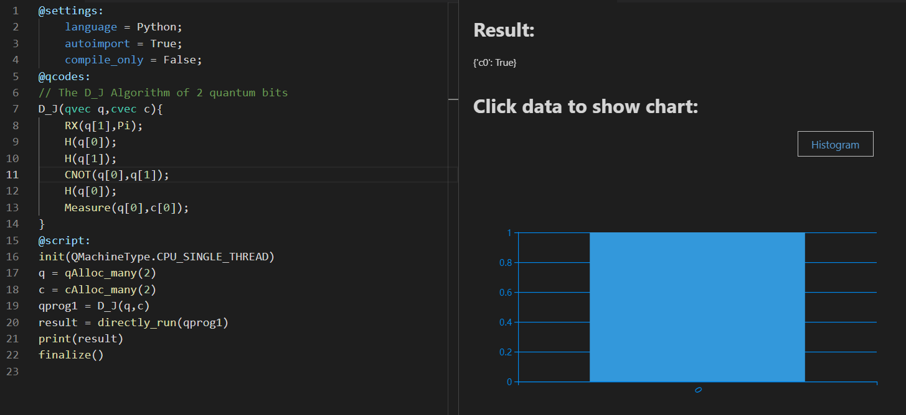

- [写在前面](#1)
  - [量子](#1.1)
  - [量子计算](#1.2)
  - [量子经典混合编程](#1.3)
- [Quick Start](#2)
  - [QRunes简介](#2.1)
  - [QRunes开发环境](#2.2)
  - [Qurator介绍](#2.3)
  - [初窥QRunes](#2.4)
- [QRunes基本类型与变量](#3)
  - [QRunes的基本对象类型](#3.1)
  - [常量](#3.2)
  - [变量](#3.3)
- [QRunes表达式与运算符](#4)
  - [表达式](#4.1)
  - [表达式的类型介绍](#4.2)
- [语句](#5)
  - [简单语句](#5.1)
  - [复合语句](#5.2)
  - [函数调用语句](#5.3)
  - [辅助类型控制语句](#5.4)
  - [量子类型控制语句](#5.5)
  - [量子比特测量语句](#5.6)
- [函数](#6)
  - [函数的声明](#6.1)
  - [函数的定义](#6.2)
  - [函数的参数](#6.3)
  - [函数的返回类型](#6.4)
  - [函数的调用](#6.5)
- [常用量子算法介绍及实现](#7)


# <a name="1"></a>写在前面

## <a name="1.1"></a>量子


​	量子（quantum）是现代物理的重要概念。最早是由德国物理学家M·普朗克在1900年提出的。他假设黑体辐射中的辐射能量是不连续的，只能取能量基本单位的整数倍，从而很好地解释了黑体辐射的实验现象。

​	后来的研究表明，不但能量表现出这种不连续的分离化性质，其他物理量诸如角动量、自旋、电荷等也都表现出这种不连续的量子化现象。这同以牛顿力学为代表的经典物理有根本的区别。量子化现象主要表现在微观物理世界。描写微观物理世界的物理理论是量子力学。

​	量子一词来自拉丁语quantus，意为“有多少”，代表“相当数量的某物质”。自从普朗克提出量子这一概念以来，经爱因斯坦、玻尔、德布罗意、海森伯、薛定谔、狄拉克、玻恩等人的完善，在20世纪的前半期，初步建立了完整的量子力学理论。绝大多数物理学家将量子力学视为理解和描述自然的基本理论。

## <a name="1.2"></a>量子计算

​	量子计算是一种遵循量子力学规律调控量子信息单元进行计算的新型计算模式。对照于传统的通用计算机，其理论模型是通用图灵机；通用的量子计算机，其理论模型是用量子力学规律重新诠释的通用图灵机。从可计算的问题来看，量子计算机只能解决传统计算机所能解决的问题，但是从计算的效率上，由于量子力学叠加性的存在，目前某些已知的量子算法在处理问题时速度要快于传统的通用计算机。

## <a name="1.3"></a>量子经典混合编程

​	QRunes根据量子计算的经典与量子混合（Quantum-Classical Hybrid）特性，在程序编译之后可以操纵宿主机器、量子测控设备与量子芯片来实现量子计算。所谓的量子经典混合编程即是将实现量子计算的部分用量子代码实现量子比特和量子逻辑门的操作，而与经典计算机打交道的部分（结果展示、量子程序开发包，比如QPanda）用经典语言实现的一种编程方式成为量子经典混合编程。


# <a name="2"></a>Quick Start

## <a name="2.1"></a>QRunes简介

​	QRunes是一种面向过程、命令式的量子编程语言Imperative language（这也是当前主流的一种编程范式），它的出现是为了实现量子算法。QRunes根据量子计算的经典与量子混合（Quantum-Classical Hybrid）特性，在程序编译之后可以操纵经典计算机与量子芯片来实现量子计算。

​	QRunes通过提供高级语言的形式（类C的编程风格）来量子算法的实现和程序逻辑控制。其丰富的类型系统(Quantum Type，Auxiliary Type，Classical Type)可以实现量子计算中数据对象的绑定和行为控制，可以满足各类量子算法开发人员的算法实现需求。

​	QRunes构成：Settings, QCodes和Script。其中Settings部分定义了关于QRunes编译的全局信息；QCodes部分是具体的对于量子比特操作和行为的控制；Script部分是宿主程序的实现，它的实现依赖于经典编程语言（C++，Python等）和相关联的量子程序开发工具包（比如：QPanda/pyQPanda）。

## <a name="2.2"></a>QRunes开发环境

### QRunes与QPanda/pyQPanda

**\#\#\#\# QPanda**

​	QPanda SDK是由本源量子推出的，基于量子云服务的，开源的量子软件开发包。用户可基于此开发包开发在云端执行的量子程序。QPanda使用C++语言作为经典宿主语言，支持以QRunes书写的量子语言。
​	目前，QPanda支持本地仿真运行模式和云仿真运行模式，最高可支持到32位。Q-Panda提供了一个可执行的命令行程序，通过指令控制量子程序的加载、运行和读出。另外，QPanda提供了一组API，可供用户自行定制功能。

**\#\#\#\# QPanda 2**

​	QPanda 2(Quantum Programming Architecture for NISQ Device Applications)是一个高效的量子计算开发工具库，可用于实现各种量子算法，QPanda2基于C++实现，并可扩展到Python。

**\#\#\#\# PyQPanda**

​	PyQPanda是我们通过pybind11工具，以一种直接和简明的方式，对QPanda2中的函数、类进行封装，并且提供了几乎完美的映射功能。封装部分的代码在QPanda2编译时会生成为动态库，从而可以作为python的包引入。

### 开发环境配置与运行

为了兼容高效与便捷，我们为您提供了C++ 和Python（pyQPanda）两个版本，pyQPanda封装了C++对外提供的接口。

**\#\#\#\# C++的使用**

使用QPanda 2相对于pyQPanda会复杂一些，不过学会编译和使用QPanda2，您会有更多的体验，更多详情可以阅读[使用文档](https://qpanda-2.readthedocs.io/zh_CN/latest/)。话不多说，我们先从介绍Linux下的编译环境开始。

**\#\#\#\# 编译环境**

在下载编译之前，我们需要：

| software | version   |
| -------- | --------- |
| GCC      | >= 5.4.0  |
| CMake    | \>= 3.1   |
| Python   | \>= 3.6.0​ |

**\#\#\#\# 下载和编译**

我们需要在Linux终端下输入以下命令：

- \$ git clone <https://github.com/OriginQ/QPanda-2.git>
- \$ cd qpanda-2
- \$ mkdir build
- \$ cd build
- \$ cmake -DCMAKE\_INSTALL\_PREFIX=/usr/local ..
- \$ make

**\#\#\#\# 安装**

编译完成后，安装就简单的多，只需要输入以下命令：

- \$ make install

**\#\#\#\# 开始量子编程**

现在我们来到最后一关，创建和编译自己的量子应用。我相信对于关心如何使用QPanda2的朋友来说，如何创建C++项目，不需要我多说。不过，我还是需要提供CMakelist的示例，方便大家参考。

```
cmake_minimum_required(VERSION 3.1)
project(testQPanda)
SET(CMAKE_INSTALL_PREFIX "/usr/local")
SET(CMAKE_MODULE_PATH  ${CMAKE_MODULE_PATH} "${CMAKE_INSTALL_PREFIX} lib/cmake")

add_definitions("-std=c++14 -w -DGTEST_USE_OWN_TR1_TUPLE=1")
set(CMAKE_BUILD_TYPE "Release")
set(CMAKE_CXX_FLAGS_DEBUG "$ENV{CXXFLAGS} -O0 -g -ggdb")
set(CMAKE_CXX_FLAGS_RELEASE "$ENV{CXXFLAGS} -O3")
add_compile_options(-fPIC -fpermissive)
find_package(QPANDA REQUIRED)
if (QPANDA_FOUND)

    include_directories(${QPANDA_INCLUDE_DIR}
                    ${THIRD_INCLUDE_DIR})
    add_executable(${PROJECT_NAME} test.cpp)
    target_link_libraries(${PROJECT_NAME} ${QPANDA_LIBRARIES})
endif (QPANDA_FOUND)
```

我们接下来通过一个示例介绍QPanda2的使用，此例子构造了一个量子叠加态。在量子程序中依次添加H门和CNOT门，最后对所有的量子比特进行测量操作。此时，将有50%的概率得到00或者11的测量结果。

```
#include "QPanda.h"
#include <stdio.h>
using namespace QPanda;
int main()
{
    init(QMachineType::CPU);
    QProg prog;
    auto q = qAllocMany(2);
    auto c = cAllocMany(2);
    prog << H(q[0])
        << CNOT(q[0],q[1])
        << MeasureAll(q, c);
    auto results = runWithConfiguration(prog, c, 1000);
    for (auto result : results){
        printf("%s : %d\n", result.first.c_str(), result.second);
    }
    finalize();
}
```

最后，编译，齐活。 

```
$ mkdir build
$ cd build
$ cmake .. 
$ make
```

运行结果如下:

```
00 : 512
11 : 488 
```

**\#\#\#\# python的使用**

pyQPanda只需要通过pip就可安装使用。

- -pip install pyqpanda

我们接下来通过一个示例介绍pyQPanda的使用，此例子构造了一个量子叠加态。在量子程序中依次添加H门和CNOT门，最后对所有的量子比特进行测量操作。此时，将有50%的概率得到00或者11的测量结果。

```
from pyqpanda import *

init(QMachineType.CPU)
prog = QProg()
q = qAlloc_many(2)
c = cAlloc_many(2)
prog.insert(H(q[0]))
prog.insert(CNOT(q[0],q[1]))
prog.insert(measure_all(q,c))
result = run_with_configuration(prog, cbit_list = c, shots = 1000)
print(result)
finalize()
```

运行结果如下:

```
{'00': 493, '11': 507}
```

## <a name="2.3"></a>Qurator介绍

qurator-vscode 是本源量子推出的一款可以开发量子程序的 VS Code插件。其支持 QRunes2 语言量子程序开发，并支持 Python 和 C++语言作为经典宿主语言。

在 qurator-vscode 中，量子程序的开发主要分为编写和运行两个部分。

- 编写程序：插件支持模块化编程，在不同的模块实现不同的功能，其中量子程序的编写主要在
  qcodes 模块中；
- 程序运行：即是收集结果的过程，插件支持图表化数据展示，将运行结果更加清晰的展现在您的面前。

### qurator-vscode 设计思想

考虑到目前量子程序的开发离不开经典宿主语言的辅助，qurator-vscode插件设计时考虑到一下几点：

1.模块编程：

​	qurator-vscode插件支持模块编程，将整体程序分为三个模块：settings、qcodes 和 script模块。在不同的模块完成不同的功能。 在 settings模块中，您可以进行宿主语言类型、编译还是运行等设置；在 qcodes 模块中，您可以编写 QRunes2 语言程序； 在 script模块中，您可以编写相应的宿主语言程序。

​2. 切换简单： 

​	qurator-vscode 插件目前支持两种宿主语言，分别为 Python 和C++。您可以在两种宿主语言之间自由的切换，您只需要在 settings 模块中设置language 的 类型，就可以在 script模块中编写对应宿主语言的代码。插件会自动识别您所选择的宿主语言，并在script 模块中提供相应的辅助功能。

​3. 图形展示： 

​	qurator-vscode 插件提供图形化的结果展示，程序运行后会展示json格式的运行结果，您可以点击运行结果，会生成相应的柱状图，方便您对运行结果的分析。

## <a name="2.4"></a>初窥QRunes

### QRunes关键字

| keywords | keywords           |
| -------- | ------------------ |
| int      | vector             |
| double   | hamiltionian       |
| bool     | variationalCircuit |
| map      | avar               |
| qubit    | circuit            |
| cbit     |                    |

### QRunes程序结构

**\#\#\# QRunes由三部分组成**

- \#\#\#\# settings 模块中可以设置宿主语言，编译还是运行；

```
@settings:
    language = Python;
    autoimport = True;
    compile_only = False;
```

- \#\#\#\# qcodes 模块中可以编写 QRunes2 量子语言代码；

```
D_J(qvec q,cvec c){
    RX(q[1],Pi);
    H(q[0]);
    H(q[1]);
    CNOT(q[0],q[1]);
    H(q[0]);
    Measure(q[0],c[0]);
}
```

- \#\#\#\# script 模块中可以编写宿主语言代码，目前支持 Python 和 C++两种宿主语言。

```
init(QuantumMachine_type.CPU_SINGLE_THREAD)
q = qAlloc_many(2)
c = cAlloc_many(2)
qprog1 = D_J(q,c)
result = directly_run(qprog1)
print(result)
finalize()
```

### Oops!你的第一个量子程序

点击右上方 Run this QRunes 运行程序，或者使用命令提示符 qurator-vscode:Run this QRunes 来运行程序(快捷键F5)，点击运行结果可以以柱状图的的形式展示。




# <a name="3"></a>QRunes基本类型与变量

## <a name="3.1"></a>QRunes的基本对象类型

### 量子类型 Quantum Type

量子类型的对象描述的是量子芯片上的量子比特。

例如：qubit q;

它在运行期间会映射某一个量子芯片上的量子比特。这种对象只能被最终用于量子逻辑门操作中。它的赋值相当于创建这个映射的别名，并非描述其中的数据的复制。

### 辅助类型 Auxiliary Type

辅助类型是为了更方便创建量子操作的辅助对象。它在编译后的程序中不存在。它可以用于描述一些用于决定量子程序构造的变量或者常量。它也可以是一个编译期间的if判断或者for循环。

对于一组qubit，例如vector\<qubit\> qs，我们要创建作用在它们上面的Hadamard门，我们可以利用如下语句：

```
for (i = 0: 1: qs.size()) {
    H(qs[i]);
}
```

这一组语句是一个典型的for循环，但是执行这个程序的时机是在编译期间，因此这个for循环并不是在量子计算机中运行的for循环。它的效果相当于全部展开。即：

```
H(q[0]);  
H(q[1]);  
H(q[2]);  
...
```

### 经典类型 Classical Type

经典类型是在量子测控系统中存在的对象。他们的创建、计算、管理都是由量子芯片的测控系统完成的。这个系统具有实时性的特点，因此这些变量的生命周期和qubit的退相干时间共存。它是为了解决普通的宿主机和量子芯片之间无法进行实时数据交换的问题而存在的。简而言之，它们介于宿主机（辅助类型）和量子芯片（量子类型）之间。

经典类型的变量典型地可以被用于保存量子比特的测量结果。除此之外，由测量结果决定的IF和WHILE操作，即后面会提到的QIF，QWHILE操作也是在测控系统中完成的，所以也属于经典类型。要注意到QIF和QWHILE和宿主机（辅助类型）的if，for，while等操作具有完全不同的运行时机，其中辅助类型的变量、表达式、语句等是编译期间计算的，经典类型是运行期间计算的。

例如：

```
cbit c;  
qubit q;  
H(q);  
Measure(q,c);  
qif(c){  
    // do something...  
}
```

这个程序就根据一个qubit在执行完Hadamard门之后进行的测量的结果来选择执行分支。注意到c是一个在测控系统中存在的变量，而qif的判断也是在这个系统中实时完成的，之间与宿主机不会发生数据传输。

经典变量之间还可以进行计算，比如：

```
qif(!c) {} // 对c求非  
qif(c1 == c2) {} //比较c1与c2的值  
qif(c1 == True) {} //等价于qif(c1) 
```

但是经典辅助的if中是绝对不允许存在经典类型的变量的，原因是辅助类型的值是要求编译期间能够完全确定的，例如：

```
if(c) {} // Error：编译期间无法判断c的值
```

## <a name="3.2"></a>常量

目前QRune包含的常量有：Pi，默认值为 3.14159265358979。

## <a name="3.3"></a>变量

变量的定义分为两个部分来说明：

1.形参变量

形参变量，只做变量声明，由传递函数的实参进行初始化，作用域为所在函数体内，当函数结束的时候，形参即被销毁。
形参变量的格式： 变量类型 变量名 当前QRunes支持的形参变量类型有：

| variables | variables      |
| -------- | -------------- |
| int      | vector\_type   |
| double   | hamiltionian   |
| bool     | avar           |
| map      | circuit        |
| qubit    | callback\_type |
| cbit     |                |

hamiltionian类型是哈密顿量类型数据，它是一种复合类型。

avar是可变参数类型。

vector\_type是数组类型的数据，具体的参数类型需要在泛型中确定。例如：vector\<qubit\>表示qubit类型的数组。

callback\_type是回调函数类型，由 返回类型\<参数\> 组成。 例如：

```
circuit unitary(vector<qubit> q) {
    RX(q[0], -Pi);
}

//qc为返回类型为circuit类型，参数类型为vector<qubit>的回调函数类型
circuit unitarypower(vector<qubit> q, int min, circuit<vector<qubit>> qc) { 
    for (let i=0: 1: (1 << min)) {
        qc(q);
    }
}

unitarypower(q, min, unitary)  //函数的调用，callback参数类型只需传入所需调用的函数名
```

2.变量

在QRunes中变量的定义分为三部分来说明：

a.量子类型的变量。 格式：量子类型 变量名 比如：

```
qubit q; => q = allocMany(1);  
vector<qubit> qvec;
```

b.经典辅助类型的变量。 格式：let 变量名 = 初始值
	在辅助类型中的let关键字作用是定义并初始化辅助类型的变量。（占位符也是自动类型推断）。其中变量的类型由量子编译器根据初始值来推断确定变量的类型。这样做的好处：

​	1). 简化量子编程的编程操作，并使代码简介。（凡是辅助类型的变量直接用let关键字来定义）

​	2). let关键字涉及的行为只在编译期间，而不是运行期间。

注意：

1).let 关键字定义的变量必须有初始值。

```
let a; //ERROR  
let a = 3.14; //CORRECT 
```

2).函数参数不可以被声明为 let。

```
ker(qubit q, let a){ //ERROR  
    ...  
}  
```

3).let不能与其他类型组合连用。

```
let int a = 0.09; //ERROR  
```

4).定义一个let关键字序列的对象的变量，其所有初始值必须为最终能推导为同一类型。

```
let a = 0.09, b = false, c =10; //ERROR  
let a = 0.09, b = 3.14, c=100.901; //CORRECT  
```

c.经典类型的变量。 格式：经典类型 变量名 比如：

```
cbit c;  
```


# <a name="4"></a>QRunes表达式与运算符

本章节及后续的第四章来详细叙述下QRunes中的表达式和语句，因为当前的量子编程涉及三个部分：经典计算机模块，测控系统模块和量子芯片模块，故这种混合（量子、经典、辅助类型）程序各自分别运行在其对应的硬件模块上，他们的编译和运行方式也将会不同。

## <a name="4.1"></a>表达式

**在QRunes中，表达式由运算符和操作数组成，主要的作用是：**

- 计算辅助类型操作数的值。
- 指定函数。

**操作数可以是常量或者一个数据对象。比如：**

- 常量：3.14,1
- 数据对象：标识符,表达式本身

## <a name="4.2"></a>表达式的类型介绍：

### 主表达式

**它是构造其他表达式的基本块。**

语法构成：

```
主表达式：标识符 | 常量 | 括号表达式  
primary_expression: idetifier | constant |parenthesis_expression  
例如：qubit_s1,3.1415,(c1 + c2)     
注：支持量子类型，经典类型，辅助类型
```

### 括号表达式

语法构成：

```
parenthesis_expression：（ expression ）  
它表示在不更改括号封闭里面的表达式类型或值的情况下来构造表达式的分组方式。  
例如:  （ 2 + 3 ）/5 与 2 + 3 / 5   
注：支持量子类型，经典类型，辅助类型
```

### 后缀表达式与其运算符

**它是后面跟运算符的主表达式。**

| 后缀运算符         | 示          例 | 支持类型 |
| ------------------ | -------------- | -------- |
| 下标运算符         | [  ]           | Q A C    |
| 函数调用运算符     | (  )           | Q A C    |
| 对象成员访问运算符 | .              | Q A C    |
| 后缀递增运算符     | ++             | A        |
| 后缀递减法运算符   | --             | A        |

### 一元表达式与其运算符

| 一元运算符 | 含义           | 示例 | **支持类型** |
| ---------- | -------------- | ---- | ------------ |
| \~         | 取反运算符     | \~x  | A            |
| !          | 逻辑非运算符   | !x   | A C          |
| ++         | 一元递增运算符 | x++  | A            |
| --         | 一元递减运算符 | x--  | A            |

### 二元表达式与其运算符

- 基本的赋值运算符是“=”。他的优先级别低于其他的运算符，所以对该运算符往往最后读取。

  | 赋值运算符 | 含义                            | 示 例        | 支持类型 |
  | ---------- | ------------------------------- | ------------ | -------- |
  | =          | 将右操作数的值赋给左操作数 x=y; | 将x的值赋为y | A C      |
  | +=         | 加后赋值 x+=y;                  | 即x=x+y      | A C      |
  | -=         | 减后赋值 x-=y;                  | 即x=x-y      | A C      |
  | *=         | 乘后赋值 x\*=y;                 | 即x=x\*y     | A C      |
  | /=         | 除后赋值 x/=y;                  | 即x=x/y      | A C      |
  | %=         | 取余后赋值 x%=y;                | 即x=x%y      | A C      |
  | &=         | 按位与后赋值 x&=y ;             | 即x=x&y      | A C      |
  | \|=        | 按位或后赋值 x=y;               | 即x=x\|y     | A C      |
  | ^=         | 按位异或后赋值 x^=y;            | 即x=x^y      | A C      |
  | <\<=       | 左移后赋值 x\<\<=y;             | 即x=x\<\<y   | A C      |
  | >\>=       | 右移后赋值 x\>\>=y;             | 即x=x\>\>y   | A C      |

- 算术运算符即算术运算符号。是完成基本的算术运算 (arithmetic operators) 符号，就是用来处理四则运算的符号。

  | 算术运算符 | 含义                                   | 示 例  | 支持类型 |
  | ---------- | -------------------------------------- | ------ | -------- |
  | +          | 两个操作数相加                         | x + y  | A C      |
  | -          | 第一个操作数减去第二个操作数 x - y     | x -  y | A C      |
  | *          | 两个操作数相乘                         | x \* y | A C      |
  | /          | 第一个操作数除第二个操作数 x / y       | x / y  | A C      |
  | %          | 第一个操作数整除第二个操作数之后的余数 | x % y  | A        |
  | ^          | 第一个操作数的第二个操作数幂次方 x\^y  | x ^ y  | A        |

- 关系运算符有6种关系，分别为小于、小于等于、大于、等于、大于等于、不等于。关系运算符的值只能是0或1。关系运算符的值为真时，结果值都为1。关系运算符的值为假时，结果值都为0。

  | 关系运算符 | 含义                                                 | 示 例   | 支持类型 |
  | ---------- | ---------------------------------------------------- | ------- | -------- |
  | ==         | 判断两个操作数是否相等,相等则返回真值                | x == y  | A C      |
  | !=         | 判断两个数是否相等，不相等则返回真值                 | x != y  | A C      |
  | >          | 判断左操作数是否大于右操作数，大于则返回真值         | x \> y  | A C      |
  | <          | 判断左操作数是否小于右操作数，小于则返回真值         | x \< y  | A C      |
  | >=         | 判断左操作数是否大于等于右操作数，大于等于则返回真值 | x \>=y  | A C      |
  | <=         | 判断左操作数是否小于等于右操作数，小于等于则返回真值 | x \<= y | A C      |

- 在形式逻辑中，逻辑运算符或逻辑联结词把语句连接成更复杂的复杂语句

  | 逻辑运算符 | 含义                                     | 示 例    | 支持类型 |
  | ---------- | ---------------------------------------- | -------- | -------- |
  | &&         | 如果两个操作数都非零，则返回真值         | x && y   | A C      |
  | \|\|       | 如果两个操作数任意一个非零，则返回真值 x | x \|\| y | A C      |
  | !          | 如果操作数为零                           | !x       | A C      |

- 位操作是程序设计中对位模式按位或二进制数的一元和二元操作。在许多古老的微处理器上，位运算比加减运算略快，通常位运算比乘除法运算要快很多。在现代架构中，情况并非如此：位运算的运算速度通常与加法运算相同（仍然快于乘法运算）。

  | 位运算符 | 含义             | 示 例  | 支持类型 |
  | -------- | ---------------- | ------ | -------- |
  | &        | 按位与           | x & y  | A        |
  | \|       | 按位或           | x \| y | A        |
  | ^        | 异或运算符       | x ^ y  | A        |
  | <<       | 二进制左移运算符 | x << y | A        |
  | >>       | 二进制右移运算符 | x >> y | A        |

### 三元表达式与运算符

| 三元运算符 | 含义                                    | 示 例            | 支持类型 |
| ---------- | --------------------------------------- | ---------------- | -------- |
| ？：       | 根      据计算的值结果选择true还是false | a \> b ? a   : b | A        |

### 逗号运算符

```
逗号运算符的作用是将几个表达式放在一起，起到分割表达式的作用。  
注：支持 A Q C
```

### 常量表达式

```
常量表达式是在编译时计算而不是在运行时计算。
注：支持 A
```

### lambda表达式

匿名函数lambda：是指一类无需定义标识符（函数名）的函数或子程序。

1. lambda 函数可以接收任意多个参数 (包括可选参数) 并且返回单个表达式的值。

2. lambda匿名函数的格式：冒号前是参数，可以有多个，用逗号隔开，冒号右边的为表达式或是语法块。其实lambda返回值是一个函数的地址，也就是函数对象。

示例：

```
lambda (vector<qubit> qlist,qubit qubit2):{
    if (oracle_function[0] == false &&
        oracle_function[1] == true)
    {
        // f(x) = x;
        CNOT(qlist[0], qubit2);
    }
    else if (oracle_function[0] == true &&
        oracle_function[1] == false)
    {
        // f(x) = x + 1;
        CNOT(qlist[0], qubit2);
        X(qubit2);
    }
    else if (oracle_function[0] == true &&
        oracle_function[1] == true)
    {
        // f(x) = 1
        X(qubit2);
    }
    else
    {
        // f(x) = 0, do nothing
    }
};
```

注意：lambda表达式包含的语法块或表达式不能超过一个。

### 运算符优先级

| 运算符                             | 结合性   |
| ---------------------------------- | -------- |
| [ ] . ( )(方法调用)                | 从左向右 |
| ! \~ ++ - - +(一元运算)-(一元运算) | 从右向左 |
| \* / %                             | 从左向右 |
| +-                                 | 从左向右 |
| \<\< \>\> \>\>\>                   | 从左向右 |
| \<\<=  \>\>=                       | 从左向右 |
| == !=                              | 从左向右 |
| &                                  | 从左向右 |
| ^                                  | 从左向右 |
| \|                                 | 从左向右 |
| &&                                 | 从左向右 |
| \|\|                               | 从左向右 |
| ? :                                | 从右向左 |
| =                                  | 从右向左 |


# <a name="5"></a>语句

- QRunes中语句近似与人类的自然语言，既有完成单一任务的简单语句也有作为一个集合的一组语句组成的复合语句。同时QRunes既能支持辅助类型的条件分支和循环控制结构，也支持经典类型的QIF和QWHILE的量子分支和量子循环控制结构。
- QRunes中的语句大部分都是以分号；结尾。

## <a name="5.1"></a> 简单语句

### 表达式语句

表达式语句的类型取决于表达式类型，表达式类型参见Chapter 3.2。

举例如下：

```
c2 = c1 + 1; //Assign statement
```

### 声明语句

- QRunes中声明语句主要分为两种：函数的声明和变量的定义与。
- 具体可以参见Chapter 2.3 和Chapter 5.2，其中变量的定义支持A Q
  C类型的变量定义。

举例如下：

```
qubit q;// declaration a variable with qubit type named q  
let i = 3.14;// declaration a variable with assist-classical type which named i and intialized 3.14
```

## <a name="5.2"></a> 复合语句

- QRunes中复合语句通常按块的概念，表现形式为使用一对花括号{}括起来的语句序列。
- 在复合语句中的一组语句不仅仅是一堆简单语句的组合，同时根据程序的逻辑要求，一个程序逻辑也被称为一条语句块，比如if,for,qif,qwhile。

例如：

```
if (oracle_function[0] == False && oracle_function[1] == True) {  
     // f(x) = x;  
     CNOT(q1, q2);  
 } else if (oracle_function[0] == True && oracle_function[1] == False) {  
     // f(x) = x + 1;  
     X(q2);  
     CNOT(q1, q2);  
     X(q2);  
 }        
```

**注意：**

```
1. 与其他语句不同的是，复合语句不是以分号；结尾。
2. 只能用在某个函数体中书写。
```

## <a name="5.3"></a> 函数调用语句

### 量子逻辑门操作函数调用语句

- 在QRunes中所有对于量子比特的操作，我们称为逻辑门函数或者XX门，比如我们常说的X门，Y门，CNOT门，他们都是类似于QRunes的库文件中实现过其函数实现，预先定义好的，用户可以直接通过调用的形式实现逻辑门的操作。
- 当前QRunes支持18中量子逻辑门函数的操作，其函数声明分别如下：

```
H(qubit);  
NOT(qubit);    
T(qubit);      
S(qubit);      
Y(qubit);      
Z(qubit);      
X1(qubit);      
Y1(qubit);      
Z1(qubit);      
U4(qubit,alpha,beta,gamma,delta);      
RX(qubit,alpha);      
RY(qubit,alpha);      
RZ(qubit,alpha);      
CNOT(qubit,qubit);     
CZ(qubit,qubit);      
CU(qubit,qubit,alpha,beta,gamma,delta);      
ISwap(qubit,qubit,alpha);       
CR(qubit,qubit,alpha);   
```

### 可变量子逻辑门函数调用语句

可变量子逻辑门是构成可变量子线路VQC的基本单位,可变量子逻辑门函数内部维护着一组变量参数以及一组常量参数。当前QRunes支持6种可变量子逻辑门函数调用：

```
VQG_H(qubit);    
VQG_RX(qubit,alpha);  
VQG_RY(qubit,alpha);  
VQG_RZ(qubit,alpha);  
VQG_CNOT(qubit,qubit);    
VQG_CZ(qubit,qubit);
```

### 经典返回值类型函数调用语句

定义一个函数，但是该函数并不会自动的执行。定义了函数仅仅是赋予函数以名称并明确函数被调用时该做些什么。调用函数才会以给定的参数真正执行这些动作，比如如下函数：

```
Reset_Qubit_Circuit(qubit q, cbit c, bool setVal) {  
    Measure(q, c);  
    if (setVal == False) {  
        qif (c) {  
            X(q);  
        }  
    } else {  
        qif (c) {  
        } qelse {  
            X(q);  
        }  
    }   
}  
Reset_Qubit(qubit q, cbit c, bool setVal) {     
// quantum logic gate function call,and can reference to its function definition  
    Reset_Qubit_Circuit(q, c, setVal);  
}
```

其中的Reset\_Qubit\_Circuit函数在Reset\_Qubit中的调用，该表示方法就是函数调用。

**注意：**

1.函数调用语句必须严格按照函数调用的格式进行书写：

```
function_name(args....);  
```

2.回调函数中的参数必须严格匹配原函数定义中的参数的类型、个数。

3.函数调用语句只能在调用函数体内书写。

## <a name="5.4"></a>辅助类型控制语句

### 选择语句

QRunes中的选择语句主要是if-else格式的语句，其计算流程为根据if中表达式的是否有条件地执行分支语句，其中else分支可以是可选项。

语法结构如下：

```
if(condition)
    statement;
else
    statement;
```

举例如下：

```
if (fx) {  
    X(q[0]);  
}else{
    H(q[0]);
    X(q[1]);
}  
```

其中if中的condition必须是一个返回值为bool类型的表达式或者可以转换为bool类型的表达式，此外statement部分可以是用花括号括起来的复合语句。

### 循环语句

QRunes中的循环语语句主要是for循环语句，其语法格式如下：

```
for(initializer:condition:expression)  
    statement
```

其中initializer、condition和expression都是以冒号结束，initializer用于循环结构的变量初始化;condition(循环条件)则是用来控制循坏的，当判断条件为true的时候则执行statement;expression用来修改initializer的值。特殊情况如下，当循环结构第一次在求解condition的时候就返回false，则该循环体将始终不会执行。通常，循环体中的statement可以是单个语句也可以是复合语句。

举例如下：

```
for(let i=0: 1: qlist.size()){
    VQG_RX(qlist[i],2.0*beta);
}
```

展示的程序用将以qubit为类型的集合qlist中的每个qubit进行可变量子线路构造的操作。

## <a name="5.5"></a>量子类型控制语句

### QIF语句

QIF的结构如下：

```
qif(condition)
    statement
qelse
    statment
```

与4.4.1中的if相比较，二者的差别在condition和statement中，QIF语句中的condition必须是是经典类型且返回值为bool类型的表达式,statement只能为返回值为经典类型的语句、量子逻辑门操作函数调用语句、返回值为量子类型（QProg,QCircuit）的函数调用、量子比特测量语句和QIF/QWHILE语句。

举例如下：

```
qif(!c1){  
    Measure(q[2],c[2]);  
}  
qelse{  
    Measure(q[1],c[1]);  
}  
```

### QWHILE语句

QWHIE的结构如下：

```
qwhile(condition)  
    statement
```

与4.4.2中的for相比较，二者的差别在condition和statement中，QWHILE语句中的condition必须是是经典类型且返回值为bool类型的表达式,statement只能为返回值为经典类型的语句、量子逻辑门操作函数调用语句、返回值为量子类型（QProg,QCircuit）的函数调用、量子比特测量语句和QIF/QWHILE语句。

举例如下：

```
qwhile(c[0] < 3){ //c is declarated by type cbit  
   H(qvec[c[0]]);  
   let i = 1; //the value of declaration statement is assist-classical.EEROR!  
   c[0] = c[i] + 1; //ERROR?  
   c[0] = c[0] + 1;  
} 
```

## <a name="5.6"></a>量子比特测量语句

量子测量是指通过量子计算机的测控系统对量子系统进行干扰来获取需要的信息，测量比特使用的是蒙特卡洛方法的测量。
QRunes中的量子比特测量语句的结构如下：

```
Measure(qubitType,cbitType);
```

举例如下：

```
H(q);  
Measure(q,c);
```

# <a name="6"></a>函数


在QRunes中，函数可以被看作是由开发人员自己定义的为了完成某个功能任务的一组语句的集合，每个QRunes程序都会至多有一个入口函数，在QRunes中入口函数即main函数都是在第三方经典语言中来进行实现。

## <a name="6.1"></a> 函数的声明

函数声明和变量的定义和声明一样，必须是声明之后才可以使用。函数的声明很函数的定义可以分离开来，同时一个函数只能定义一次，但是可以声明多次。

函数声明的结构如下：

```
return_type? function_name(args);
```

举例如下：

```
circuit createCircuit(qubit qu);
```

返回值，函数名和函数形参列表称为函数原型。函数的声明为定义函数的使用者和调用函数的使用者之间提供了一种天然的接口。

## <a name="6.2"></a>函数的定义

QRunes中，函数是由返回值，函数名，函数参数和一组语句组成。其中函数名在同一个.qrunes文件中必须唯一；函数参数即函数的形式参数，它们由一对圆括号包围并在其中进行声明，形参之间的以逗号进行分割；一组语句即函数的函数体是函数的执行部分。每一个函数都有一个相关联的返回类型。

函数定义的格式如下：

```
    return_type? function_name(args){  
        function_body  
    }
```

举例如下：

```
    Two_Qubit_DJ_Algorithm_Circuit(qubit q1, qubit q2, cbit c, vector<bool> oracle_function) {  
        H(q1);  
        Measure(q1, c);  
    }
```

## <a name="6.3"></a>函数的参数


- QRunes中函数不能省略或者为空，函数的形参表由一系列的由逗号分隔符分离的参数类型和参数名组成，如果两个形参的类型相同，则其类型必须重复声明。
- 在QRunes中所有的函数参数都必须命名之后才可以使用。

## <a name="6.4"></a>函数的返回值

QRunes中函数的返回类型可以是内置类型、复合类型也可以是void类型。其中，

- **内置类型**

```
 qprog  
 circuit  
 variationalCircuit 
 int 
 double
 bool  
 cbit 
```

- **复合类型**

复合类型即由vector关键字构造的类型集合及map类型，其中的vector集合中的类型为经典类型。

比如：

```
    vector<cbit>
    map
```

- **void 类型**

函数不返回任何值。

- **函数回调类型**

callback_type是回调函数类型，由 返回类型<参数> 组成。

比如：

```
    circuit<vector<qubit>>
```

根据函数的返回值可以将QRunes中的函数分为两个部分：量子函数和经典函数。
其中的返回值为经典类型、经典类型构造的集合类型和void类型为经典函数，其余为量子函数。

函数的定义举例如下：

```
    //quantum function  
    qu_function(vector<qubit> qvec, vector<cbit> cvec){
        for(let i = 0: 1: len(qvec)){
            H(qvec[i]);
            Measure(qvec[i], cvec[i]);
        }
        vector<cbit> cc = getCbitNotEqualZero(cvec);
        for(let c in cc){
            c = c + 1;
        }
    }
    
    //classical function  
    vector<cbit> getCbitNotEqualZero(vector<cbit> cvec){  
        vector<cbit> c2;
        for(let c in cevc){
            if(c == 1){
                c = c + 1;
                c2.insert(c);
            }
        }  
        return c2;
    }
    
    //return value is null
    void rotateOperation(vector<qubit> qlist){
        for(let qu in qlist){
            H(qlist[i]);
        }
    }
```

## <a name="6.5"></a>函数调用

函数调用的结构：

```
    function_name(args...);
```

其中的实参可以是常量，变量，多个实参之间用逗号进行分割。

函数调用的方式：

- 函数调用作为表达式中的一项，常用于赋值表达式，也可称为函数调用表达式

举例：

```
 c = getCbit(cbit c);
```

- 函数作为单独的语句，及函数调用语句

举例：

```
 ker(qlist,clist);
```

- 函数也可以作为另一个函数的实参


# <a name="7"></a> 常用量子算法介绍及实现

[常见量子算法](https://qrunes-tutorial.readthedocs.io/en/latest/chapters/chapter6.html)