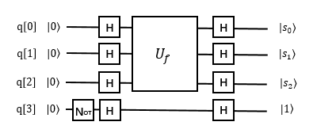

6.8 Bernstein-Vazirani算法
=============================

6.8.1 Bernstein-Vazirani算法介绍
----------------------------------

量子计算机是相对经典计算机而言的，量子计算机并不是在通常的计算问题上取代传统的电子计算机，而是针对特定问题完成经典计算机难以胜任的高难度计算工作。它是以量子力学为基础，实现量子计算的机器。比如：若运Deutsch-Jozsa 问题的量子算法（DJ算法），只需运行一次，就可以分辨函数是常数函数还是对称函数，而运用相应的经典算法则需要运行O(N)次才能达到该目的。 后来，Bernstein和Vazirani运用DJ算法有效地解决了询问量子数据库的
问题（即BV算法）。

问题描述：
************

| Input:
| 考虑一个经典的布尔函数：

.. math:: f:\{0,1\}^n→\{0,1\}

| 存在 :math:`s∈\{0,1\}^n` ，再定义一个函数：

.. math:: f_s (x)=〈s,x〉  ,x∈\{0,1\}^n

| s是一个未知的向量，通常称s为隐藏字符串（Hidden string），其中 :math:`〈s,x〉` 表示内积（inner product），定义为：

.. math:: 〈s,x〉=s_0 x_0⊕s_1 x_1⊕…⊕s_n x_n

| 符号 :math:`⊕` 在所出现的量子算法文中都表示布尔加或模2加。）
| Output：
| 算法目标：找到s.

经典算法情况：
***************

由于对该函数的每个经典查询只能生成1位的信息, 而任意隐藏字符串 s 具有n位的信息, 所以经典查询复杂性是  :math:`O(n)` 。

量子算法情况：
**************

Bernstein-Vazirani的工作建立在Deutsch和Jozsa早期工作理论上来探索量子查询复杂度。他们对该领域的贡献是一个用于隐藏字符串问题的量子算法, 该算法的非递归量子查询复杂度仅为1，同比经典情况 :math:`O(n)` 。这一量子算法的真正突破在于加快查询复杂度, 而不是执行时间本身。

案例：考虑n=3时的Bernstein-Vazirani问题。变量是3比特时，二进制表示为  :math:`x_0 x_1 x_2` ，常数s则表示为 :math:`s_0 s_1 s_2` ，因此所求的常数s总共有8个。此时，问题函数描述如下：

.. math:: f_s (x_0 x_1 x_2 )=s_0 x_0⊕s_1 x_1⊕s_2 x_2 

不难看出，对于经典算法而言，如果是 :math:`f_s (100)=s_0` ,  :math:`f_s (010)=s_1` , :math:`f_s (001)=s_2` ，那么最少也需要3次调用函数才可以确定常量 :math:`s=s_0 s_1 s_2` 。但是对于量子算法而言，使用下面的量子Oracle计算，1次就可以决定 :math:`s=s_0 s_1 s_2` ，其计算复杂度为 :math:`O(1)` 。
 

| 分析上图:

.. math:: |000⟩|1⟩\xrightarrow[]{H⨂H⨂H⨂H}\frac{2}{2\sqrt{2}}\sum_{x=0}^{7}{|x⟩⨂\left ( \frac{|0⟩-|1⟩}{\sqrt{2}}\right )}\\
    \xrightarrow[]{U_f }\frac{1}{2\sqrt{2}}\sum_{x=0}^{7}{\left ( -1 \right )^\left \langle s,x\right \rangle\:   |x⟩⨂\left ( \frac{|0⟩-|1⟩}{\sqrt{2}} \right )}\\
    \xrightarrow[]{H⨂H⨂H⨂H}\frac{2}{2\sqrt{2}}\sum_{x=0,y=0}^{7}{\left ( -1 \right )^{\left \langle s,x\right \rangle ⨂\left \langle x,y\right \rangle}\; \;    |y⟩⨂\left ( \frac{|0⟩-|1⟩}{\sqrt{2}} \right )\equiv|s⟩⨂\left ( \frac{|0⟩-|1⟩}{\sqrt{2}} \right ) }
    
| 不失一般性：

.. math:: |0⟩^n|1⟩\xrightarrow[]{H^{⨂(n+1)}}\frac{1}{\sqrt{2^n}}\sum_{x=0}^{2^n-1}{|x⟩⨂\left ( \frac{|0⟩-|1⟩}{\sqrt{2}}\right )}\\
    \xrightarrow[]{U_f }\frac{1}{\sqrt{2^n}}\sum_{x=0}^{2^n-1}{\left ( -1 \right )^\left \langle s,x\right \rangle\:   |x⟩⨂\left ( \frac{|0⟩-|1⟩}{\sqrt{2}} \right )}\\
    \xrightarrow[]{H^{⨂(n+1)}}\frac{1}{\sqrt{2^n}}\sum_{x=0}^{2^n-1}{\left ( -1 \right )^{\left \langle s,x\right \rangle ⨂\left \langle x,y\right \rangle}\; \;    |y⟩⨂\left ( \frac{|0⟩-|1⟩}{\sqrt{2}} \right )\equiv|s⟩⨂\left ( \frac{|0⟩-|1⟩}{\sqrt{2}} \right ) }

 
参考线路图：
************

| 下面给出两组案例,分别是s=101和s=111
| s=101

.. image::
        ../../images/bva_6.jpg
        :align: center
 
| QRunes :

::

    RX 3,"pi"
    H 0
    H 1
    H 2
    H 3
    CNOT 0,3
    CNOT 2,3
    H 0
    H 1
    H 2
    MEASURE 0,$0
    MEASURE 1,$1
    MEASURE 2,$2

这时，输出的结果，指代了s。通过验证,输出结果为：

.. image::
        ../../images/bva_7.jpg
        :align: center

| s=111时：
| 线路图设计为：

.. image::
        ../../images/bva_8.jpg
        :align: center
 
测量结果：

.. image::
        ../../images/bva_9.jpg
        :align: center
 
| QRunes :

::

    RX 3,"pi"
    H 0
    H 1
    H 2
    H 3
    CNOT 0,3
    CNOT 1,3
    CNOT 2,3
    H 0
    H 1
    H 2
    MEASURE 0,$0
    MEASURE 1,$1
    MEASURE 2,$2

6.8.2 Bernstein-Vazirani算法的实现
-------------------------------------

下面给出 QRunes 实现 Bernstein-Vazirani 算法的代码示例：

.. tabs::

   .. code-tab:: python
        @settings:
            language = Python;
            autoimport = True;
            compile_only = False;

        @qcodes:
        circuit<vector<qubit>,qubit> generate_bv_oracle(vector<bool> oracle_function){
            return lambda (vector<qubit> qVec, qubit qu): {
                let cd = oracle_function.length();

                for(let i = 0: 1: cd){
                    if(oracle_function[i]){
                        CNOT(qVec[i], qu);
                    }

                }
            };
        }

        BV_QProg(vector<qubit> qVec, vector<cbit> cVec, vector<bool> a, circuit<vector<qubit>,qubit> oracle){

            if(qVec.length() != (a.length()+1)){
                let cd = qVec.length();
                X(qVec[cd-1]);
                apply_QGate(qVec, H);
                oracle(qVec, qVec[cd - 1]);

                qVec.remove(0);

                apply_QGate(qVec, H);
                measure_all(qVec, cVec);
            }
        }
        @script:
        import sys
        if __name__ == '__main__':
            print('Bernstein Vazirani Algorithm')
            print('f(x)=a*x+b')
            input_a = input('input a\n')
            a = []
            for i in input_a:
                if i == '0':
                    a.append(0)
                else:
                    a.append(1)
            b = int(input('input b\n'))
            print('a=\t%s' %(int(input_a)))
            print('b=\t%s' %(int(bool(b))))
            print('Programming the circuit...')

            init(QMachineType.CPU_SINGLE_THREAD)
            qubit_num = len(a)
            cbit_num = qubit_num
            # Initialization quantum bits
            qv = qAlloc_many(qubit_num+1)
            cv = cAlloc_many(cbit_num)

            if len(qv) != (len(a)+1):
                print("error: param error")
                sys.exit(1)
            bvAlgorithm = BV_QProg(qv, cv, a, b)
            directly_run(bvAlgorithm)

            print('a=\t', end='')
            for c in cv:
                print(c.eval())
            print('b=\t%s' %(int(bool(b))))

            finalize()

   .. code-tab:: c++

       @settings:
            language = C++;
            autoimport = True;
            compile_only = False;
            
        @qcodes:
        circuit<vector<qubit>,qubit> generate_bv_oracle(vector<bool> oracle_function){
            return lambda (vector<qubit> qVec, qubit qu): {
                let cd = oracle_function.length();

                for(let i = 0: 1: cd){
                    if(oracle_function[i]){
                        CNOT(qVec[i], qu);
                    }
                }
            };
        }

        BV_QProg(vector<qubit> qVec, vector<cbit> cVec, vector<bool> a, circuit<vector<qubit>,qubit> oracle){

            if(qVec.length() != (a.length()+1)){
                let cd = qVec.length();
                X(qVec[cd-1]);
                apply_QGate(qVec, H);
                oracle(qVec, qVec[cd - 1]);

                qVec.remove(0);

                apply_QGate(qVec, H);
                measure_all(qVec, cVec);
            }

            

        }
        @script:
        int main() {
            cout << "Bernstein Vazirani Algorithm\n" << endl;
            cout << "f(x)=a*x+b\n" << endl;
            cout << "input a" << endl;
            string stra;
            cin >> stra;
            vector<bool> a;
            for (auto iter = stra.begin(); iter != stra.end(); iter++)
            {
                if (*iter == '0')
                {
                    a.push_back(0);
                }
                else
                {
                    a.push_back(1);
                }
            }
            cout << "input b" << endl;
            bool b;
            cin >> b;
            cout << "a=\t" << stra << endl;
            cout << "b=\t" << b << endl;
            cout << " Programming the circuit..." << endl;
            size_t qubitnum = a.size();
            init();
            vector<Qubit*> qVec = qAllocMany(qubitnum+1) ;
            auto cVec = cAllocMany(qubitnum);
            auto oracle = generate_bv_oracle(a);
            auto bvAlgorithm = BV_QProg(qVec, cVec, a, oracle);
            directlyRun(bvAlgorithm);
            string measure;
            cout << "a=\t";
            for (auto iter = cVec.begin(); iter != cVec.end(); iter++)
            {
                cout << (*iter).eval();
            }
            cout << "\n" << "b=\t" << b << endl;
            finalize();
        }

6.8.3 Bernstein-Vazirani算法小结
-----------------------------------
	
Bernstein-Vazirani的工作建立在Deutsch和Jozsa早期工作理论上来探索量子查询复杂度。他们对该领域的 贡献是一个用于隐藏字符串问题的量子算法, 该算法的非递归量子查询复杂度仅为1，同比经典情况O(n)。这一量子算法的真正突破在于加快查询复杂度, 而不是执行时间本身。
