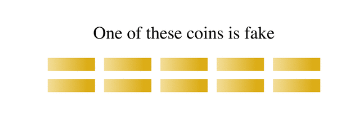
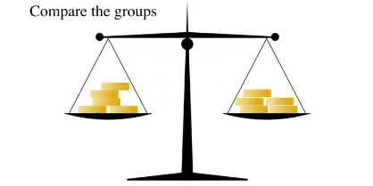
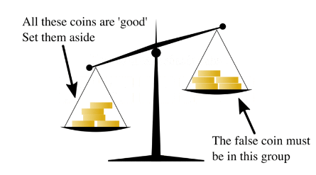
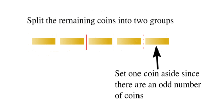

6.7 CoinFlip算法
====================

6.7.1 CoinFlip算法介绍
-------------------------

你扔出一枚硬币，硬币要么正面朝上，要么背面朝上。但是在微观情况下，事情并非完全那么确定。如果你扔出的是一枚“原子”硬币，那么你得到的可能是一种正面和反面的叠加态，但是，这样的情况只是发生在你不在观察硬币的时候。如果你去观察，呈现在你眼前的可以是正面也可以是反面，随你喜欢而定。如果你像抛硬币一样扔出一个量子粒子，你就会看到不同寻常的效应。德国波恩大学的物理学家首次在铯原子实验中展示了这种效应。

6.7.2 CoinFlip算法的实现
--------------------------

问题描述：
**************

E.D.Schell在1945年1月版的美国数学月刊上提出了假币问题，初始问题是给定一定数量的硬币，其中一枚假币的质量和其他真币的质量不一样（外形一样，但质量轻），给定一个天平，可用来确定哪一枚是假币（通过天平的倾斜与否来判断重量差异）。

理解问题：（以下是帮助理解规则）
**********************************

假设给定10枚硬币，其中一枚硬币是假的，质量比真硬币轻。

 
第一步，将10枚硬币均分为两组，每一组包含5个硬币：

.. image::
        ../../images/coinflip_2.jpg

 
第二步，使用天平来判断：

 
第三步：根据倾斜程度，可以判断假币在哪一个分组里，如下图，假硬币在左侧。

 
第四步，将包含假币的5枚硬币拿出来。

.. image::
        ../../images/coinflip_5.jpg

第五步，将5枚硬币划分为2组2枚的，外加单独1枚。

 

第六步，把2组硬币放入天平，查看天平倾斜情况。如果天平，持平，则额外的哪一枚是假币。

.. image::
        ../../images/coinflip_7.jpg
 

第七步，判断天平倾斜情况，如果是下面的情况，表明左侧包含了假币。

.. image::
        ../../images/coinflip_8.jpg
 

第八步，判断可能包含假币的两枚，分别放入天平两侧，一次性就可以判断出真假。

.. image::
        ../../images/coinflip_9.jpg
 
如上问题是对十个硬币的判断。（如上参考维基百科）

当然，该问题在不同的参考文献里有不同的版本，本实验算法里假设：

#. 真币的重量均等，假币的质量也均等，假币的质量比真币轻。
#. 天平只给我们提供两个信息，平衡（两组币的重量相同）或倾斜。

| 算法简述：给定N个外形一样的硬币，其中有k个假币，真币的质量均相等，假币质量轻。
| 算法目标：找出这k个假币。

策略：
*********

本实验算法主要是Berstein 和 Vazirani 奇偶校验问题的一个应用，在经典策略里面，每次测量只能有一次，左右两边相同数的硬币数判断。而量子算法是通过构建叠加态从而对经典策略基础上的改进，我们可以同时查询叠加的左右两边状态。

量子策略模型简述：
******************

在该问题里，平衡的天平模型可以用一个Oracle来刻画。简称B-Oracle(Balance Oracle)，它是一个N位的寄存器： :math:`x_1 x_2…x_N∈\{0,1\}^N`，为了检索这些值，我们需要做一个查询（Query）,查询字符 :math:`q_1 q_2…q_n∈\{0,1,-1\}^N`,其中包括相同数量的1和-1（数量定义为L）。该Oracle返回1位的答案X，定义如下：

.. math:: f(x)=\left\{
                            \begin{aligned}
                            & 0 &  \sum_{i=1}^{n}{x_iq_i=0} \\
                            &1& Otherwise \\
                            \end{aligned}
                            \right.

考虑 :math:`x_1 x_2…x_N` 表示N个硬币，而且0表示硬币质量均等，1表示有一个假币。因此， :math:`q_i=1` 意味着我们把硬币 :math:`x_i` 放在天平右侧， :math:`q_i=-1` 则表示将x_i放在左侧盘里。这个时候我们必须保证，有相同数量的1和-1（天平里左右两侧放入相同数量的硬币），答案X正确的模拟了天平秤。如：  :math:`X=0`  
则表示天平两边相等，反之  :math:`X=1` 表示倾斜。

有效的构造转化W(这里的思想可以参考Gervor算法). 从上面我们也可看出，如果N个硬币里包含了k（k大于1）个假币，那么Find(k)的复杂度是多项式时间复杂，我们已经在Bernstein-Vazirani算法接触了k=2的情况（请参考我们算法库里的Bernstein-Vazirani Algorithm ）。本算法主要目的是展示量子算法的优越性，因此只考虑包含一个假币的情况（即k=1）。

查找所有 k 假硬币的量子查询复杂度是入下表, 给定输入如上描述。

===============   ===============   ===============   ===============   ===============   
Results             k=1               k=2               k=3               general
Quantum             1                 1                 2<=k<=3           O(k^(1/4))
Classical           logN              >=2log(N/2)       >=3log(N/3)       Ω(k log(N/k))
===============   ===============   ===============   ===============   ===============   

通过上表，比较清晰的展示了量子策略的优越性，尤其在多假币的情况下，当然，我们一个假币的情况，但是在硬币为N的时候，量子测量一次就可以完成。
一个假币的情况，详情请看Counterfeit Coin Game的参考线路图：

参考线路图：
*********************

.. image::
        ../../images/coinflip_10.jpg

线路说明：紫色的if表示的是测量判断，根据输出的经典信息来判断是否需要执行下一步的操作。上面线路图里判定条件，如果输出为0的时候，则需要执行0 对应的操作，实际上就是从新执行一遍量子线路，反之，执行U_f操作，U_f指代了错误币所在位置的控制非门，目标位最后一位。

下面给出 QRunes 实现 CoinFlip 算法的代码示例：

::

    @settings:
        language = Python;
        autoimport = True;
        compile_only = False;
        
    @qcodes:
    // Determine whether the next step needs to be performed based on the classical output information
    CoinFlip_Algorithm(vector<qubit> q, vector<cbit> c, bool fx) {
        X(q[0]);
        H(q[0]);
        X(q[1]);
        CNOT(q[0], q[1]);
        H(q[1]);
        // If the output is 0, then the corresponding operation is needed later.
        if (fx) {
            X(q[0]);
        }
        H(q[0]);
        CNOT(q[0], q[1]);
        H(q[0]);
        Measure(q[0], c[0]);
        Measure(q[1], c[1]);
    }
        
    @script:
    import sys
    def CoinFlip_Prog(prog, q, c, fx):
        temp = CoinFlip_Algorithm(q, c, fx)
        prog.insert(temp)
        res = directly_run(prog)
        return ( c[1].eval() << 1) + int(c[0].eval())
    
    if __name__ == '__main__':
        print('Entanglement Flip Game')
        fx = int(input('Input choice of Q:(0/1)\n'))
        print('Programming the circuit...')
    
        init(QMachineType.CPU_SINGLE_THREAD)
    
        qubit_num = 2
        cbit_num = 2
        # Initialization of 2 quantum bits
        qv = qAlloc_many(qubit_num)
        cv = cAlloc_many(cbit_num)
        out_come = 0
        prog = QProg()
        temp = CoinFlip_Prog(prog, qv, cv, fx)
        for i in range(0, 10, 1):
            out_come = CoinFlip_Prog(prog, qv, cv, fx)
            if out_come != temp:
                print('Q wins!')
                sys.exit(0)
        print('max entanglement!')
        print('P wins!')
    
        finalize()

6.7.3 CoinFlip算法小结
------------------------

我们传统的电脑构建模块，只能存储两个状态中的其中一个，就如硬币，50个同时抛掷你只能记录一种正反面的状态，50个硬币同时记录的话，就需要量子计算机就数千兆字节的数据存储才能达到。量子计算机就是这样的，它们是基于量子位的，它可以同时处于两个状态。这可以使每个硬币的单个量子位一次存储所有配置的概率分布