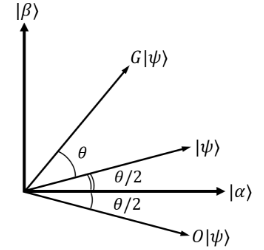

6.3 Grover算法
=================

6.3.1 Grover算法介绍
------------------------

什么是搜索算法呢？举一个简单的例子，在下班的高峰期，我们要从公司回到家里。开车走怎样的路线才能够耗时最短呢？我们最简单的想法，当然是把所有可能的路线一次一次的计算，根据路况计算每条路线所消耗的时间，最终可以得到用时最短的路线，即为我们要找的最快路线。这样依次的将每一种路线计算出来，最终对比得到最短路线。搜索的速度与总路线数N相关，记为 O(N) 。而采用量子搜索算法，则可以以 O(sqrt(N)) 的速度进行搜索，要远快于传统的搜索算法。

那么我们怎么实现Grover搜索算法呢？ 

首先，我们先化简一下搜索模型。我们将所有数据存在数据库中，假设我们有n个量子比特，用来记录数据库中的每一个数据的索引，一共可以表示 :math:`2^n` 个数据，记为N个。我们希望搜索得到的数据有M个。为了表示一个数据是否我我们搜索的结果。我们建立一个函数：

.. math:: f(x) = \left\{\begin{matrix}0 & (x \neq x_0)\\ 1 & (x = x_0) \end{matrix}\right.

其中 :math:`x_0` 为我们的搜索目标的索引值。也就是说，当我们搜索到我们的目标时，我们的函数值f(x)置为1，如果搜索的结果不是我们的目标时，f(x)置为0。

接下来，我们假设有一个量子Oracle可以识别搜索问题的解，是别的结果通过Oracle的一个量子比特给出。我们可以将Oracle定义为:

.. math:: |x⟩|q⟩\overset{Oracle}{\rightarrow} |x⟩|q⟩⨁f(x)⟩
 
其中 \|q⟩ 是一个结果寄存器, ⨁ 是二进制加法，通过Oracle，我们可以实现，当搜索的索引为我们的目标结果时，结果寄存器翻转；反之，结果寄存器值不变。从而我们可以通过判断结果寄存器的值，来确定搜索的对象是否为我们要的目标值。
如此描述Oracle有些抽象，Oracle对量子态的具体操作是什么样的呢？同D-J算法相似，我们先将初态制备在 :math:`|0⟩ ⨁^{n}|1⟩` 态上，:math:`0⟩⨁^{n}` 为查询寄存器，:math:`1⟩` 为结果寄存器。 经过 Hardmard 门操作后，可以将查询寄存器的量子态，变为所有结果的叠加态。换句话说，经过了 Hardmard 门，
我们就可以得到所有结果的索引。而结果寄存器则变为 :math:`\frac{1}{\sqrt{2}}(|0⟩ - |1⟩)` 接下来，使其通过Oracle，可以对每一个索引都进行一次检验，如果是我们的目标结果，则将答案寄存器的量子态进行0、1翻转，即答案寄存器变为 

.. math:: \frac{1}{\sqrt{2}}(|1⟩ - |0⟩) = -\frac{1}{\sqrt{2}}(|1⟩ - |0⟩)

，而查询寄存器不变。而当检验的索引不是我们要求的结果时，寄存器均不发生改变。因此，Oracle可以换一种表示方式

.. math:: |x⟩\left ( \frac{|0⟩-|1⟩}{\sqrt{2}} \right )\overset{Oracle}{\rightarrow}(-1)^{f(x)}|x⟩\left ( \frac{|0⟩-|1⟩}{\sqrt{2}} \right )

其中，\|x⟩ 是查询寄存器的等额叠加态中的一种情况。 

也就是说，Oracle的作用，是通过改变了解的相位，标记了搜索问题的解。

现在，我们已经将搜索问题的解通过相位标记区分出来了。那么如何能够将量子态的末态变为已标记出的态呢？

我们将问题换一种思路进行考虑。我们知道，当查询寄存器由初态经过 Hardmard 门后，会变为所有可能情况的等额叠加态。也就是说，它包含着所有搜索问题的解与非搜索问题的解。我们将这个态记为
 
.. math:: |\psi⟩ = \frac{1}{\sqrt{N}}\sum_{x}|x⟩

我们将所有非搜索问题的解定义为一个量子态 \|α⟩ ,其中 :math:`\sum_{x_{1}}` 代表着 x 上所有非搜索问题的解的和。

.. math:: |\alpha⟩  = \frac{1}{\sqrt{N - M}}\sum_{x_1}|x⟩
 
显然，\|β⟩ 为我们期望的最终的量子态，而且 \|α⟩ 和 \|β⟩ 相互正交。利用简单的代数运算，我们就可以将初态 \|ψ⟩ 重新表示为

.. math:: |\psi⟩ = \sqrt{\frac{N -M}{N}}|\alpha⟩+\sqrt{\frac{M}{N}}|\beta⟩
 
也就是说，我们用搜索问题的解的集合和非搜索问题的解的集合，重新定义了初始态换句话说，我们的初态属于 \|α⟩ 与 \|β⟩ 张成的空间。因此，我们可以用平面向量来表示这三个量子态，如图。

那么，Oracle作用在新的表示方法下的初态会产生怎样的影响呢？
我们知道，Oracle的作用是用负号标记搜索问题的解，因此相当于将 \|β⟩ 内每一个态前均增加一个负号，将所有的负号提取出来，可以得到：
 
.. math:: |\psi⟩ \overset{Oracle}{\rightarrow} \sqrt{\frac{N -M}{N}}|\alpha⟩ - \sqrt{\frac{M}{N}}|\beta⟩

对应在平面向量中，相当于将 \|ψ⟩ 做关于 \|α⟩ 轴的对称。
但是，仅仅有这一种操作，是无法将量子态从 \|ψ⟩ 变为 \|β⟩ 。我们还需要另一种对称操作。

第二种对称操作，是将量子态关于|ψ⟩ 对称的操作。这个操作由三个部分构成。 

1. 将量子态经过一个 Hardmard 门。 
2. 对量子态进行一个相位变换，将 :math:`|0⟩ ⨁^n` 态的系数保持不变，将其他的量子态的系数增加一个负号。相当于 :math:`2|0⟩⟨0|-I` 酉变换算子。 
3. 再经过一个 Hardmard 门。 

这三步操作的数学表述为:

.. math:: H^{\bigotimes n}(2|0⟩⟨0|-I)H^{\bigotimes n}= 2|\psi ⟩⟨\psi|-I
 
上述过程涉及到复杂的量子力学知识，如果你不理解，没关系。你只需要知道，这三部分的操作，只是为了实现将量子态关于|ψ⟩ 对称即可。如果你想了解为什么这三步操作可以实现，可以阅读关于量子计算相关书籍进一步理解。

前面介绍的两种对称操作，合在一起称为一次Grover迭代。假设初态 \|ψ⟩与 \|α⟩ 可以表示为
 
.. math:: |\psi⟩ = cos\frac{\theta}{2}|\alpha⟩ + sin\frac{\theta}{2}|\beta⟩

很容易得到

.. math:: cos\frac{\theta}{2} = \sqrt{\frac{N-M}{N}}
 
可以从几何图像上看到，每一次Grover迭代，可以使量子态逆时针旋转 θ。经历了k次Grover迭代，末态的量子态为：

.. math:: G^{k}|\psi⟩ = cos\left (\frac{2k+1}{2}\theta\right )|\alpha⟩  + sin\left (\frac{2k+1}{2}\theta\right )|\beta⟩ 
 
因此，经过多次迭代操作，总可以使末态在|β⟩ 态上概率很大，满足精确度的要求。经过严格的数学推导，可证明，迭代的次数R满足:

.. math:: R\leq \frac{\pi }{4}\sqrt{\frac{N}{M}}

**参考线路图：**

.. image:: ../../images/dj_3.png
 

6.3.2 Grover算法的实现
------------------------

下面给出 QRunes 实现 Grover 算法的代码示例：

::

    @settings:
    language = Python;
    autoimport = True;
    compile_only = False;

    @qcodes:
    circuit<vector<qubit>,qubit> generate_3_qubit_oracle(int arget){
        return lambda (vector<qubit> qvec,qubit qu):{
            if(target == 0){
                X(qvec[0]);
                X(qvec[1]);
                Toffoli(qvec[0], qvec[1], qu);
                X(qvec[0]);
                X(qvec[1]);
            }
            if(target == 1){
                X(qvec[0]);
                Toffoli(qvec[0], qvec[1], qu);
                X(qvec[0]);
            }
            if(target == 2){
                X(qvec[1]);
                Toffoli(qvec[0], qvec[1], qu);
                X(qvec[1]);
            }
            if(target == 3){
                Toffoli(qvec[0], qvec[1], qu);
            }
        };
    }

    circuit diffusion_operator(vector<qubit> qvec){
        vector<qubit> controller;
        controller = qvec[0:qvec.leng()-1];
        for (qubit q in qvec)
            H(q);
        for (qubit q in qvec)
            X(q);
        Z(qvec[qvec.length()-1]).control(controller);
        for (qubit q in qvec)
            X(q);
        for (qubit q in qvec)
            H(q);
    }

    @script:
    if __name__ == '__main__':
        condition = 1
        while condition == 1:
            print("input the input function")
            print("The function has a boolean input")
            print("and has a boolean output")
            print("target=(0/1/2/3)?")
            target = int(input())
            print("Programming the circuit...")
            oracle = generate_3_qubit_oracle(target)

            qvm = init_quantum_machine(QMachineType.CPU_SINGLE_THREAD)

            qubit_number = 3

            working_qubit = qvm.qAlloc_many(qubit_number-1)
            
            ancilla = qvm.qAlloc()

            cbitnum = 2
            cvec = qvm.cAlloc_many(cbitnum);
            
            repeate = 1
            
            prog = Grover_algorithm(working_qubit, ancilla, cvec, oracle, repeate)

            # To Print The Circuit
            print(to_QRunes(prog, qvm))

            resultMap = directly_run(prog)
            
            if resultMap["c0"]:
                if resultMap["c1"]:
                    print("target number is 3 !")
                else:
                    print("target number is 2 !")
            else:
                if resultMap["c1"]:
                    print("target number is 1 !")
                else:
                    print("target number is 0 !")
            destroy_quantum_machine(qvm)

6.3.3 Grover算法小结
-----------------------
1996年，Lov Grover提出了量子搜索算法，对于N个无序列数据里寻求1个有效数据，经典算法给出的有效时间复杂度为O(N)，而Grover证明了处理同样的问题，量子算法可以做到时间复杂度为O(√N)。也就说Grover的搜索算法可以以指数级的加速改善搜索复杂度。
如何更直观理解：假设给定相同的问题，量子计算用10000次就解决，但是经典计算机则需要10000^2=100000000，这是一万和一亿的差距。由此可见，对于大数据的搜索，Grover算法印证了量子计算能大显身手，可有效解决搜索问题。