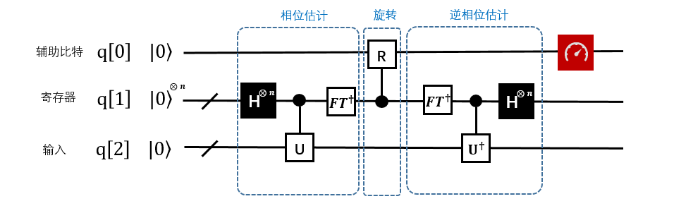

6.4 HHL算法 
=============

6.4.1 HHL算法介绍
--------------------

HHL算法是一个用量子计算机解决线性问题Ax=b最优解的算法，广泛的被应用于许多量子机器学习算法中（如支持向量机SVM，主成分分析PCA等等）。量子算法在其经典计算对比下，呈指数级加速。Harrow, Hassidim 和 Lloyd（HHL）提出了一种求解线性系统 Ax=b (其中A是算子，x，b是向量)中x信息的量子线性系统分析。HHL算法解决了什么样的问题？那就是求解线性方程的问题。

HHL算法的输入和输出:

- 输入：一个n*n的矩阵A和一个n维向量b， 

- 输出：n维向量x，满足Ax=b。

    
HHL的限制条件：

1. 输入的矩阵，必须是adjoint矩阵，当A不是Hermitian时，需要构造成adjoint矩阵。算法的输入部分如图1中红色方框所标出。输入q[2]存放在底部寄存器中，输入A作为相位估计中酉算子的一个组成部分。
2. 输出x的形式：算法的输出如红色部分标出（同一个寄存器）。底部寄存器存放的是一个蕴含了向量x的量子态。 此处不需要知道这个状态具体情况。

.. image::
        ../../images/hhl_2.png

6.4.2 HHL算法的实现 
---------------------

下面给出 QRunes 实现 HHL 算法的代码示例：

.. tabs::

   .. code-tab:: python

        @settings:
            language = Python;
            autoimport = True;
            compile_only = False;

        @qcodes:
        circuit CRotate(vector<qubit> q) {
            vector<qubit> controlVector;
            controlVector.append(q[1]);
            controlVector.append(q[2]);
            X(q[1]);
            RY(q[0], Pi).control(controlVector);
            X(q[1]);
            X(q[2]);
            RY(q[0], Pi/3).control(controlVector);
            X(q[2]);
            RY(q[0], 0.679673818908).control(controlVector);  //arcsin(1/3)
        }

        //Phase estimation algorithms
        circuit hhlPse(vector<qubit> q) {

            H(q[1]);
            H(q[2]);
            RZ(q[2], 0.75*Pi);
            CU(Pi, 1.5*Pi, -0.5*Pi, Pi/2, q[2], q[3]);
            RZ(q[1], 1.5*Pi);
            CU(Pi, 1.5*Pi, -Pi, Pi/2, q[1], q[3]);

            CNOT(q[1], q[2]);
            CNOT(q[2], q[1]);
            CNOT(q[1], q[2]);

            H(q[2]);
            CU(-0.25*Pi, -0.5*Pi, 0, 0, q[2], q[1]);
            H(q[1]);
        }

        hhl_no_measure(vector<qubit> qlist, vector<cbit> clist) {
            //phase estimation
            hhlPse(qlist);
            //rotate
            CRotate(qlist);
            measure(qlist[0], clist[0]);
            qif (clist[0]) {
                hhlPse(qlist).dagger();
            }
        }

        @script:
        if __name__ == '__main__':
            init(QMachineType.CPU_SINGLE_THREAD)

            qubit_num = 4
            cbit_num = 2
            qv = qAlloc_many(qubit_num)
            cv = cAlloc_many(cbit_num)
            hhlprog = QProg()
            hhlprog.insert(RY(qv[3], 3.14159265358979/2))   #change vecotr b in equation Ax=b
            hhlprog.insert(hhl_no_measure(qv, cv))
            directly_run(hhlprog)
            pmeas_q = []
            pmeas_q.append(qv[3])
            res = PMeasure_no_index(pmeas_q)
            print('prob0: %s' %(res[0]))
            print('prob1: %s' %(res[1]))

            finalize()

   .. code-tab:: c++

        @settings:
            language = C++;
            autoimport = True;
            compile_only = False;
            
        @qcodes:
        circuit CRotate(vector<qubit> q) {
            vector<qubit> controlVector;
            controlVector.append(q[1]);
            controlVector.append(q[2]);
            X(q[1]);
            RY(q[0], Pi).control(controlVector);
            X(q[1]);
            X(q[2]);
            RY(q[0], Pi/3).control(controlVector);
            X(q[2]);
            RY(q[0], 0.679673818908).control(controlVector);  //arcsin(1/3)
        }

        //Phase estimation algorithms
        circuit hhlPse(vector<qubit> q) {

            H(q[1]);
            H(q[2]);
            RZ(q[2], 0.75*Pi);
            CU(Pi, 1.5*Pi, -0.5*Pi, Pi/2, q[2], q[3]);
            RZ(q[1], 1.5*Pi);
            CU(Pi, 1.5*Pi, -Pi, Pi/2, q[1], q[3]);

            CNOT(q[1], q[2]);
            CNOT(q[2], q[1]);
            CNOT(q[1], q[2]);

            H(q[2]);
            CU(-0.25*Pi, -0.5*Pi, 0, 0, q[2], q[1]);
            H(q[1]);
        }

        hhl_no_measure(vector<qubit> qlist, vector<cbit> clist) {
            //phase estimation
            hhlPse(qlist);
            //rotate
            CRotate(qlist);
            measure(qlist[0], clist[0]);
            qif (clist[0]) {
                hhlPse(qlist).dagger();
            }
        }
        @script:
        int main() {
            map<string, bool> temp;
            int x0 = 0;
            int x1 = 0;

            init(QMachineType::CPU);
            int qubit_number = 4;
            vector<Qubit*> qv = qAllocMany(qubit_number);
            int cbitnum = 2;
            vector<ClassicalCondition> cv = cAllocMany(2);

            auto hhlprog = CreateEmptyQProg();
            hhlprog << RY(qv[3], PI / 2); //  change vecotr b in equation Ax=b
            hhlprog << hhl_no_measure(qv, cv);
            directlyRun(hhlprog);
            QVec pmeas_q;
            pmeas_q.push_back(qv[3]);
            vector<double> s = PMeasure_no_index(pmeas_q);

            cout << "prob0:" << s[0] << endl;
            cout << "prob1:" << s[1] << endl;
            finalize();
        }

6.4.3 HHL算法小结
-------------------

线性系统是很多科学和工程领域的核心，由于HHL算法在特定条件下实现了相较于经典算法有指数加速效果，从而未来能够在机器学习、数值计算等场景有优势体现。配合Grover算法在数据方面的加速，将是未来量子机器学习，人工智等科技得以突破的关键性技术。

