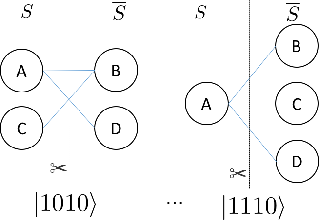
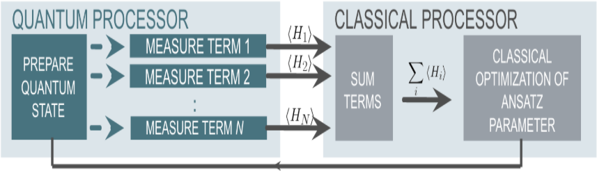

6.1 QAOA算法
================

6.1.1 QAOA算法介绍
----------------------

量子近似优化算法(QAOA)，是由Farhi, Goldstone和Gutmann开发的一个多项式时间算法，用于寻找“最优化问题的一种‘好’的解决方案”。对于给定的NP-Hard问题，近似算法是一种多项式时间算法，QAOA算法以期望的一些质量保证来解决每个问题实例。品质因数是多项式时间解的质量与真实解的质量之间的比率。

**NP-Hard Problem**

最大切割问题（MAX-CUT）是原始量子近似优化算法论文中描述的第一个应用。此问题类似于图形着色。给定节点和边的图形，将每个节点着色为黑色或白色，然后对有不同颜色节点的边给定一个分值。目的是找到得分最高的着色点。
更正式地说，问题是将图的节点划分为两组，使得连接相对组中的节点的边的数量最大化。例如，杠铃图
 
.. image:: ../../images/qaoa_1.png\
    :width: 160px
    :height: 70px
    :align: center

有4种方法将节点分为两组：

.. image:: ../../images/qaoa_2.png
 
我们仅对连接不同集合中的节点时才会绘制边。带有剪刀符号的线条表示我们要计算的切割边。对于杠铃图，有两个相等的权重分区对应于最大切割（如上图，右侧两个分区），将杠铃切成两半。我们可以将集合S或¯S中的节点表示为
0或1，组成一个长度为N的比特串 。上图的四个分区可以表示为 {00, 11, 01, 10} 其中最左边的比特对应节点 A，最右边的比特对应节点B。用比特串来表示使得表示图的特定分区变得很容易。每个比特串具有相关联的切割权重。
对任意一个图中，节点分割所使用的比特串长度总是N。可分割的情况总数是 :math:`2^N` 。例如，方形环见下图：

.. image:: ../../images/qaoa_3.png
    :width: 160px
    :height: 140px
    :align: center

有16个可能的分区（:math:`2^4`）。以下是两种可能的节点分区方式：
 

与每个分区相关联的比特串如上图所示，其中最右边的比特对应节点A，最左边的比特对应节点D。

解决方案
++++++++++

**经典解决算法**

为了在经典计算机上找到最佳剪切，最直接的方法是枚举图的所有分区并检查与分区关联的切割的权重。

面对寻找最佳切割（或一组最佳切割）的指数成本，我们可以设计出具有特定质量的多项式算法。例如，著名的多项式时间算法是随机分区方法，通过遍历图表的节点并抛掷硬币，如果硬币是正面，则节点在集合S中，否则节点在集合¯S中。随机分配算法的质量至少是最大切割的50％。对于硬币抛掷过程来说，边被切割中的概率是50％。因此，随机分配产生的切割的期望值可以写成如下：

.. math:: \sum W_e\cdot Pr(e \in cut) = \frac{1}{2} \sum W_e

由于所有边的总和必然是最大切割的上限，因此随机化方法产生的切割预期值至少是中最佳切割的 0.5 倍。
其它多项式方法包括半定规划可以使期望的切割值至少为最大切割的 0.87856 倍。

**量子近似优化算法（QAOA）**

我们可以将对应于图上的最大切割的比特串（或比特串组），视为是使用哈密顿量编码的代价函数的基态。这个哈密顿量的形式，可以通过构造经典函数返回值来决定，如果被切割边所对应的两个节点跨越不同集合，则返回1（或边的权重），否则返回0。

.. math:: C_{ij} = 1/2(1-z_i z_j)

如果节点i和节点j属于S，则 :math:`z_i` 或 :math:`z_j` 的值为 +1，否则为 -1。总代价是图中所有 (i, j) 节点对形成的边集权重的总和。这表明对于 MAX-CUT，哈密顿量编码的问题是

.. math:: \sum_{ij}\frac{1}{2}(I-σ_i^z σ_j^z)

其中和是对图中（i，j）节点对组成的边集权重的遍历。量子近似优化算法（QAOA）基于这样的事实：我们可以准备一些近似于该哈密顿量的基态的东西并对该状态进行测量，对 N 位量子状态执行测量，并以高概率返回对应于最大切割的比特串。
为了使描述更具体，让我们回到杠铃图。该图需要两个量子位以表示节点。就会有如下的哈密顿量的形式

.. math::  \widehat{H} = \frac{1}{2} (I-σ_z^1 ⊗σ_z^0 )= \begin{bmatrix}0& 0 &  0& 0\\ 0 &  1& 0 & 0\\ 0&  0&  1& 0\\ 0 & 0 & 0 & 0\end{bmatrix}

基序对应于以二进制格式增加整数值（最左边的位是最重要的）。这对应于上面的H ̂操作符的基底是：

.. math:: (|00⟩, |01⟩, |10⟩, |11⟩)

这里哈密顿量是带有整数特征值的对角线，显然这里每个比特串都是哈密顿量的特征态因为 :math:`\widehat{H}` 是对角线的。

QAOA 通过从参考状态演变来识别 MAXCUT 哈密顿量的基态，该参考状态是哈密顿量的基态，它耦合总共 :math:`2^N` 个状态来构成成本哈密顿量的基底——成本函数的对角基底。对于 MAX-CUT，这是以 Z 为计算基底。

参考哈密顿量的基态与 MAXCUT 哈密顿量的基态之间的演化可以通过两个算子之间的插值产生

.. math:: \widehat{H}_τ= τ\widehat{H}_{ref}+ (1-τ)\widehat{H}_{MAXCUT}

其中 τ 在 1 和 0 之间变化，如果参考的哈密顿量基态已经准备好并且 τ=1 ，这个状态是 :math:`\widehat{H}_τ` 的静止状态。当 :math:`\widehat{H}_τ` 变换到 MAXCUT 哈密顿量，基态相对于 :math:`\widehat{H}_(τ≠1)` 将演变成为不再静止。这可以被认为是 QAOA 演变的连续版本。

算法的近似部分来自于使用多少个T值来逼近连续演化。我们将这个切片数称作 α。原始论文证明，对于 α = 1 时，最优线路产生的状态分布，具有哈密顿期望值为3-正则图的真实最大切割值 0.6924。此外，通过增加近似演化的切片数量，可以改善真实最大切割与来自 QAOA 的期望值之间的比值。

**实现细节**

对于MAXCUT，参考哈密顿量是 :math:`σ_x` 运算符在每个量子位上的和。

.. math:: \widehat{H}_{ref}= \sum_{i=0}^{N-1}\sigma ^{X}_{i}

该哈密顿量具有基态，该基态是 :math:`σ_x` 算子 (\|+⟩) 的最低特征向量的张量积。

.. math:: |ψ_{ref}⟩=|+⟩_{N-1}⊗|+⟩_{N-2}⊗…⊗|+|+⟩_0

通过在每个量子位上执行 Hadamard 门很容易生成参考状态。假设系统的初始状态全为零。生成此状态的 QRunes 代码是

::

    H 0
    H 1
    ...
    H N-1

QPanda::QAOA要求用户输入参考哈密顿量和 MAXCUT 哈密顿量之间演化的近似步长。然后，该算法使用最大化成本函数的 quantum-variational-eigensolver 方法来变分地确定旋转的参数（表示为 β 和 γ ）。

例如，如果选择（α = 2），则生成近似连续演化的两个单一算子。

.. math:: U = U(\widehat{H}_{\alpha1})U(\widehat{H }_{\alpha0})

每个 :math:`U (\widehat{H}_{\alpha i})` 由一阶 Trotter-Suzuki 分解近似，Trotter 步数等于1

.. math:: U (\widehat{H}_{si})= U(\widehat{H}_{ref},β_i)U(\widehat{H}_{MAXCUT},γ_i )
 
其中

.. math:: U(\widehat{H}_{ref},β_i ) = e^{-iβ_{i}\widehat{H}_{ref}}

并且

.. math:: U(\widehat{H}_{MAXCUT},γ_i ) = e^{-iγ_{i}\widehat{H}_{MAXCUT}}

:math:`U(\widehat{H}_{ref},β_i )` 和 :math:`U(\widehat{H}_{MAXCUT},γ_i )` 可以表示为一个短的量子线路。

对于 :math:`U(\widehat{H}_{ref},β_i )` 项（或混合项），总和中的所有运算符都可以通信，因此可以分成指数 :math:`σ_x` 运算符的乘积。

.. math:: e^{−iβ_{i}\widehat{H}ref} = \prod_{n=0}^{1}e^{−iβ_{i}\sigma^{x}_{n}}

::

    H 0
    RZ(beta_i) 0
    H 0
    H 1
    RZ(beta_i) 1
    H 1

当然，如果RZ在量子处理器的自然门集中，则该 QRunes 被编译成一组RZ旋转。QRunes代码风格的成本函数。

.. math:: e^{-i\frac{γi}{2}(I-σ_1^Z⊕σ_0^Z)}

看起来像这样：

::

    X 0
    U1(gamma{i}/2) 0
    X 0
    U1(gamma{i}/2) 0
    CNOT 0 1
    RZ(gamma{i}) 1
    CNOT 0 1

执行QRuns代码将会产生 :math:`|+⟩_1⊗|+⟩_0` 状态，并用选定的β 和 γ 角度进行演化

.. math:: |β,γ⟩= e^{-iβ_1\widehat{H}_{ref}}\quad e^{-iγ_1\widehat{H}_{MAXCUT}}\quad  e^{-iβ_0\widehat{H}_{ref}}\quad e^{-iγ_0\widehat{H}_{MAXCUT}}\quad |+⟩_{N-1,… ,0}

为了识别最大化目标函数的β和γ角的集合

.. math:: ⟨β,γ|\widehat{H}_{MAXCUT} |β,γ⟩

QPanda::QAOA利用经典量子混合方法，称为quantum-variational-eigensolver。量子处理器通常通过多项式操作来准备状态，然后使用该操作来评估成本。评估成本（ :math:`⟨β,γ|\widehat{H}_{MAXCUT}|β,γ⟩` ）需要进行许多准备和测量以生成足够的样本来准确地构建分布。然后，经典计算机再生成一组新的参数(β,γ)，以最大化成本函数。
 

通过允许β和γ角度的自由变化，QAOA找到固定步数的最佳路径。一旦通过经典优化循环确定了最佳角度，就可以通过β，γ和采样的状态的许多准备来读出分布。

6.1.2 QAOA算法的实现
-----------------------

下面给出 QRunes 实现 QAOA 算法的代码示例：

.. tabs::

   .. code-tab:: python

        @settings:
            language = Python;
            autoimport = True;
            compile_only = False;

        @qcodes:
        //Solving the problem of Maximum Cutting
        variationalCircuit oneCircuit(vector<qubit> qlist, hamiltonian hp, avar beta, avar gamma){
            for(let i = 0 : 1: hp.size()){
                vector<qubit> tmp_vec;
                let hamiltonItem = hp[i];
                let dict_p = hamiltonItem.getFirst();
                for(map m in dict_p) {
                    tmp_vec.add(qlist[m.first()]);
                }

                let coef = tmp_vec.getSecond();
                VQG_CNOT(tmp_vec[0], tmp_vec[1]);
                VQG_RZ(tmp_vec[1], 2*gamma);
                VQG_CNOT(tmp_vec[0], tmp_vec[1]);
            }

            for(let i=0: 1: qlist.size()){
                VQG_RX(qlist[i],2.0*beta);
            }
        }

        @script:
        import numpy as np

        #Convert the data format to be processed
        def trans(friendShip):
            pro = {}
            for i in range(len(friendShip)):
                for j in range (len(friendShip[i])):
                    if i != j:
                        s = "Z" + str(i) + " " + "Z" + str(j)
                        pro[s] = friendShip[i][j]
            return pro

        if __name__=="__main__":
            firendShip =[[0, 0.8, 0.2, -0.2],[0.8, 0, 0, 0.7],[0.2, 0, 0, -0.3],[-0.2, 0.7, -0.3, 0]]
            print("what we r need to handle:")
            print(firendShip)
            problem = trans(firendShip)

            #Bulid pauli operator base on the data of problem
            Hp = PauliOperator(problem)
            qubit_num = Hp.getMaxIndex()

            machine = init_quantum_machine(QMachineType.CPU_SINGLE_THREAD)
            qlist = machine.qAlloc_many(qubit_num)
            step = 4
            beta = var(np.ones((step,1), dtype = 'float64'), True)
            gamma = var(np.ones((step,1), dtype = 'float64'), True)

            #Create a variable quantum circuit
            vqc = VariationalQuantumCircuit()

            #Insert Hadamard gates to each qubit as initial condition
            for i in qlist:
                vqc.insert(VariationalQuantumGate_H(i))

            #Insert quantum circuits corresponding to each step according to the step size
            for i in range(step):
                vqc.insert(oneCircuit(qlist, Hp.toHamiltonian(1), beta[i], gamma[i]))

            #Calculate loss variables
            loss = qop(vqc, Hp, machine, qlist)
            #Use momentum-based optimizer and get result variables
            optimizer = MomentumOptimizer.minimize(loss, 0.02, 0.9)
            leaves = optimizer.get_variables()

            for i in range(100):
                loss_value = optimizer.get_loss()
                print("i: ", i, " loss:", loss_value )
                optimizer.run(leaves, 0)

            prog = QProg()
            qcir = vqc.feed()
            prog.insert(qcir)
            #Run quantum programs
            directly_run(prog)

            result = quick_measure(qlist, 100)
            print(result)

   .. code-tab:: c++

        @settings:
            language = C++;
            autoimport = True;
            compile_only = False;
            
        @qcodes:
        variationalCircuit oneCircuit(vector<qubit> qlist, hamiltonian hp, avar beta, avar gamma){
            for(let i = 0 : 1: hp.size()){
                vector<qubit> tmp_vec;
                let hamiltonItem = hp[i];
                let dict_p = hamiltonItem.getFirst();
                for(map m in dict_p) {
                    tmp_vec.append(qlist[m.first()]);
                }

                let coef = tmp_vec[1];
                VQG_CNOT(tmp_vec[0], tmp_vec[1]);
                VQG_RZ(tmp_vec[1], 2*gamma);
                VQG_CNOT(tmp_vec[0], tmp_vec[1]);
            }

            for(let j=0: 1: qlist.size()){
                VQG_RX(qlist[j],2.0*beta);
            }
        }

        @script:
        void transverter(MatrixXf & friendship, PauliOperator::PauliMap & friendship_map) {
            for (size_t i = 0; i < friendship.rows(); i++) {
                for (size_t j = i+1; j < friendship.cols(); j++) {
                    stringstream ss_temp;
                    ss_temp << "Z" << i << " " << "Z" << j;
                    string s_temp(ss_temp.str());
                    friendship_map.insert(make_pair(s_temp, friendship(i, j)));
                }
            }

            cout << friendship.rows() << endl;
        }

        string  testQAOA(MatrixXf & friendship) {
            auto qvm = initQuantumMachine(CPU);

            PauliOperator::PauliMap  friendship_map;
            transverter(friendship, friendship_map);
            PauliOperator Hp(friendship_map);

            auto qubit_num = Hp.getMaxIndex();
            auto qvec = qAllocMany(qubit_num);
            int step = 4;

            var x(MatrixXd::Random(step, 1), true);
            var y(MatrixXd::Random(step, 1), true);

            VQC  qprog;
            for (auto qubit : qvec) {
                qprog.insert(VQG_H(qubit));
            }

            for (size_t i = 0; i < step; i++) {
                qprog.insert(oneCircuit(qvec, Hp.toHamiltonian(), x[i], y[i]));
            }
        
            var loss = qop(qprog, Hp, qvm, qvec);
            auto optimizer = MomentumOptimizer::minimize(loss, 0.02, 0.9);

            auto leaves = optimizer->get_variables();
            size_t iterations = 10;
            for (size_t i = 0; i < iterations; i++) {
                optimizer->run(leaves);
                std::cout << " iter: " << i << " loss : " << optimizer->get_loss() << std::endl;
            }

            QProg prog;
            prog << qprog.feed();
            directlyRun(prog);
            auto result = quickMeasure(qvec, 10);
            size_t temp = 0;
            string key;
            for (auto i : result) {
                if (i.second > temp) {
                    temp = i.second;
                    key = i.first;
                }
            }
            destroyQuantumMachine(qvm);
            return key;
        }

        int main() {
            const int prisoner_count = 4;
            MatrixXf friendship = MatrixXf::Zero(prisoner_count, prisoner_count);
            friendship << 0, 0.8, 0.2, -0.2,
                0.8, 0, 0, 0.7,
                0.2, 0, 0, -0.3,
                -0.2, 0.7, -0.3, 0;
            cout << friendship << endl;
            string result = testQAOA(friendship);
            cout << result << endl;
            getchar();
        }

6.1.3 QAOA算法小结
--------------------

我们用于求解这些问题的经典方法已经历了数十年的打磨发展，效果已经相当好了。即使早期 NISQ 时代的量子设备还无法与最好的经典计算机媲美，实验结果也可能会激励我们期待看到 QAOA 或 VQE 在未来超越经典方法，从而近一步推动技术发展。QAOA很有意思的一个原因是它具有展示量子霸权潜力。
