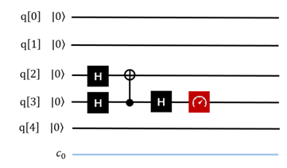
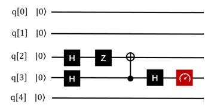

6.9 QPE算法
==============

6.9.1 QPE算法介绍
--------------------

QPE算法（Quantum Phase Estimation），量子相位估计算法。该算法在很早就已经被提出了，然而真正带来很大影响的，就是基于它实现的HHL算法，以及各种基于HHL算法实现的量子机器学习算法。
相位估计最神奇的效果是达到了相比传统计算机上运行的算法的一个指数加速。这个效果怎么理解，举个简单的例子，就是传统计算机上要运行2的30次方（约等于10亿）次运算，量子计算机上只要运行30次左右就OK了。当然这个指数加速效果是有前提条件的，就是输入和输出都需要是量子比特，而量子比特怎么和经典比特对应起来呢，这又是另外一个问题了。我们只要知道，在算法的运算过程中，是有一个指数加速的效果就可以了。而这个算法凭借它的优势，可以用在很多应用上，比如求阶问题，因子分解问题以及量子机器学习HHL算法等等。

问题描述：
****************

| 相位估计 (Phase estimation)，也简称QPE,是量子计算中极为重要的一个子算法，它作为很多算法的主要构成部分，包括Shor算法，HHL求解线性系统算法等。尤其HHL算法，因为求解线性系统对量子机器学习算法的的价值潜力极大。目前，可用的真实量子比特可用数还比较少，如果我们想要测量更复杂的可观测量，例如哈密顿量H描述的能量，我们就会采用量子相位估计。
| 在相位估计里会用到量子傅里叶变换（QFT）, 它的重要性体现在它是很多量子算法的基础,因此了解本算法，对于了解其他量子算法有很好的帮助，甚至是理解很多典型算法必不可少的路径。

问题定义：
**************

| 给定可作用于量子线路的幺正矩阵U以及其本征向量之一|ψ⟩，求其对应的本征值。

.. math:: U|ψ⟩=e^{2πiϕ}|ψ⟩\\
     0≤ϕ≤1 

| 由于U是幺正矩阵，所以其该本征值可以被表示为 :math:`λ=e^{2πiϕ}` 。求本征值在这里等价于求相位 :math:`ϕ` ，相位估计，顾名思义，就是求解相位 :math:`ϕ` 。该算法使用受控U操作 :math:`O(1/ε)` 在加性误差 :math:`ε`， 可以高概率估计 :math:`ϕ` 的值。 

| 需要准备实现的线路模型图如下：

.. image::
        ../../images/qpe_1.jpg
        :align: center

植入步骤：
************

- 初始化：

输入包括两部分寄存器集：上面的n个量子位包含第一个寄存器，下面的m个量子位是第二个寄存器。

- 创建叠加态：

统一给n个量子比特添加H门操作，将n个初始状态置于叠加态，上图中淡蓝色框步骤1里。

- 应用受控的单一操作：

C-U是一个受控U门，只有当相应的控制位（来自第一个寄存器）为 :math:`|1⟩` 时，它才在第二个寄存器上应用单一运算符U。注意位置位的位置，与目标位的对应。

- 应用逆傅里叶变换：

执行傅里叶变换，详情参考傅里叶变换算法。

- 测量：

|  测量前位量子比特。
|  如上就是相位估计算法的步骤。需要需要注意的是受控单元那里的处理。

参考线路图：
*************

这里给出了一个最简单的测试案例，分别是“-”的相位估计和“+”的相位估计（）。以下示例演示了作用于量子比特q[2]的单量子比特哈密顿量 :math:`σ_x`   的量子相位估计。去q[3]作为指针系统（测量操作在上面）。在这个例子中，指针系统上的量子傅立叶变换等效于q[3]上的Hadamard门。CNOT门描述了系统+指针系统的离散化演变。指针量子位q[3]的最终测量结果是0或1，这取决于q[2]是在 :math:`σ_x` 的+ 1还是-1对应的本征态中准备。在该示例中，量子位q[2]初始化为ZH|0⟩，它是 :math:`σ_x` -1所对应的特征向量。因此，测量结果为1。（注意，测量结果等于0，表示的就是-1）

相位估计 – 的情况：
************************
 

相位估计 + 情况：
************************

6.9.2 QPE算法的实现
---------------------

下面给出 QRunes 实现 QPE 算法的代码示例：

.. tabs::

   .. code-tab:: python

        @settings:
            language = Python;
            autoimport = True;
            compile_only = False;

        @qcodes:
        // Perform Fourier Transform
        circuit QFT(vector<qubit> q) {
            for(let i=0: 1: q.length()) {
                H(q[q.length()-1-i]);
                for (let j=i+1: 1: q.length()) {
                    CR(q[q.length()-1-j],
                        q[q.length()-1-i], 2*Pi/(1<<(j-i+1)));
                }
            }
        }

        circuit QFTdagger(vector<qubit> q) {
            QFT(q).dagger();
        }

        circuit unitary(vector<qubit> q) {
            RX(q[0], -Pi);
        }

        circuit Hadamard(vector<qubit> q) {
            for (let i=0: 1: q.length()) {
                H(q[i]);
            }
        }

        // U is generated by qc,
        // output U^(2^min)
        circuit unitarypower(vector<qubit> q, int min) {
            for (let i=0: 1: (1 << min)) {
                unitary(q);
            }
        }

        // Applying a controlled single operation
        circuit controlUnitaryPower(vector<qubit> qvec, qubit controlQubit, int min) {
            circuit  qCircuit = unitarypower(qvec, min);
            vector<qubit> cControlQubit;
            cControlQubit.append(controlQubit);
            qCircuit.control(cControlQubit);
        }

        circuit QPE(vector<qubit> controlqvec, vector<qubit> targetqvec) {
            // A unified H-gate operation is added to controlqvec qubits, and N initial states are placed in superposition states.
            for(let i=0: 1: controlqvec.length()) {
                H(controlqvec[i]);
            }

            vector<qubit> controlqubit;

            for (let i=0: 1: controlqvec.length()) {
                controlUnitaryPower(targetqvec, controlqvec[controlqvec.length()-1-i], i);
            }
            QFTdagger(controlqvec);
        }

        @script:
        if __name__ == '__main__':
            init(QMachineType.CPU_SINGLE_THREAD)

            qubit_num = 2
            cbit_num = 2
            # Initialization 2 quantum bits
            cqv = qAlloc_many(qubit_num)
            # Initialization 1 quantum bits
            tqv = qAlloc_many(1)
            cv = cAlloc_many(cbit_num)
            qpeProg = QProg()
            qpeProg.insert(H(tqv[0]))
            qpeProg.insert(QPE(cqv, tqv))
            qpeProg.insert(measure(cqv[0], cv[0]))
            qpeProg.insert(measure(cqv[1], cv[1]))
            directly_run(qpeProg)
            print("c0: %s" %(cv[0].eval()))
            print("c1: %s" %(cv[1].eval()))

            finalize()

   .. code-tab:: c++

        @settings:
            language = C++;
            autoimport = True;
            compile_only = False;
            
        @qcodes:
        // Perform Fourier Transform
        circuit QFT(vector<qubit> q) {
            for(let i=0: 1: q.length()) {
                H(q[q.length()-1-i]);
                for (let j=i+1: 1: q.length()) {
                    CR(q[q.length()-1-j],
                        q[q.length()-1-i], 2*Pi/(1<<(j-i+1)));
                }
            }
        }

        circuit QFTdagger(vector<qubit> q) {
            QFT(q).dagger();
        }

        circuit unitary(vector<qubit> q) {
            RX(q[0], -Pi);
        }

        circuit Hadamard(vector<qubit> q) {
            for (let i=0: 1: q.length()) {
                H(q[i]);
            }
        }

        // U is generated by qc,
        // output U^(2^min)
        circuit unitarypower(vector<qubit> q, int min) {
            for (let i=0: 1: (1 << min)) {
                unitary(q);
            }
        }

        // Applying a controlled single operation
        circuit controlUnitaryPower(vector<qubit> qvec, qubit controlQubit, int min) {

            unitarypower(qvec, min).control(controlQubit);
        }

        circuit QPE(vector<qubit> controlqvec, vector<qubit> targetqvec) {
            // A unified H-gate operation is added to controlqvec qubits, and N initial states are placed in superposition states.
            for(let i=0: 1: controlqvec.length()) {
                H(controlqvec[i]);
            }

            vector<qubit> controlqubit;

            for (let i=0: 1: controlqvec.length()) {
                controlUnitaryPower(targetqvec, controlqvec[controlqvec.length()-1-i], i);
            }
            QFTdagger(controlqvec);
        }

            
        @script:
        int main()
        {
            init(QMachineType::CPU);
            int qubit_number = 2;
            int cbitnum = 2;
            vector<Qubit*> cqv = qAllocMany(qubit_number);      //control
            vector<Qubit*> tqv = qAllocMany(1);
            vector<ClassicalCondition> cv = cAllocMany(cbitnum);
            auto qpeProg = CreateEmptyQProg();
            qpeProg << H(tqv[0]);
            qpeProg << QPE(cqv, tqv);
            qpeProg << Measure(cqv[0], cv[0]) << Measure(cqv[1], cv[1]);
            directlyRun(qpeProg);
            cout << "c0: " << cv[0].eval()<< endl;
            cout << "c1: " << cv[1].eval() << endl;
            finalize();
        }

6.9.3 QPE算法小结
-------------------

QPE算法应用了量子傅里叶逆变换，同时作为一个实用的基础量子算法，又被应用在Shor Algorithm（质因式分解算法），和HHL Algorithm（经常用于各种量子机器学习的最优化算法）等等算法中。
