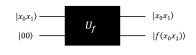
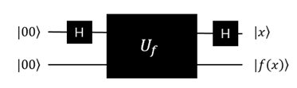

6.6 Simon算法
================

6.6.1 Simon算法介绍
----------------------

Simon问题是Daniel Simon在1994年提出。它是一个计算问题, 可以在量子计算机上以指数速度相较经典计算机更快地解决。虽然这个问题本身目前没有在实际应用中产生实际价值, 但它的趣味内涵在于它证明了量子算法可以比任何经典算法更快地解决这个问题。

Simon的算法也启发了Shor算法（详细请查阅Shor量子算法）。这两个问题都是阿贝尔隐子群（Abelian hidden subgroup problem）问题的特例, 而且是现今已知有效的量子算法。

问题描述：
**********

- 给定一个方程： 

.. math:: f:\{0,1\}^n→\{0,1\}^n 

- 存在 :math:`s∈\{0,1\}^n`，对所有的 :math:`x,y∈\{0,1\}^n`，满足下面的性质：
    :math:`f(x)=f(y)` 当且仅当  :math:`x=y` 或 :math:`x⊕y=s`

（这里⊕表示模2加。)

算法目标：
**********
| 寻找s.
| 例：n=2的Simon问题,考虑2量子比特。注意，如果目标 :math:`s=0^n`，那这个函数是1对1（one-to-one）的，此处不考虑。反之，则是一个二对一(two-to-one)的函数，几种情况如下图（函数值任意给定）：

=============   =============   =============   =============   =============   ============= 
           (1)s=01                         (2)s=10                         (3)s=11
-----------------------------   -----------------------------   ----------------------------- 
  x              f(x)	         x                f(x)	          x	               f(x)
=============   =============   =============   =============   =============   ============= 
00	              1              00               1               00               1
01	              1              01               2               01               3
10	              0              10               1               10               3
11	              0              11               2               11               1
=============   =============   =============   =============   =============   ============= 

| 在（1）很容易看出 :math:`f(00)=f(01)=1`，:math:`f(10)=f(11)=0`，因此 :math:`00⊕01=01`， :math:`10⊕11=01`，推出 :math:`s=01`。经典算法最低需要2次的才能确定，一般情况下，对于n比特的问题估计找到目标s最糟糕的情况下要消耗多达 :math:`2^{n-1}+1` 次。但是在量子算法里，1次就解决了这个问题。

量子Oracle
************

| Simon问题的量子Oracle(考虑s=11)

| 考虑n=2的Simon问题，此时需要2量子比特的变量和2量子比特的函数，合计需要4量子比特。

- 下面考虑Simon问题的Oracle:

.. math:: | x_0 x_1 ⟩ |00⟩\overset{U_f}{\rightarrow} |x_0 x_1 ⟩ |00⊕f(x_0 x_1 ) ⟩=|x_0 x_1 ⟩ |f(x_0 x_1 ) ⟩

- 线路图如下:

 
| 上面的这个量子Oracle可以加入Hadamard门，对前两个量子比特做H操作，等价于：

过程：
*******

.. math:: |0000⟩\xrightarrow[]{H⨂H⨂I⨂I}|++⟩|00⟩\xrightarrow[]{U_f}\frac{1}{2}[(|00⟩+|11⟩ )|1⟩+(|01⟩+|10⟩ ) |3⟩ ]\\
    \xrightarrow[]{H⨂H⨂I⨂I}\frac{1}{2} [(|00⟩+|11⟩ )|1⟩+(|00⟩-|11⟩ )|3⟩ ]
    
| (注意： :math:`|3⟩` 是我定义的函数值)

| 因此，最下面的两个位分别对应了 :math:`|1⟩` 和 :math:`|3⟩`，测量上面的两量子位， :math:`|00⟩` 和 :math:`|11⟩` 则会被以50%的概率被观察到。

下面是QRunes的实施过程：
**************************

::

    1.	初始化4个量子比特。
    2.	创建线路图: q[0], q[1]分别做Hadamard操作。
    3.	对q[0]，q[2]和q[1], q[2]分别执行CNOT操作。
    4.	对q[3]执行NOT操作。
    5.	再对q[0]，q[1]分别做Hadamard操作
    6.	最后测量全部量子逻辑位，输出结果。

Simon问题(s=11）的线路图设计参考图：
**************************************

| 这里，测定结果得|00⟩的时候，表示没有得到任何的信息，当测量得到|11⟩的时候，就得到了s=11，也就是说Simon量子算法里面，0以外的获取s的概率为50%。

.. image::
        ../../images/simon_3.jpg
        :align: center

| s=10的线路图参考，流程和思路和上面完全一致，测试用。
| s= 10:

.. image::
        ../../images/simon_4.jpg
        :align: center

6.6.2 Simon算法的实现
----------------------

下面给出 QRunes 实现 Simon 算法的代码示例：
*******************************************

::

    @settings:
        language = Python;
        autoimport = True;
        compile_only = False;
        
    @qcodes:
    circuit controlfunc(vector<qubit> qvec, int index, int value) {
        let cd = qvec.length() / 2;
        vector<qubit> qvtemp;
        qvtemp = qvec[0:cd];
        if (index == 1) {
            X(qvec[0]);
        } else if (index == 2) {
            X(q[1]);
        } else if (index == 0) {
            X(qvec[0]);
            X(qvec[1]);
        }

        if (value == 1) {
            X(qvec[3]).control(qvtemp);
        } else if (value == 2) {
            X(qvec[2]).control(qvtemp);
        } else if (value == 3) {
            X(qvec[2]).control(qvtemp);
            X(qvec[3]).control(qvtemp);
        }

        if (index == 1) {
            X(qvec[0]);
        } else if (index == 2) {
            X(qvec[1]);
        } else if (index == 0) {
            X(qvec[0]);
            X(qvec[1]);
        }
    }

    circuit oraclefunc(vector<qubit> qvec, vector<int> funvalue) {
        let cd = qvec.length()/2;
        for (let i=0: 1: 4){
            let value = funvalue[i];
            controlfunc(qvec, i, value);
        }
    }

    Simon_QProg(vector<qubit> qvec, vector<cbit> cvec, vector<int> funvalue) {
        let cd = cvec.length();
        for (let i=0: 1: cd) {
            H(qvec[i]);
        }
        oraclefunc(qvec, funvalue);
        for (let i=0: 1: cd) {
            H(qvec[i]);
        }
        for (let i=0: 1: cd) {
            measure(qvec[i], cvec[i]);
        }
    }
    
    @script:
    if __name__ == '__main__':
        print('4-qubit Simon Algorithm')
        print('f(x)=f(y)\t x+y=s')
        print('input f(x),f(x):[0,3]')
        func_value = []
        func_value.append(int(input('input f(0):\n')))
        func_value.append(int(input('input f(1):\n')))
        func_value.append(int(input('input f(2):\n')))
        func_value.append(int(input('input f(3):\n')))
        print('f(0)=%d' %(func_value[0]))
        print('f(1)=%d' %(func_value[1]))
        print('f(2)=%d' %(func_value[2]))
        print('f(3)=%d' %(func_value[3]))
        print('Programming the circuit...')
    
        init(QMachineType.CPU_SINGLE_THREAD)
        qubit_num = 4
        cbit_num = 2
        # Initialization of 4 quantum bits
        qv = qAlloc_many(qubit_num)
        cv = cAlloc_many(cbit_num)
        simonAlgorithm = Simon_QProg(qv, cv, func_value)
    
        result = []
        for i in range(0, 20, 1):
            re = directly_run(simonAlgorithm)
            result.append(cv[0].eval()*2 + cv[1].eval())
        if 3 in result:
            if 2 in result:
                print('s=00')
            else:
                print('s=11')
        elif 2 in result:
            print('s=01')
        elif 1 in result:
            print('s=10')
        
        finalize()

6.6.3 Simon算法小结
----------------------
    
在一台量子计算机上运行了该算法的最简单版本,仅仅用了六个量子比特,量子计算机完成 这一任务仅用了两次迭代,而普通计算机得用三次。这种区别似乎不算什么,但人们相信,如果增加更多量子比特,量子计算机和普通计算机运算能力的差别就会拉 大,这也意味着,量子计算机能更快、更高效地解决此类算法问题。不过,还是要泼一盆冷水,到目前为止,能够运行西蒙算法并没有什么实际价值,该实验的唯一 目的是证明量子计算机在一种算法上能够做得更好。