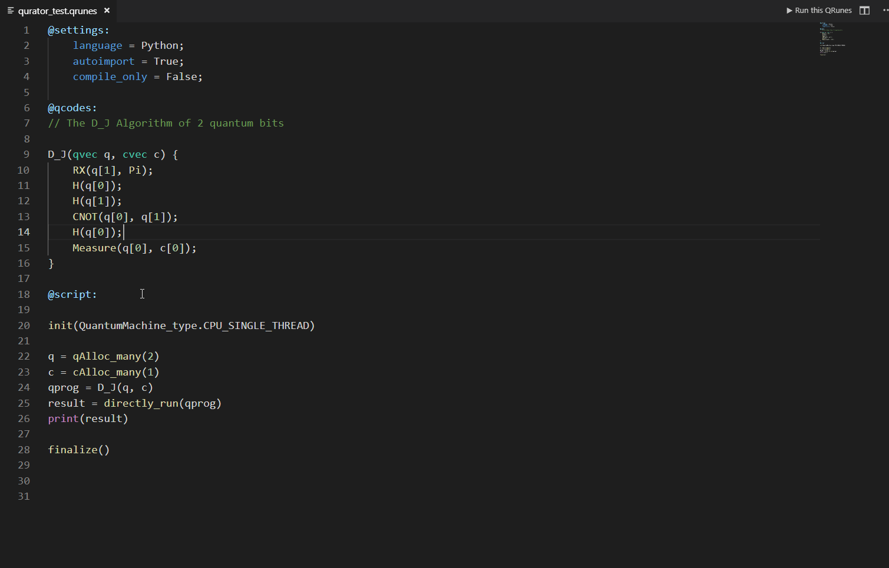

Quick Start
========================

1.1 QRunes简介
------------------

1.2 QRunes开发环境 
------------------
1.2.1 QRunes与QPanda/pyQPanda 
+++++++++++++++++++++++++++++++++

**#### QPanda**

QPanda SDK是由本源量子推出的，基于量子云服务的，开源的量子软件开发包。用户可基于此开发包开发在云端执行的量子程序。QPanda使用C++语言作为经典宿主语言，支持以QRunes书写的量子语言。
目前，QPanda支持本地仿真运行模式和云仿真运行模式，最高可支持到32位。Q-Panda提供了一个可执行的命令行程序，通过指令控制量子程序的加载、运行和读出。另外，QPanda提供了一组API，可供用户自行定制功能。

**#### QPanda 2**

QPanda 2(Quantum Programming Architecture for NISQ Device Applications)是一个高效的量子计算开发工具库，可用于实现各种量子算法，QPanda 2基于C++实现，并可扩展到Python

**#### PyQPanda**

PyQPanda我们通过pybind11工具，以一种直接和简明的方式，对QPanda2中的函数、类进行封装，并且提供了几乎完美的映射功能。 封装部分的代码在QPanda2编译时会生成为动态库，从而可以作为python的包引入

1.2.2 开发环境配置与运行
++++++++++++++++++++++++++++
为了兼容高效与便捷，我们为您提供了C++ 和 Python（pyQPanda）两个版本，pyQPanda封装了C++对外提供的接口。

**#### C++的使用**

使用QPanda 2相对于pyQPanda会复杂一些，不过学会编译和使用QPanda 2，您会有更多的体验，更多详情可以阅读 使用文档_。话不多说，我们先从介绍Linux下的编译环境开始。

.. _使用文档: https://qpanda-2.readthedocs.io/zh_CN/latest/

**#### 编译环境**

在下载编译之前，我们需要：

==================== ==========
software              version        
==================== ==========
  GCC                 >= 5.4.0        
  CMake               >= 3.1          
  Python              >= 3.6.0        
==================== ==========
   
**#### 下载和编译**

我们需要在Linux终端下输入以下命令：

- $ git clone https://github.com/OriginQ/QPanda-2.git

- $ cd qpanda-2

- $ mkdir build

- $ cd build

- $ cmake -DCMAKE_INSTALL_PREFIX=/usr/local .. 

- $ make
    
**#### 安装**

编译完成后，安装就简单的多，只需要输入以下命令：

- $ make install

**#### 开始量子编程**

现在我们来到最后一关，创建和编译自己的量子应用。
我相信对于关心如何使用QPanda 2的朋友来说，如何创建C++项目，不需要我多说。不过，我还是需要提供CMakelist的示例，方便大家参考。

::

        cmake_minimum_required(VERSION 3.1)
        project(testQPanda)
        SET(CMAKE_INSTALL_PREFIX "/usr/local")
        SET(CMAKE_MODULE_PATH  ${CMAKE_MODULE_PATH} "${CMAKE_INSTALL_PREFIX} lib/cmake")
    
        add_definitions("-std=c++14 -w -DGTEST_USE_OWN_TR1_TUPLE=1")
        set(CMAKE_BUILD_TYPE "Release")
        set(CMAKE_CXX_FLAGS_DEBUG "$ENV{CXXFLAGS} -O0 -g -ggdb")
        set(CMAKE_CXX_FLAGS_RELEASE "$ENV{CXXFLAGS} -O3")
        add_compile_options(-fPIC -fpermissive)
        find_package(QPANDA REQUIRED)
        if (QPANDA_FOUND)
    
            include_directories(${QPANDA_INCLUDE_DIR}
                            ${THIRD_INCLUDE_DIR})
            add_executable(${PROJECT_NAME} test.cpp)
            target_link_libraries(${PROJECT_NAME} ${QPANDA_LIBRARIES})
        endif (QPANDA_FOUND)

我们接下来通过一个示例介绍QPanda 2的使用，此例子构造了一个量子叠加态。在量子程序中依次添加H门和CNOT门，最后对所有的量子比特进行测量操作。此时，将有50%的概率得到00或者11的测量结果。

::  

        #include "QPanda.h"
        #include <stdio.h>
        using namespace QPanda;
        int main()
        {
            init(QMachineType::CPU);
            QProg prog;
            auto q = qAllocMany(2);
            auto c = cAllocMany(2);
            prog << H(q[0])
                << CNOT(q[0],q[1])
                << MeasureAll(q, c);
            auto results = runWithConfiguration(prog, c, 1000);
            for (auto result : results){
                printf("%s : %d\n", result.first.c_str(), result.second);
            }
            finalize();
        }
    
最后，编译，齐活。
::

        $ mkdir build
        $ cd build
        $ cmake .. 
        $ make
    
运行结果如下:
::

        00 : 512
        11 : 488 

**#### python的使用**

pyQPanda只需要通过pip就可安装使用。

- -pip install pyqpanda

我们接下来通过一个示例介绍pyQPanda的使用，此例子构造了一个量子叠加态。在量子程序中依次添加H门和CNOT门，最后对所有的量子比特进行测量操作。此时，将有50%的概率得到00或者11的测量结果。
::

        from pyqpanda import *
    
        init(QMachineType.CPU)
        prog = QProg()
        q = qAlloc_many(2)
        c = cAlloc_many(2)
        prog.insert(H(q[0]))
        prog.insert(CNOT(q[0],q[1]))
        prog.insert(measure_all(q,c))
        result = run_with_configuration(prog, cbit_list = c, shots = 1000)
        print(result)
        finalize()

运行结果如下:
::

        {'00': 493, '11': 507}

1.3 Qurator介绍  
--------------------

1.4 初窥QRunes 
--------------------
1.4.1 QRunes关键字 
+++++++++++++++++++++++++

1.4.2 QRunes程序结构  
+++++++++++++++++++++++++

**### QRunes由三部分组成**

* #### settings 模块中可以设置宿主语言，编译还是运行；

::

        @settings:
            language = Python;
            autoimport = True;
            compile_only = False;

* #### qcodes 模块中可以编写 QRunes2 量子语言代码；

::

        D_J(qvec q,cvec c){
            RX(q[1],Pi);
            H(q[0]);
            H(q[1]);
            CNOT(q[0],q[1]);
            H(q[0]);
            Measure(q[0],c[0]);
        }
        
* #### script 模块中可以编写宿主语言代码，目前支持 Python 和 C++ 两种宿主语言。

::

        init(QuantumMachine_type.CPU_SINGLE_THREAD)
        q = qAlloc_many(2)
        c = cAlloc_many(2)
        qprog1 = D_J(q,c)
        result = directly_run(qprog1)
        print(result)
        finalize()

1.4.3 Ops!你的第一个量子程序
-------------------------------
点击右上方 Run this QRunes 运行程序，或者使用命令提示符 qurator-vscode: Run this QRunes 来运行程序(快捷键 F5)，点击运行结果可以以柱状图的的形式展示。

**##### 小结**
